# 头发——女孩子的发型究竟要如何获得

# 0x00 前言
发型对于一个女孩子来说究竟有多重要，恐怕是一件不言而喻的事情。即使是近视到“十米外人畜不分”的人，也能模模糊糊地根据头发的长度来分辨一个人的性别。

可以说，想要成为一个受欢迎的可爱女孩子，我们首先需要从头开始。

如何通过发型给自己的女子力加分，这里我将会告诉你。

# 0x01 男生的头发和女生的头发究竟有什么区别呢
（注：本系列的图片如无特殊说明，则来自文心大模型，GPT-4或者Midjourney，如果你看到很简单的草图，那则是我自己绘制的）

看看这个标准男生的发型，是不是给了你一种帅气，干练，严肃的印象呢？

通常来说，男生的发型分为平头和背头。平头只要拿剪刀剪一剪就可以实现，所以大部分不太注重自己打扮的男生或者学生都是使用的这种发型。这是一种简单、清爽的发型，头顶和后脑勺的头发长度较短，两侧可能稍微剃短一些，整体给人一种干净利落的感觉。平头适合各种脸型和头型，对于凸显男生硬朗的气质有很好的效果。

那么，女生的发型究竟有何特点呢？

通过这两幅图片，我们也许可以得到一个模糊的印象：即女生的头发相对男生更长，而且整体上头发是向下延伸的。但我们需要注意，对于女生来说，即使是短发，通常也远远长于男生的长发。而且，长发通常被视为女性化的象征，给人一种柔美、温柔的感觉。飘逸的长发让女生看起来更加淑女，展现出女性特有的柔美和魅力。

接下来来研究一下如何将男生的平头变成具有女生气质的长发吧！
# 0x02 获得女生发型的必经之路
也许你也听说过一个概念名叫“药娘头”，这个概念或许已经成为了许多对跨性别女生的带有偏见的刻板印象之一。

实际上，我第一次被人说是这个发型时也是很难受的，如果我们参考一下下面这张图，大概也就知道这究竟是怎样一种刻板印象了。

> 

但是我们又会不自觉地开始思考另一个问题：“为什么这样一个让人印象并不好的形容，却几乎是每一位跨性别女生都收到过的评价？“

让我们来剖析一下为什么会这样。请看下图：

这张没有灵魂的草图（因为灵魂都在我这个灵魂画手这里）向你解释了为什么大部分跨性别女生开始蓄发后就会变成所谓的“药娘头”。答案就是，对于男性的平头发型而言，大部分区域的头发长度都是几乎一致的。在生长过程中，头发的各个部位同时生长（后脑勺的毛发优势区生长的会稍快），因此最终如果在不加修剪的情况下，就会形成这种前面的头发长，但侧面的和后面的头发长度却没有长出很多的“药娘头”发型。

**因此，即使我们说“药娘头”是每一个跨性别女生在转换过程中所需要经历的必经之路也没有什么问题。** 出于对我和你们的心理健康问题的考虑，接下来我们将其称之为“转换发型”。

对于一般的顺性别男性而言，如果他们要留长发，也不是仅仅留长就好。他们也需要去找Tony老师进行修剪，以变成符合社会印象的那种男性长发发型。这对于跨性别女生来说毫无作用，因为去修剪那样的发型几乎可以肯定一定会导致我们的焦虑爆炸（没错，这种事情我也亲身体会过，结果也就是哭了整整一天一夜还摔烂了一台手机而已），更何况那样的发型在继续留长以后也无法变成女生发型，因此这条路是行不通的。

但是如果有朝一日你得到了一个转换发型，那么恭喜你，接下来你就有一些事情可以做了。

看看下面这张短发女生的画像吧，你是否觉得这样的发型也可以是一种女生的发型呢？

我们来分析一下这种发型吧。
> 这种发型的总体头发长度并不太长，包含一个斜刘海，头顶的长发蓬松且具有长度，两侧鬓发基本盖住耳朵，后方长度基本上到脖子附近。

诶！！这好像和我们的转换发型有点像诶！

事实上，当你已经有了转换发型，只要头发再长一点（给Tony老师留出修剪和造型的空间），修剪和造型后你也就可以获得这样一个发型了。就像在前言部分，我在2018年11月拍摄的“我可以不用假发出门啦！”那张照片一样。

最重要的是，这个发型经过留长和修剪是可以顺利变成普通女生的长发的！

如果你已经得到了一个转换发型，那么恭喜你，你已经基本走完了这段必经之路！
# 0x03 先看看自己的脸型吧
如果我们看动漫的话，不管是男性角色还是女性角色，他们的脸型大部分似乎都是V型尖脸。就像这样
> 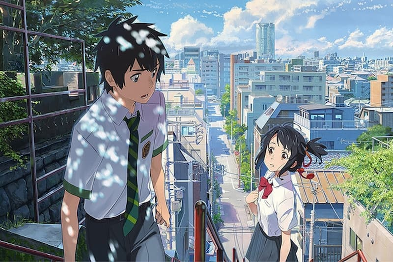

但是问题来了，现实中好像并不是这样的啊？

## 0x03.A 你的脸型是什么

要回答这个问题，我们需要先想一下我们的脸型究竟是什么样子的。

我找到了一篇很不错的判断脸型的方法，首先我们判断一下自己是什么脸型吧！

<https://www.zhihu.com/tardis/zm/art/146144916?source_id=1003>

脸型并不直接决定你的性别气质，但是比较柔和的脸型通常会给人更接近于女性的感觉。

因此接下来我们将会讨论，如何使用头发修饰你的脸型。
## 0x03.B 我们面临什么脸型问题
如果只是单纯的脸型，那确实并不和性别气质直接挂钩。但是，脸部外围形状以外的一些生理特征却实打实的和性别气质相关。

这些不符合性别气质的面部特征大抵如下，对着镜子看看你会不会有什么问题吧：
- 额头扁平
- 眉弓高
- 颧弓宽
- 下颌角宽/有突起
- 脸颊部宽
- 鼻梁高/凸出
- 鼻翼和鼻头宽大
（本来想画一个没有灵魂的示意图，但是这些区别有点微妙，因此还是放弃了）

既然是脸型和别的女孩子有所区别，那么一个自然的想法就是去拜访一下整形外科医生做点什么手术。不过，脸部的整形手术除了价格高昂，也有着瘢痕，色素沉着，痛苦等风险和不利因素存在。

不过既然是RLE，就让我们从简单的方法开始，尝试使用发型来遮掩一下这些不足之处吧！
# 0x04 如何选择一个适合自己的发型
如果我们使用Google搜索发型，那就会看到无数女生的发型。这些发型大约包括以下区别：
- 长发还是短发
- 直发还是卷发
- 有刘海还是没有刘海
- 头发的颜色
- 鬓角的处理
- 是蓬松的发型还是顺直的发型
- ……

不同的发型会给人不同的印象，同时不同的发型对脸型也会有不同的修饰效果。除了修饰我们在脸型上可能存在的某些缺陷，发型也是我们表达自我（或者说，实现内心对自己的期待）的一种方式，请务必要好好试一试！
## 0x04.A 发型给人带来的印象
### 从我喜欢的百合番海报开始说起……
如果我们审视这张《~Citrus~ 柑橘味香气》的配图，不难发现，两位女主角的发型会给我们带来一些第一印象。

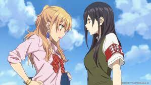

柚子的头发是浅色的长卷发，她将一部分头发向后梳并且扎了一个高马尾，同时前方的刘海也更加蓬松并整体上更像一个向左的斜刘海，鬓发长度较短，整体上发型给人一种高扬感，让人能够想象这位女生活泼，开朗，并且似乎不愿意受到太多约束的感觉。

芽衣的头发则是深色的长卷发，她的头发被简单地放在身后，一部分头发可能随着转头等动作跨过了肩部来到前方。她的刘海相对没有那么蓬松，厚度也相对于柚子的为厚。耳朵前面的鬓发较长，已经超出了整个下巴。相比起柚子，芽衣的头发让人看起来更感到沉稳，是一个顺从，严肃的好学生形象。（吐槽：这头发看起来好像我的辅导员……因此我老觉得这个发型不仅土，还很显老）

尽管在现实生活中我们的发型（尤其是发色）不太可能会像动漫那样夸张，但是一些基本的发型所给人的印象是不会有变化的。例如，通常来说：
- 短发女生相对于长发女生更显活泼
- 直发女生相对于卷发女生更显乖巧
- 头发长度中等的女生或许会让人感到知性或者随和
- 尾端带有微微内扣的发型或许会让人觉得更可爱
- 蓬松的发型有时会让人觉得更强势（或者更不羁）
- ……

### 以下是一部分我的不同发型照片，你看了会有什么不同的感觉吗？
> |        发型         |                     照片                      |
> |:-----------------:|:-------------------------------------------:|
> |      短发+斜刘海       | 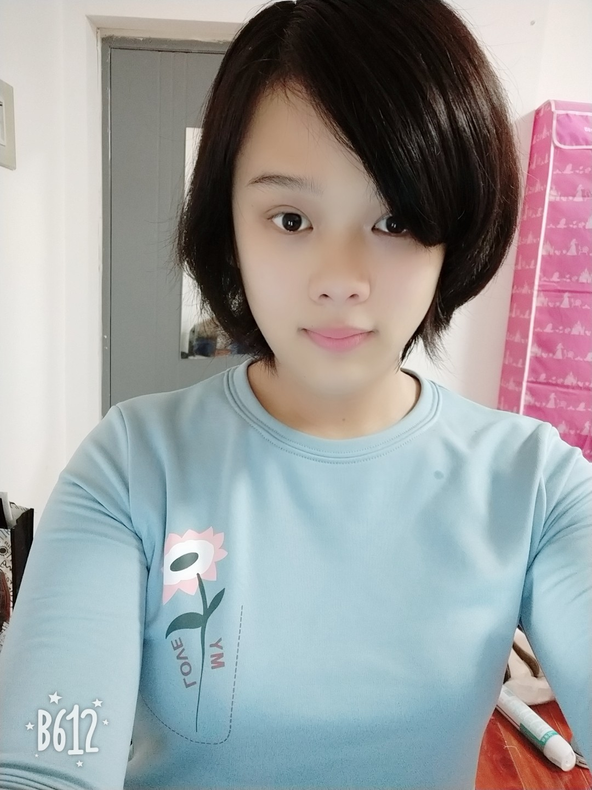 |
> |     无刘海、中发微卷      | 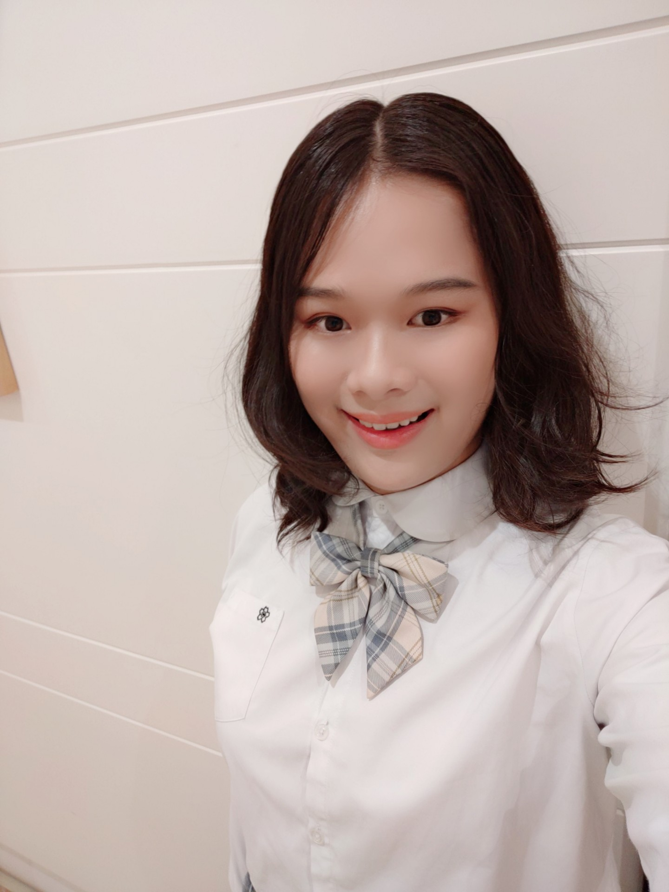 |
> |     长发披发+中分刘海     | 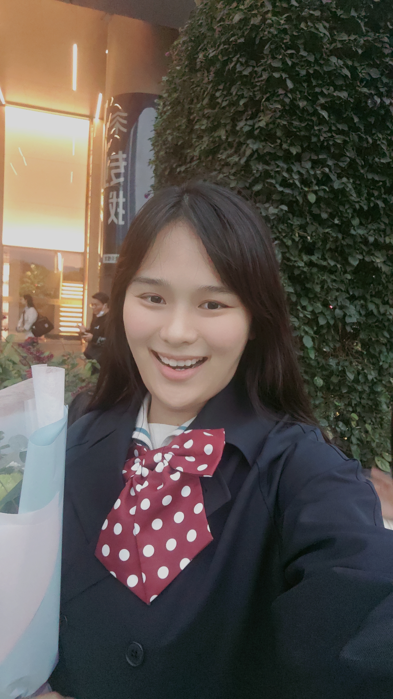 |
> |    蓬松且微微卷起的长发     |  |
> |   单马尾、齐刘海、放下的鬓发   |  |
> |   空气刘海、单马尾、蝴蝶结    | 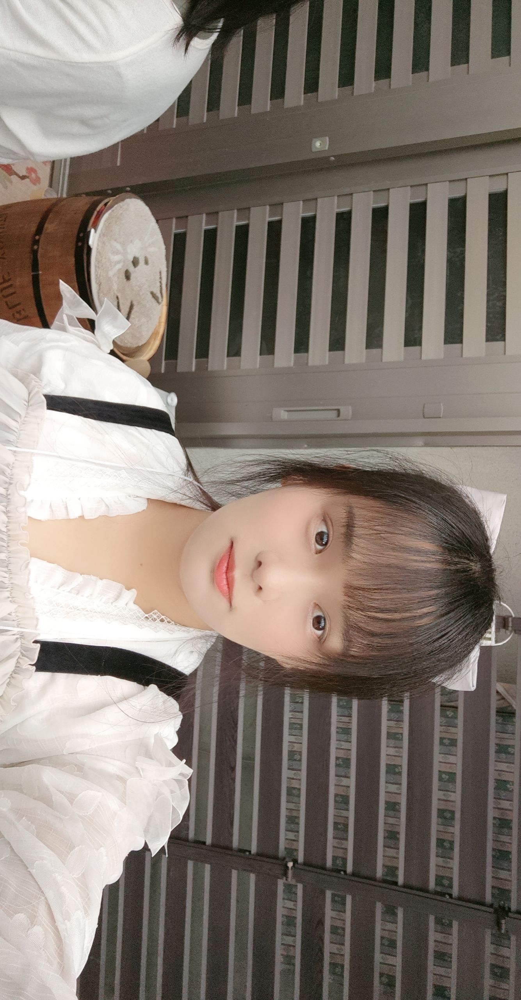 |
> | 斜刘海+长发披发（TODO:打码） |  |
> |    空气刘海、中发、微卷     | 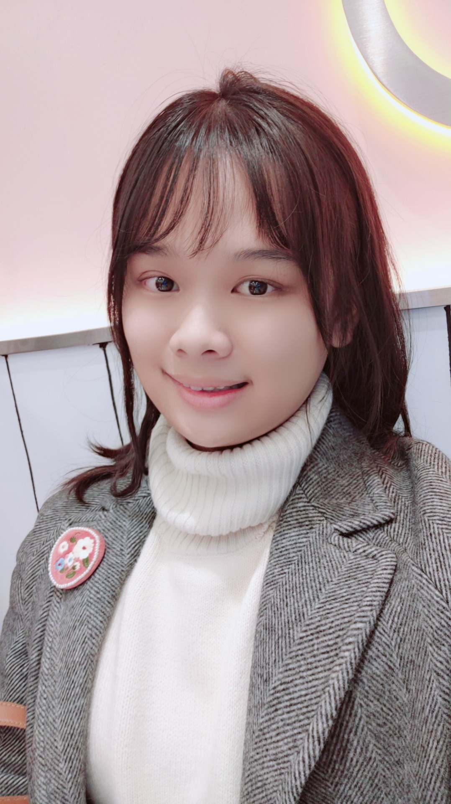 |
> |     中分刘海、半披发      | 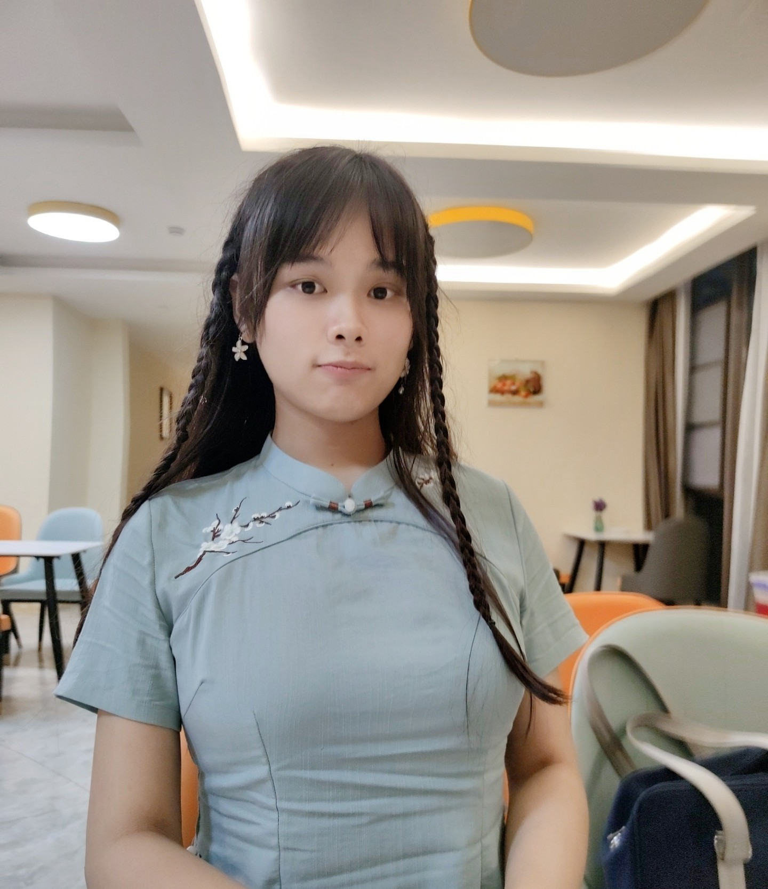 |
> |     无刘海、中长发披发     | 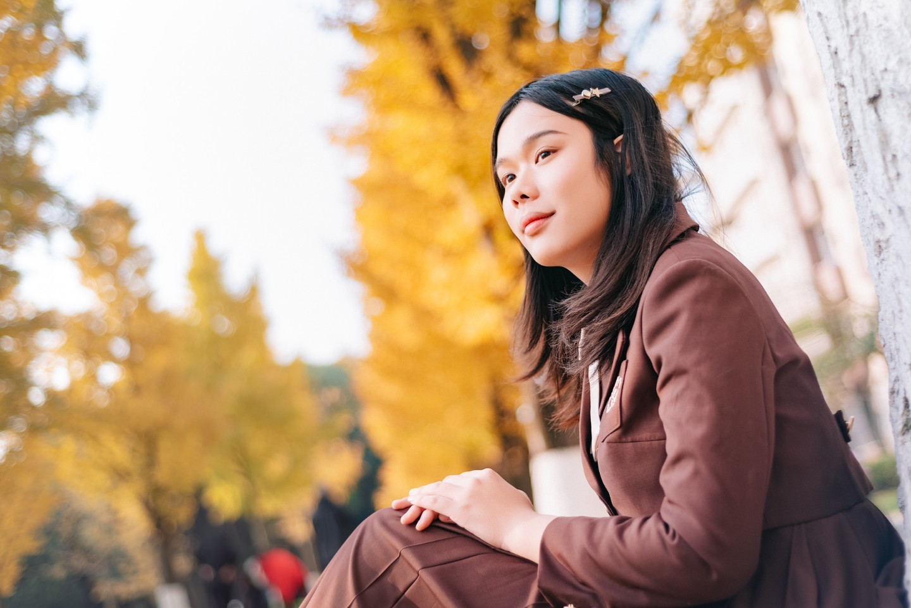 |
> |顺滑的披发| 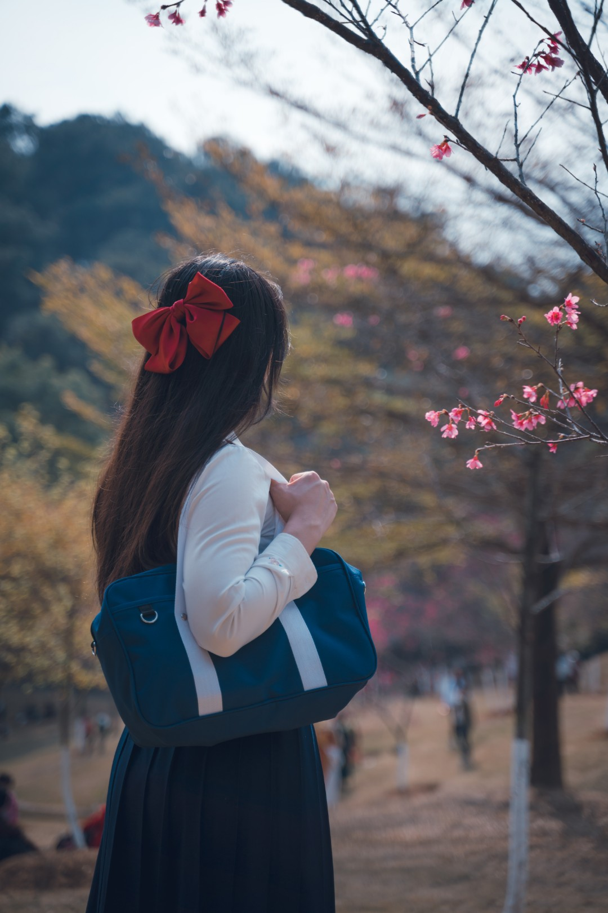 |
>  

## 0x04.B 发型带来的修饰效果
### 女生的发型都有哪些部分
如果你还对0x03.B节中提到的脸部问题有些记忆，现在我们就来解决他们。

作为跨性别女生来说，脸上存在一些男性特点通常是难以避免的。我的脸上主要存在颧弓宽和下颌角宽的问题。

这两个问题如果想要通过整形外科的方式彻底解决，将需要进行削骨手术。幸运的是，除了这个，**头发可以很大程度上掩盖这些问题。**

我是一个怕痛的人，因此我让Tony老师给我设计了一款发型，来解决（遮挡）这些问题。

在此之前，我们需要先了解一下，女生的发型都有哪些部分：
- **刘海** ：刘海指垂在前额的短发，根据头发的方向可分为齐刘海和斜刘海；根据刘海的厚度可以分为空气刘海、法式刘海和厚刘海。并不是每一种发型都有刘海。
- **副刘海** ：副刘海一般来说指的是刘海在从瞳孔外缘到外眼角范围内的部分。副刘海的作用是使得从刘海到鬓发的衔接不那么生硬（比如说，类似于一个直角）。具体来说，并不是每一种有刘海的发型都有副刘海。
- **鬓发** ：所谓“两鬓斑白”就是指的这个部位。通常是刘海的外延，基本上延伸到颧骨附近。有时候鬓发会采用一个比较柔和的造型，但类似于公主切那样锐利的鬓发也是存在的。（也许那种情况下说是耳发也说得过去了）
- **耳发** ：在耳朵前面的一丝头发，最长可以延伸到下巴附近，或者超出下巴。可以自然垂下，也可以做一个向后延伸的造型。

没有灵魂的示意图：（灵魂还是在我这个灵魂画手这里）
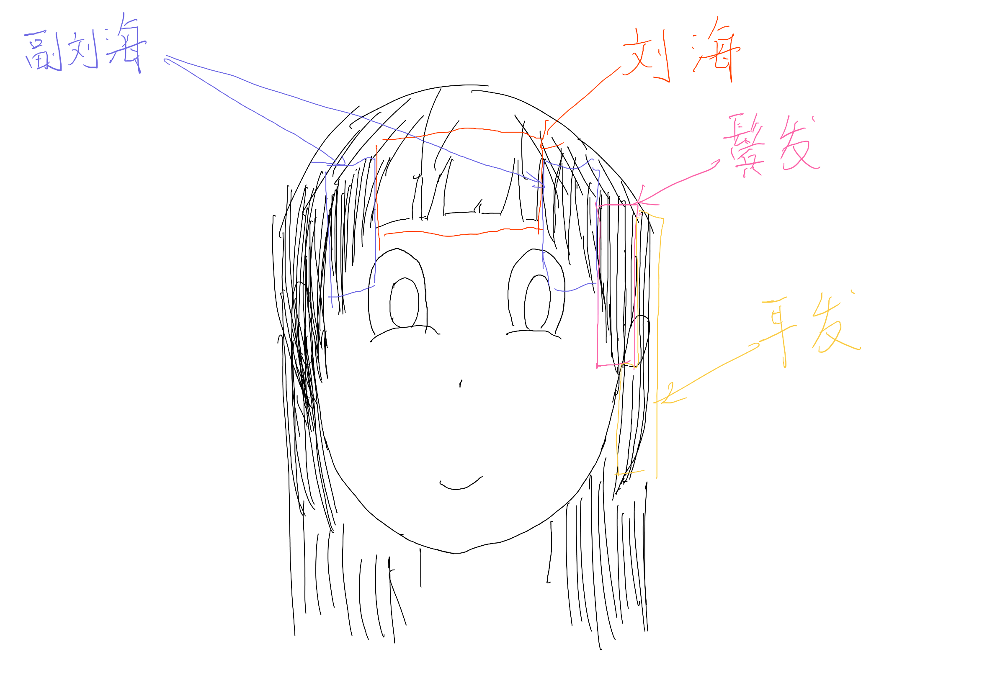

如果我们将这些部分的位置和我们脸上存在的（可能的或潜在的）缺陷的位置进行对比，不难发现，这些女生的发型简直是天赐的礼物！
- 刘海的位置使其具有遮挡低平的额头和过高的眉弓的潜力。
- 鬓发的位置使其具有遮挡过宽的颧骨的潜力。
- 耳发的位置使其具有遮挡过宽的下颌骨、过于方正的脸型、或者挡脸使得脸显得更小的潜力。
### 选择属于你的女生发型
接下来，让我们根据自己脸部的特点和缺陷，结合自己对于发型的偏好，选择一个自己喜欢的发型吧！

-  我的发型基本上是一个法式刘海加上长直发，颜色是带有渐变的棕色哦！（带有渐变的棕色是自然的，不是染的哦！）
  - 发色将在下一个小节内进行介绍
  - 以下的列表着重展示前面的不同，后面的……扎起来都一样

|发型|介绍|可以解决的问题|示例图|
|---|---|---|---|
|空气刘海||||
|齐刘海||||
|斜刘海||||
|向后卷曲的鬓发||||
|向内扣收的鬓发||||
|直的鬓发（公主切）||||

## 0x04.C 女生的发色

# 0x05 试着和Tony老师沟通！

# 0x06 我能不能自己给自己修剪头发

# 0x07 那些好用的美发工具们

# 0x08 在女生发型的基础上变得更可爱——辫子的巧用

# 0x09 在女生发型的基础上变得更可爱——卷发和直发

# 0x0a 为什么我的发型看起来很怪异

# 0x0b 如何才能和自己的头发好好相处呢？