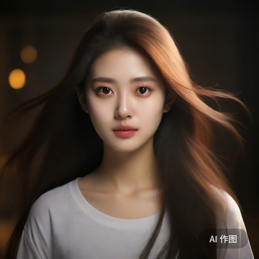
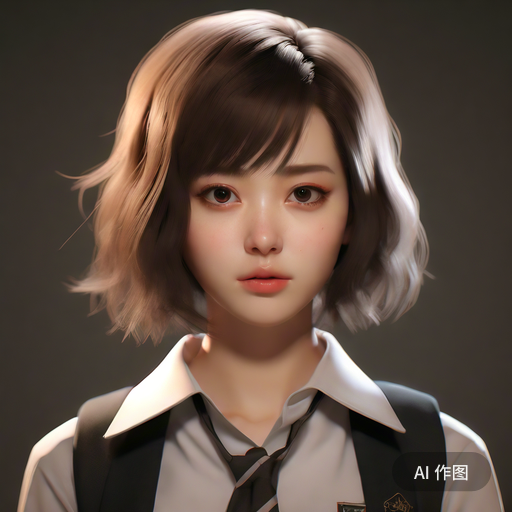
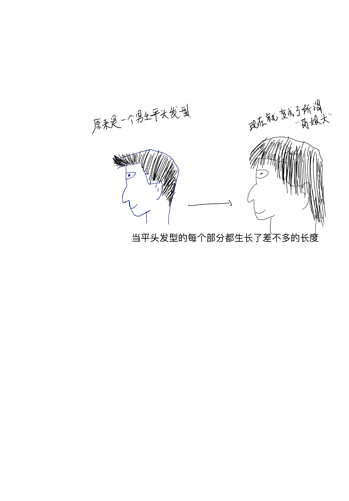
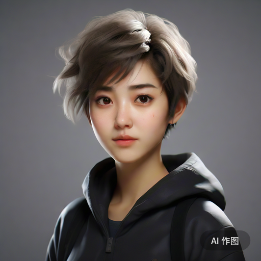

# 头发——女孩子的发型究竟要如何获得

# 0x00 前言
发型对于一个女孩子来说究竟有多重要，恐怕是一件不言而喻的事情。即使是近视到“十米外人畜不分”的人，也能模模糊糊地根据头发的长度来分辨一个人的性别。

可以说，想要成为一个受欢迎的可爱女孩子，我们首先需要从头开始。

如何通过发型给自己的女子力加分，这里我将会告诉你。

# 0x01 男生的头发和女生的头发究竟有什么区别呢
（注：本系列的图片如无特殊说明，则来自文心大模型，GPT-4或者Midjourney，如果你看到很简单的草图，那则是我自己绘制的）

看看这个标准男生的发型，是不是给了你一种帅气，干练，严肃的印象呢？

通常来说，男生的发型分为平头和背头。平头只要拿剪刀剪一剪就可以实现，所以大部分不太注重自己打扮的男生或者学生都是使用的这种发型。这是一种简单、清爽的发型，头顶和后脑勺的头发长度较短，两侧可能稍微剃短一些，整体给人一种干净利落的感觉。平头适合各种脸型和头型，对于凸显男生硬朗的气质有很好的效果。

那么，女生的发型究竟有何特点呢？

通过这两幅图片，我们也许可以得到一个模糊的印象：即女生的头发相对男生更长，而且整体上头发是向下延伸的。但我们需要注意，对于女生来说，即使是短发，通常也远远长于男生的长发。而且，长发通常被视为女性化的象征，给人一种柔美、温柔的感觉。飘逸的长发让女生看起来更加淑女，展现出女性特有的柔美和魅力。

接下来来研究一下如何将男生的平头变成具有女生气质的长发吧！
# 0x02 获得女生发型的必经之路
也许你也听说过一个概念名叫“药娘头”，这个概念或许已经成为了许多对跨性别女生的带有偏见的刻板印象之一。

实际上，我第一次被人说是这个发型时也是很难受的，如果我们参考一下下面这张图，大概也就知道这究竟是怎样一种刻板印象了。

> 

但是我们又会不自觉地开始思考另一个问题：“为什么这样一个让人印象并不好的形容，却几乎是每一位跨性别女生都收到过的评价？“

让我们来剖析一下为什么会这样。请看下图：

这张没有灵魂的草图（因为灵魂都在我这个灵魂画手这里）向你解释了为什么大部分跨性别女生开始蓄发后就会变成所谓的“药娘头”。答案就是，对于男性的平头发型而言，大部分区域的头发长度都是几乎一致的。在生长过程中，头发的各个部位同时生长（后脑勺的毛发优势区生长的会稍快），因此最终如果在不加修剪的情况下，就会形成这种前面的头发长，但侧面的和后面的头发长度却没有长出很多的“药娘头”发型。

**因此，即使我们说“药娘头”是每一个跨性别女生在转换过程中所需要经历的必经之路也没有什么问题。** 出于对我和你们的心理健康问题的考虑，接下来我们将其称之为“转换发型”。

对于一般的顺性别男性而言，如果他们要留长发，也不是仅仅留长就好。他们也需要去找Tony老师进行修剪，以变成符合社会印象的那种男性长发发型。这对于跨性别女生来说毫无作用，因为去修剪那样的发型几乎可以肯定一定会导致我们的焦虑爆炸（没错，这种事情我也亲身体会过，结果也就是哭了整整一天一夜还摔烂了一台手机而已），更何况那样的发型在继续留长以后也无法变成女生发型，因此这条路是行不通的。

但是如果有朝一日你得到了一个转换发型，那么恭喜你，接下来你就有一些事情可以做了。

看看下面这张短发女生的画像吧，你是否觉得这样的发型也可以是一种女生的发型呢？

我们来分析一下这种发型吧。
> 这种发型的总体头发长度并不太长，包含一个斜刘海，头顶的长发蓬松且具有长度，两侧鬓发基本盖住耳朵，后方长度基本上到脖子附近。

诶！！这好像和我们的转换发型有点像诶！

事实上，当你已经有了转换发型，只要头发再长一点（给Tony老师留出修剪和造型的空间），修剪和造型后你也就可以获得这样一个发型了。就像在前言部分，我在2018年11月拍摄的“我可以不用假发出门啦！”那张照片一样。

最重要的是，这个发型经过留长和修剪是可以顺利变成普通女生的长发的！

如果你已经得到了一个转换发型，那么恭喜你，你已经基本走完了这段必经之路！
# 0x03 先看看自己的脸型吧

# 0x04 如何选择一个适合自己的发型

# 0x05 试着和Tony老师沟通！

# 0x06 我能不能自己给自己修剪头发

# 0x07 那些好用的美发工具们

# 0x08 在女生发型的基础上变得更可爱——辫子的巧用

# 0x09 在女生发型的基础上变得更可爱——卷发和直发

# 0x0a 为什么我的发型看起来很怪异

# 0x0b 如何才能和自己的头发好好相处呢？