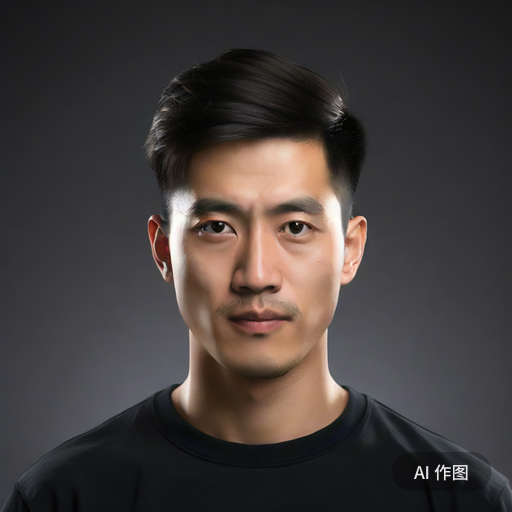

# 头发——女孩子的发型究竟要如何获得

# 0x00 前言

发型对于一个女孩子来说究竟有多重要，恐怕是一件不言而喻的事情。即使是近视到“十米外人畜不分”的人，也能模模糊糊地根据头发的长度来分辨一个人的性别。

可以说，想要成为一个受欢迎的可爱女孩子，我们首先需要从头开始。

如何通过发型给自己的女子力加分，这里我将会告诉你。

# 0x01 男生的头发和女生的头发究竟有什么区别呢

（注：本系列的图片如无特殊说明，则来自文心大模型，GPT-4或者Midjourney，如果你看到很简单的草图，那则是我自己绘制的）

看看这个标准男生的发型，是不是给了你一种帅气，干练，严肃的印象呢？

通常来说，男生的发型分为平头和背头。平头只要拿剪刀剪一剪就可以实现，所以大部分不太注重自己打扮的男生或者学生都是使用的这种发型。这是一种简单、清爽的发型，头顶和后脑勺的头发长度较短，两侧可能稍微剃短一些，整体给人一种干净利落的感觉。平头适合各种脸型和头型，对于凸显男生硬朗的气质有很好的效果。

那么，女生的发型究竟有何特点呢？

通过这两幅图片，我们也许可以得到一个模糊的印象：即女生的头发相对男生更长，而且整体上头发是向下延伸的。但我们需要注意，对于女生来说，即使是短发，通常也远远长于男生的长发。而且，长发通常被视为女性化的象征，给人一种柔美、温柔的感觉。飘逸的长发让女生看起来更加淑女，展现出女性特有的柔美和魅力。

接下来来研究一下如何将男生的平头变成具有女生气质的长发吧！

# 0x02 获得女生发型的必经之路

也许你也听说过一个概念名叫“药娘头”，这个概念或许已经成为了许多对跨性别女生的带有偏见的刻板印象之一。

实际上，我第一次被人说是这个发型时也是很难受的，如果我们参考一下下面这张图，大概也就知道这究竟是怎样一种刻板印象了。

> 

但是我们又会不自觉地开始思考另一个问题：“为什么这样一个让人印象并不好的形容，却几乎是每一位跨性别女生都收到过的评价？“

让我们来剖析一下为什么会这样。请看下图：

这张没有灵魂的草图（因为灵魂都在我这个灵魂画手这里）向你解释了为什么大部分跨性别女生开始蓄发后就会变成所谓的“药娘头”。答案就是，对于男性的平头发型而言，大部分区域的头发长度都是几乎一致的。在生长过程中，头发的各个部位同时生长（后脑勺的毛发优势区生长的会稍快），因此最终如果在不加修剪的情况下，就会形成这种前面的头发长，但侧面的和后面的头发长度却没有长出很多的“药娘头”发型。

**因此，即使我们说“药娘头”是每一个跨性别女生在转换过程中所需要经历的必经之路也没有什么问题。**
出于对我和你们的心理健康问题的考虑，接下来我们将其称之为“转换发型”。

对于一般的顺性别男性而言，如果他们要留长发，也不是仅仅留长就好。他们也需要去找Tony老师进行修剪，以变成符合社会印象的那种男性长发发型。这对于跨性别女生来说毫无作用，因为去修剪那样的发型几乎可以肯定一定会导致我们的焦虑爆炸（没错，这种事情我也亲身体会过，结果也就是哭了整整一天一夜还摔烂了一台手机而已），更何况那样的发型在继续留长以后也无法变成女生发型，因此这条路是行不通的。

但是如果有朝一日你得到了一个转换发型，那么恭喜你，接下来你就有一些事情可以做了。

看看下面这张短发女生的画像吧，你是否觉得这样的发型也可以是一种女生的发型呢？

我们来分析一下这种发型吧。
> 这种发型的总体头发长度并不太长，包含一个斜刘海，头顶的长发蓬松且具有长度，两侧鬓发基本盖住耳朵，后方长度基本上到脖子附近。

诶！！这好像和我们的转换发型有点像诶！

事实上，当你已经有了转换发型，只要头发再长一点（给Tony老师留出修剪和造型的空间），修剪和造型后你也就可以获得这样一个发型了。就像在前言部分，我在2018年11月拍摄的“我可以不用假发出门啦！”那张照片一样。

最重要的是，这个发型经过留长和修剪是可以顺利变成普通女生的长发的！

如果你已经得到了一个转换发型，那么恭喜你，你已经基本走完了这段必经之路！

# 0x03 先看看自己的脸型吧

如果我们看动漫的话，不管是男性角色还是女性角色，他们的脸型大部分似乎都是V型尖脸。就像这样

> 

但是问题来了，现实中好像并不是这样的啊？

## 0x03.A 你的脸型是什么

要回答这个问题，我们需要先想一下我们的脸型究竟是什么样子的。

我找到了一篇很不错的判断脸型的方法，首先我们判断一下自己是什么脸型吧！

<https://www.zhihu.com/tardis/zm/art/146144916>

脸型并不直接决定你的性别气质，但是比较柔和的脸型通常会给人更接近于女性的感觉。

因此接下来我们将会讨论，如何使用头发修饰你的脸型。

## 0x03.B 我们面临什么脸型问题

如果只是单纯的脸型，那确实并不和性别气质直接挂钩。但是，脸部外围形状以外的一些生理特征却实打实的和性别气质相关。

这些不符合性别气质的面部特征大抵如下，对着镜子看看你会不会有什么问题吧：

- 额头扁平
- 眉弓高
- 颧弓宽
- 下颌角宽/有突起
- 脸颊部宽
- 鼻梁高/凸出
- 鼻翼和鼻头宽大
  （本来想画一个没有灵魂的示意图，但是这些区别有点微妙，因此还是放弃了）

既然是脸型和别的女孩子有所区别，那么一个自然的想法就是去拜访一下整形外科医生做点什么手术。不过，脸部的整形手术除了价格高昂，也有着瘢痕，色素沉着，痛苦等风险和不利因素存在。

不过既然是RLE，就让我们从简单的方法开始，尝试使用发型来遮掩一下这些不足之处吧！

# 0x04 如何选择一个适合自己的发型

如果我们使用Google搜索发型，那就会看到无数女生的发型。这些发型大约包括以下区别：

- 长发还是短发
- 直发还是卷发
- 有刘海还是没有刘海
- 头发的颜色
- 鬓角的处理
- 是蓬松的发型还是顺直的发型
- ……

不同的发型会给人不同的印象，同时不同的发型对脸型也会有不同的修饰效果。除了修饰我们在脸型上可能存在的某些缺陷，发型也是我们表达自我（或者说，实现内心对自己的期待）的一种方式，请务必要好好试一试！

## 0x04.A 发型给人带来的印象

### 从我喜欢的百合番海报开始说起……

如果我们审视这张《\~Citrus\~ 柑橘味香气》的配图，不难发现，两位女主角的发型会给我们带来一些第一印象。

柚子的头发是浅色的长卷发，她将一部分头发向后梳并且扎了一个高马尾，同时前方的刘海也更加蓬松并整体上更像一个向左的斜刘海，鬓发长度较短，整体上发型给人一种高扬感，让人能够想象这位女生活泼，开朗，并且似乎不愿意受到太多约束的感觉。

芽衣的头发则是深色的长卷发，她的头发被简单地放在身后，一部分头发可能随着转头等动作跨过了肩部来到前方。她的刘海相对没有那么蓬松，厚度也相对于柚子的为厚。耳朵前面的鬓发较长，已经超出了整个下巴。相比起柚子，芽衣的头发让人看起来更感到沉稳，是一个顺从，严肃的好学生形象。（吐槽：这头发看起来好像我的辅导员……因此我老觉得这个发型不仅土，还很显老）

尽管在现实生活中我们的发型（尤其是发色）不太可能会像动漫那样夸张，但是一些基本的发型所给人的印象是不会有变化的。例如，通常来说：

- 短发女生相对于长发女生更显活泼
- 直发女生相对于卷发女生更显乖巧
- 头发长度中等的女生或许会让人感到知性或者随和
- 尾端带有微微内扣的发型或许会让人觉得更可爱
- 蓬松的发型有时会让人觉得更强势（或者更不羁）
- ……

### 以下是一部分我的不同发型照片，你看了会有什么不同的感觉吗？

> |        发型         |                     照片                      |
> |:-----------------:|:-------------------------------------------:|
> |      短发+斜刘海       |  |
> |     无刘海、中发微卷      |  |
> |     长发披发+中分刘海     |  |
> |    蓬松且微微卷起的长发     |  |
> |   单马尾、齐刘海、放下的鬓发   |  |
> |   空气刘海、单马尾、蝴蝶结    |  |
> | 斜刘海+长发披发（TODO:打码） |  |
> |    空气刘海、中发、微卷     |  |
> |     中分刘海、半披发      |  |
> |     无刘海、中长发披发     |  |
> |       顺滑的披发       |  |
>

## 0x04.B 发型带来的修饰效果

### 女生的发型都有哪些部分

如果你还对0x03.B节中提到的脸部问题有些记忆，现在我们就来解决他们。

作为跨性别女生来说，脸上存在一些男性特点通常是难以避免的。我的脸上主要存在颧弓宽和下颌角宽的问题。

这两个问题如果想要通过整形外科的方式彻底解决，将需要进行削骨手术。幸运的是，除了这个，**头发可以很大程度上掩盖这些问题。**

我是一个怕痛的人，因此我让Tony老师给我设计了一款发型，来解决（遮挡）这些问题。

在此之前，我们需要先了解一下，女生的发型都有哪些部分：

- **刘海** ：刘海指垂在前额的短发，根据头发的方向可分为齐刘海和斜刘海；根据刘海的厚度可以分为空气刘海、法式刘海和厚刘海。并不是每一种发型都有刘海。
- **副刘海** ：副刘海一般来说指的是刘海在从瞳孔外缘到外眼角范围内的部分。副刘海的作用是使得从刘海到鬓发的衔接不那么生硬（比如说，类似于一个直角）。具体来说，并不是每一种有刘海的发型都有副刘海。
- **鬓发** ：所谓“两鬓斑白”就是指的这个部位。通常是刘海的外延，基本上延伸到颧骨附近。有时候鬓发会采用一个比较柔和的造型，但类似于公主切那样锐利的鬓发也是存在的。（也许那种情况下说是耳发也说得过去了）
- **耳发** ：在耳朵前面的一丝头发，最长可以延伸到下巴附近，或者超出下巴。可以自然垂下，也可以做一个向后延伸的造型。（有一种发型没有鬓发和耳发，只有一个短刘海和后面的头发，但那通常来说不是我们可以驾驭的）

没有灵魂的示意图：（灵魂还是在我这个灵魂画手这里）

如果我们将这些部分的位置和我们脸上存在的（可能的或潜在的）缺陷的位置进行对比，不难发现，这些女生的发型简直是天赐的礼物！

- 刘海的位置使其具有遮挡低平的额头和过高的眉弓的潜力。
- 鬓发的位置使其具有遮挡过宽的颧骨的潜力。
- 耳发的位置使其具有遮挡过宽的下颌骨、过于方正的脸型、或者挡脸使得脸显得更小的潜力。你的Tony老师也许会推荐你做一个稍稍向内收或者向后延伸的造型，使其在视觉上更加显得脸比较圆润。

| 刘海和鬓发的类型  | 介绍 | 可以解决的问题 | 示例图 |
|-----------|----|---------|-----|
| 空气刘海      |    |         |     |
| 齐刘海       |    |         |     |
| 斜刘海       |    |         |     |
| 向后卷曲的鬓发   |    |         |     |
| 向内扣收的鬓发   |    |         |     |
| 直的鬓发（公主切） |    |         |     |

对于我们来说，基本上如果想要遮住低平的额头和相对较高的眉弓，刘海是必选项。（但这不是绝对的，例如我在没有刘海的情况下也能看，下文我们只是假定“刘海是必选项”，如果你把头发全部向后梳之后发现额头还能看，那么你也可以不需要刘海。）而鬓发和耳发则可以根据你的修容需求，结合你的脸型进行选择（下一节我将介绍发型和脸型相关的东西）

### 选择属于你的女生发型

接下来，让我们根据自己脸部的特点和缺陷，结合自己对于发型的偏好，选择一个自己喜欢的发型吧！（这里的发型不包括辫子等，只是修剪和造型哦，辫子的使用会在后面的章节讲解——）

但是在开始之前我需要提醒你，例如同样是方脸，跨性别女生的方脸和顺性别女生的方脸仍然有可能突出不同的性别特质。这可能是由于我们的皮下脂肪更少（进而显得轮廓更硬朗，HRT可以在一定程度上解决这个问题），或者是因为骨头更宽，或者想象一个圆角矩形在角直径减小时会显得更尖锐。因此，我个人会建议在选择发型修饰脸型是采取“饱和式攻击”的策略。

如果你的脸型已经是一个鹅蛋脸、瓜子脸或者菱形脸这样比较偏向女生的形状，那么你可以不需要在意头发的修脸效果，单纯考虑你想要什么想的发型就好！

如果你的脸属于方脸，长脸等性别特质相对没有那么女生的脸型，那么可以参考以下列表：

| 脸型  | 推荐的发型                                                                                                                                                                                                         | 有价值的参考链接                                               |
|-----|---------------------------------------------------------------------------------------------------------------------------------------------------------------------------------------------------------------|--------------------------------------------------------|
| 圆脸  | 圆脸的女生的主要烦恼可能还是在拍照时容易显得脸大，但是经过适当的处理，圆脸也可以变成可爱的“小圆脸”。（实话说，跨性别女生应该不太常见到有圆脸的……但是这种不太有棱角的脸真的很女生）小个子的女孩子如果想要极致凸显小圆脸的可爱，一个中分刘海配上中短发会是不错的选择（毕竟小个子的脸再大也是小脸）。高个子的女孩子可以考虑一下带有内扣的中长发，或者带有蓬松的刘海（法式刘海或者空气刘海）的长发发型。          |                                                        |
| 方脸  | 方脸选择发型的时候，本质上还是以增加脸长，减少脸宽，修饰脸型目的。一个延伸到颧骨部分的八字形刘海就能够很好地遮掩方脸叠加上颧骨突出的问题。此外，可以尝试做一个使耳发在下颌骨处向内卷曲的发型，以遮挡过于方正的下颌骨。（但是如果你的脸还没有方到影响性别气质的程度，也可以考虑一下只将头顶的头发弄蓬松来改进一下整体比例。）                                                |                                                        |
| 长脸  | 长脸的女生在选择发型时主要目的是“让脸不要显得那么长”，基于这个思路，特别是在“刘海是必选项”的限制条件下，增加脸的宽度，使得脸的长度相对不那么长就是解决方案。基于这点考虑，推荐选择两侧蓬松的发型，例如卷曲的中发、带有微微起伏（弯曲）的长发、或者带有向内扣收的耳发的发型                                                                       | <https://www.163.com/dy/article/G6F1PJ2P05389TTU.html> |
| 菱形脸 | 因为颧骨相对突出的原因，可能会有不少女孩子发现自己的脸型属于菱形脸。因此，菱形脸女生的发型目标是弱化自己的颧骨，同时想办法拉高视觉的重心（只要把颧骨也变成脸的一部分不就显得脸部线条很流畅了吗！）出于这些考虑，我们可以弄一个稍长且向后延伸的副刘海或者一些碎发稍微遮挡一下颧骨，或者/同时弄一个日本高中女生那种将刘海和鬓发以外的头发通通梳到耳后，以减少耳朵前下方的头发，进而提升整体视觉重心来将颧骨变成脸的一部分。 | <https://zhuanlan.zhihu.com/p/379018737>               |
| 瓜子脸 | 唉，人们常说网红明星都是这种脸型，如果你也是这种脸型，那你就在遮挡自己其他缺点的基础下自由发挥吧，羡慕了。 （你有感受到来自丽塔的怨念吗）                                                                                                                                         |                                                        |
| 鹅蛋脸 | 鹅蛋脸的脸型总的来说线条感比较流畅，同时其本身也不需要过多的修容。如果你不需要刘海的话，略微长的鬓发配上黑长直会是一个很好地选择。一个法式刘海配上弯曲的鬓发和一点点耳发，配上后面的中长发（可以内扣也可以向外弯曲）或者微微弯曲的长卷发的感觉也很不错。斜刘海会比直刘海更有气质，但是千万不要搞一个厚的日本高中女生直刘海配上后面的黑长直，会像我的辅导员一样超级土！                           |

- 我的脸基本上是一个有点长、颧骨略微突出的鹅蛋脸。（最近吃胖了，变成大胖脸惹QAQ）发型基本上是一个法式刘海加上微微弯曲的长直发，颜色是带有渐变的棕色哦！（带有渐变的棕色是自然的，不是染的哦！）
- 发色将在下一个小节内进行介绍
- 上文展示前面的不同，后面的……扎起来都一样

## 0x04.C 女生的发色

感谢基因的多样性，这个世界上不同的人会有不同的发色。但是，由于染发技术的存在，选择自己的发色，并且将其也作为表达自己的一种手段也已经成为可能。

我的发色是天生的渐变棕色，当头发从头顶长出来时，还是相对较深的棕色。随着头发越来越长，这些部分的头发也在阳光和洗发水中逐渐褪色，因此形成了渐渐变成浅棕色的独特发色。

不管你的发色如何，每位女孩子的发色都是一份与生俱来的礼物，也是专属于你的特点之一。

如果你希望通过发色表达你的内心，那么可以考虑一下：
一般来说，黑色头发的女生给人以正经、高雅、疏离的感觉。（试想一下动漫里一本正经的学生会长是不是通常都是黑长直的设定？）
而深棕色的头发，则更容易给人以甜美，温和，优雅的感觉。
浅棕色的头发同样可以拉近和人的距离感，并且更赋予一些活泼，开朗的感觉。

如果你还想考虑更浅的颜色，那么可以参考这张图片：(图片来源请参考水印)

但是需要注意，根据我喜欢染发的闺蜜反馈：

在国际通用染发品牌里，通常把发色明度从黑色到极浅亚麻色分为九个色度；颜色越深，数字越小；

如果你有白发，那么尽量选择5度或5度以下发色；大部分染发通常是6-8度色；

7度以下发色通常是绝大数女生的选择，对发质伤害不那么大，颜色褪色慢，黑发长出来后对比不是那么明显；但如果你想染绿色紫色灰色蓝色系发色，原本的发色必须褪色到8度以上，而且需要做好发质干枯，褪色特别快的心里准备。

非常神奇的一点是，深色系的染发褪色后通常都会变成黄色（黄毛？不对啊女生好像一般都不能黄毛吧x），也许这和染发剂的配方有关系。

# 0x05 试着和Tony老师沟通！

## 0x05.A 继续留长你的转换发型

这并不是一个太困难的过程，需要意识到，留长我们的转换发型只是为了给Tony老师日后创造出修剪和造型的空间罢了。因此，在这段时间里只需要定期剪掉太长的刘海，就基本上足够了（这样的沟通应该不算困难吧？）

如果你担心Tony老师问起更深入的问题，也可以说一说自己以后想要一个什么样子的发型。
例如：
> - Tony：你这个发型好像不太常见啊
> - 丽塔：对啊对啊，我以后想要一个带有法式刘海的微弯长发，现在留长着呢，你有什么建议吗？
> - Tony：那我这回就给你搞搞前面的刘海和耳发吧，后面就等着继续长长。
> - ……

……诸如此类的对话

## 0x05.B 向转换发型说再见
### 选择一个时机
当你的转换发型中，耳后那一丝头发的长度也基本上来到了下巴或者脖子附近时，我们就可以开始思考一下向转换发型说再见了。

虽然此时你的头发还不是很长，但是基本上已经足以修剪一个女生的发型。

如果你想要一个长发的发型，则需要注意这次要修剪一个“留长和修剪后能得到理想中发型”的发型。和你的Tony老师认真讨论这个问题吧！

如果没有相当的经验，**不要尝试自己剪发造型哦！** 特别是涉及到变换发型的时候，由于工程量很大，需要非常具有经验的人才能顺利完成。（但我不认为非常有经验的人会来看这种入门指南……）

### 我会不会遇到一个不理解我的情况的Tony老师？
> 如果一位Tony老师每天可以为大约15个人解决头发问题，他每个月工作25天，平均每个人每个月要见一次Tony老师的话……
> 
> 那么一个社会中每600-700人中就应该要有一位Tony老师。
> 
> 而根据一项研究，患有“性别认同障碍”的男性比例在0.05‰-0.14‰，这也就决定了你几乎不可能遇到一个有处理跨性别女生的经验的Tony老师。
> 
> 但好在，为跨性别女生做头发造型的逻辑和为顺性别女生做头发造型的逻辑没有什么本质的不同，有时候也会有女生的颧骨和我们一样高，有时候也会有女生的下颌角和我们的一样大
> 
> 因此一个受过良好训练的Tony老师是有能力解决这些问题混合在一起的情况的。

不过呢，在你准备出门去理发店之前，我需要在这里给你做一点心理准备。

在大城市的陌生人社会，Tony老师大概是不会太在意你的情况的（相反他可能更在意如何才能给你卖一张卡）。必须承认，存在着Tony老师会在意你的情况的可能性，但是一个有专业素养和服务经验的Tony老师基本上不会问这样的问题。

但是考虑到大部分人对这些问题的了解并不深入，他们基本上最多也就觉得“这个女生稍微有点奇怪”罢了，只要你一口咬定自己是个女生，他们难道还能掀裙子确认不成？

如果你遇到了一个对这些问题有了解的Tony……虽然他们也许一眼就看出来你的情况，但，等等……那岂不是变得更方便了吗？Lucky！

对了，时刻记住，你是付费享受服务的人，在和Tony的关系中，你才是享受服务的那个。因此，绝大部分Tony都会顺着你的要求完成工作，**不要担心会尴尬！**

如果你很担心，则试着找一位擅长给女生做头发的Tony吧！通常来说和女生打交道比较多的人也会比较理解女生的想法呢！
### 如何选择理发店和理发师
第一次修剪女生发型终归是一件大事，如果选择了一个技术不太过硬的理发店，那么原本满怀希望的剪发行动也有可能变得充满失望。因此，寻找一个技术过关的Tony就十分重要。

请相信，找到一个技术过关的Tony并不是一个十分困难的问题。

如果你有一个关系比较好且理解你的情况的女性朋友，那么这个过程将会变得更简单。她大概率会知道哪位Tony的技术比较好。（其实就是她试过许多店后最后决定常去的那位）

但如果你和我最初的情况一样自闭，也不要太过担心。打开你的手机，下载一个美团，我们可以根据一些特征来锁定附近靠谱的理发店。

> 当然不是让你随便选择一个分数高的理发店啊，这有可能是刷分的

剪发通常并不需要非常复杂的工具，因此这很大程度上是一个看Tony手艺的事情。也许会有一些手艺很好的Tony分散在居民区的不知名小店内，且收费并不高昂。但这毕竟需要一个试错流程，而你的第一次剪发是一个大工程，也就是说，机会只有一次。

换一个思路，我们从市场角度考虑，如果一个高端上档次的理发店没有技术过硬的Tony，那么他们就注定会在市场竞争中失败。因此，我们可以用市场的思路解决这个问题：找一家经营正常且口碑良好的中高端理发店。

以下方法是我试过几次的方法，基本上没有出现过失误（因为大学期间搬过很多次，也遇到过常去的Tony离职的情况，因此换过很多家理发店）

一般来说，满足以下特征的，通常是一个比较靠谱的理发店：
- 市场因素：如果他们做的不好，就无法在这种因素下生存
  - 位于相对繁华的地段，或者商场内
  - 规模大，发型师团队人数多
  - 开店时间足够长（基本上可以参考美团/大众点评/口碑的“收录时间”）
  - 有连锁店
  - 有专门的休息区：在商场里租一个能放下休息区的店铺可不便宜，生意不好的这么干估计都要倒闭罢
- 设施、人员因素：满足这些因素通常有可能表明更好地水平
  - 使用Dyson吹风机：Dyson吹风机不是最好的那个，但绝对是辨识度最高那个，且价格远远超出一般的吹风机。使用Dyson吹风机表明了这家理发店的实力和对服务的追求。
  - 发型师中有女性：女性发型师相对稀少，也更受到女性用户追捧。愿意招募女性发型师的店面通常需要具有一点实力。
  - 有专职接待人员：说明这家店的客流量较大。
  - 有预约系统并且能看到有较多客户预约：说明这家店有数量庞大的常客群体。
  - 有完善且透明的价格体系。
  - 即使充值也不会得到巨大的优惠（最多充1000送200）：可能受到成本限制，且至少可以过滤掉打算骗一波充值就跑的情况（侧面反映长期经营方针）

如果你选择了这样一个理发店，那么接下来如何选择你的Tony呢？

答案就是：选择一个“总监造型套餐”。

一个成熟的中高端理发店内，“总监”通常指有8-10年工作经验的造型师。这些Tony的经验相比起一般的Tony经验更为丰富，并且有更大的可能性受过专门学校的教育。
> 我第一次剪刘海时的Tony甚至能在镜子上用白板笔画一个造型示意图！比我强太多了
> 

因此，在有理发店的水平作为背书的情况下，你可以试着相信他们选择造型师的水平，和他们的服务意识（剪就剪，问那么多干嘛？）

### 如何向Tony老师传达我的想法
好了，现在你已经选择了一个Tony老师并且决定好了自己想要什么样的发型。那么接下来的任务就是向Tony传达你的要求。

对于自己发型的期待，每个人都有独特的表达方式。但无论采取怎样的表达方式，你大概可以采取以下几种策略：
- 纯语言描述法：直接告诉Tony你想要的发型。例如”我想要一个不要太密的法式刘海发型“。
- 灵魂画手法：将你想要的发型画下来，然后拿着你的画像Tony说明。
- 照片参考法：在网上搜索你想要的发型，然后将图片给Tony看。（但是你的脸型和模特的脸型未必一样，也许在她那里好看的发型在你这里不一定好看。因此，找一个和你脸型接近的模特很重要。）
- 比比划划法：用手指出“我想要一个大概这么长的刘海，耳发基本上到这个位置，……）

在你表达你的要求后，你的Tony可能会根据你的情况给你一些建议，因此你也可以在你的要求后面加上一句你对整体发型的期望，例如“我想要一个稍微可爱一些的发型”。

Tony会采用多种方法向你展示你的发型的效果，例如使用手或者夹子等工具做一个临时造型，或者直接在镜子上画图等等。

这样的流程可能会循环几次，直到你们就“究竟要做一个怎样的发型”达成一致。

### 其实理发也可以Omakase

> 正片开始！

看了上面的指引，你是不是觉得“这家伙讲的也太学院派了吧！我怎么会知道那么多东西嘛！“

如果你有那些感觉，那么你大概和我差不多，属于是对自己没有什么想法的人。实际上，上面的经验是我在第一次剪发后逐渐积累起来的，到了RLE第三年甚至差不多第四年的时候才开始使用的经验。（但难保会有些天才能够理解自己的发型嘛）

也许有的人吃过日料的omakase，即“お任せ”，一种只提出大概要求和费用预算，然后将一切委任给厨师，让厨师凭借他的专业知识制定菜单，自己只等着吃的形式。

嘛，实际上对于头发造型这种事情，只要选到了一个水平过关的造型师，咱们也可以来一场Omakase嘛！

对于我来说，剪发大概就只有一个模模糊糊的概念，即“可爱的女生好像都有刘海，那我也要一个刘海吧”，仅此而已。

然后Tony大概从我的话里提取到了“刘海”和“可爱”两个关键词，然后他就开始了他的设计和讲解。

讲解完毕并且达成共识后，正式的理发流程就开始啦！（对了，还说了我之后希望继续留长头发）

……

最后的效果就是我出了理发店还自恋的自拍了好几张……

### 你为之付费的不只是剪刀，还有知识

如果说我们在理发店中付费的是理发服务，那么很多人就会自然而然的觉得，为了找“总监”而增加的费用就是为了“总监”的知识买单了。

但事实有时候不仅仅是这样……

如果你找了一位总监理发师（指比较友好的那种）为你进行造型，那么你同时还得到了一个学习打理头发的技巧的机会。例如：
- 卷发棒的用法
- 直板夹的用法
- 刘海的吹法
- 刘海的梳法
- 如何使用发胶、发蜡、定型喷雾
- ……

现场教学的效果大抵会比在B站看视频更好吧？毕竟你可以互动，可以调整角度方便观察，甚至在一定程度上可以实操。

这些也是你为之额外支付的价值！千万不要漏掉了！

（至于下次这些东西不问了是不是很亏？问题不大，如果以后只是单剪刘海的话一般都有优惠价的！）

# 0x06 我能不能自己给自己修剪头发

# 0x07 那些好用的美发工具们

# 0x08 在女生发型的基础上变得更可爱——辫子的巧用

# 0x09 在女生发型的基础上变得更可爱——卷发和直发

# 0x0a 为什么我的发型看起来很怪异

# 0x0b 如何才能和自己的头发好好相处呢？
