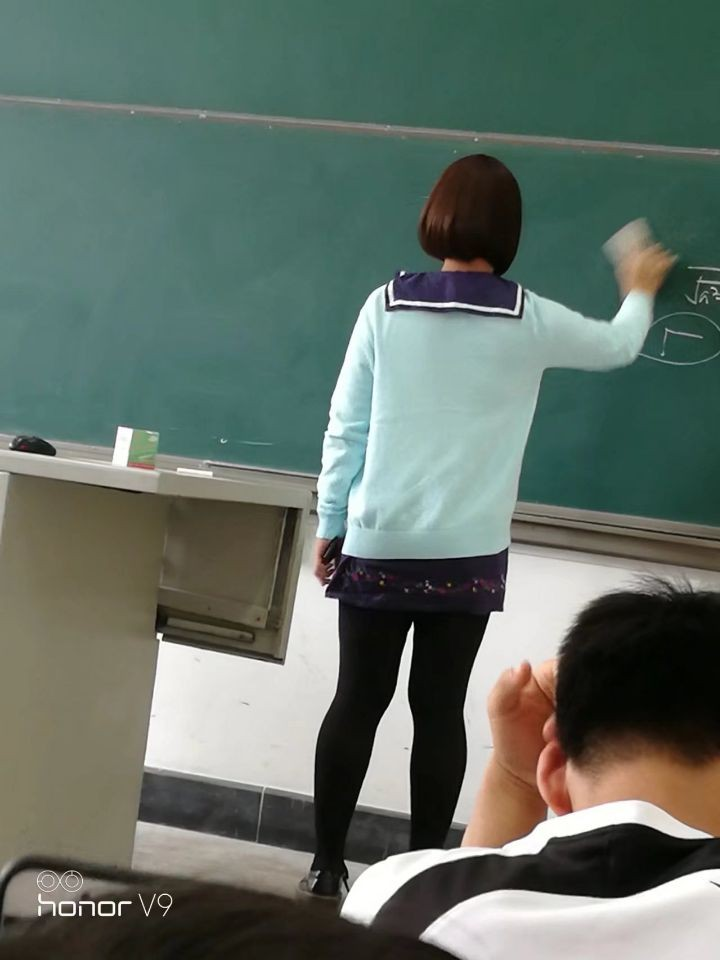
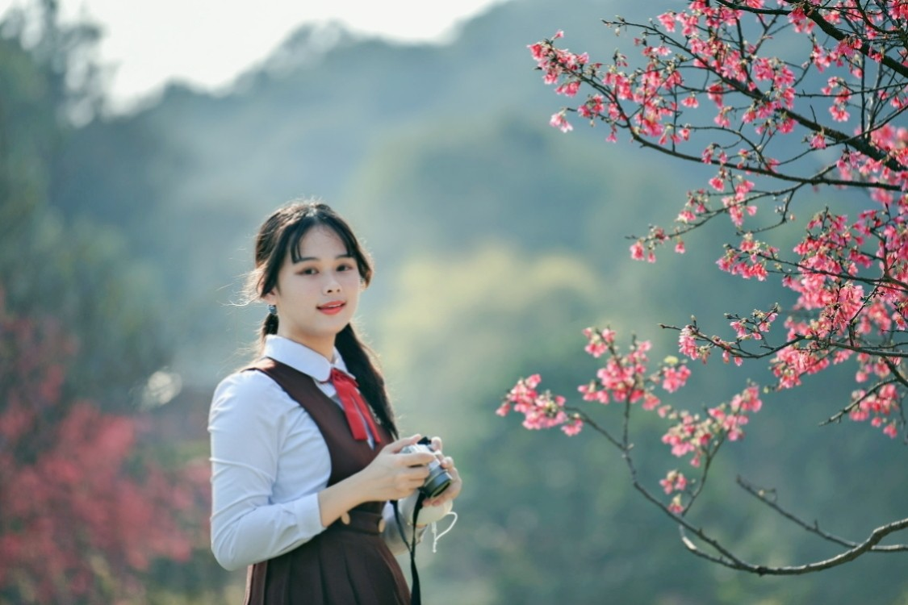
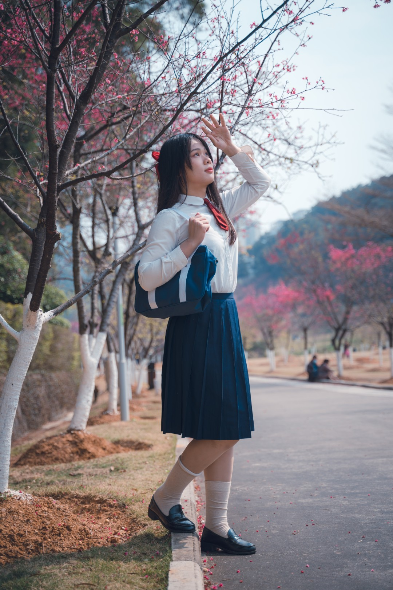
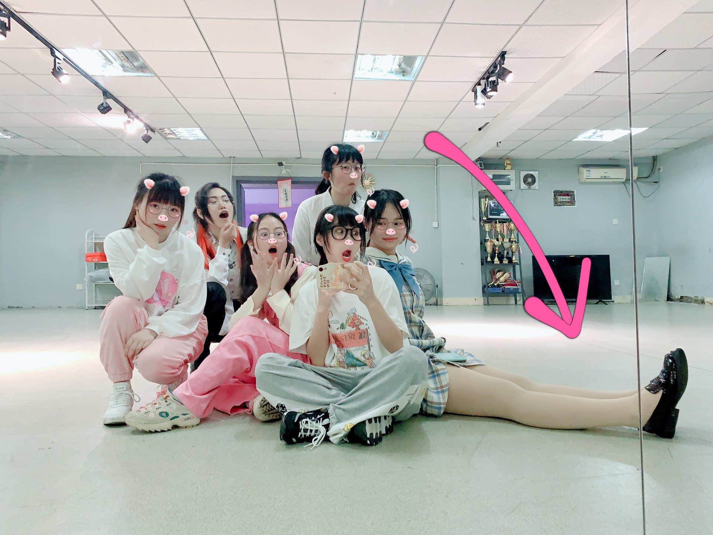
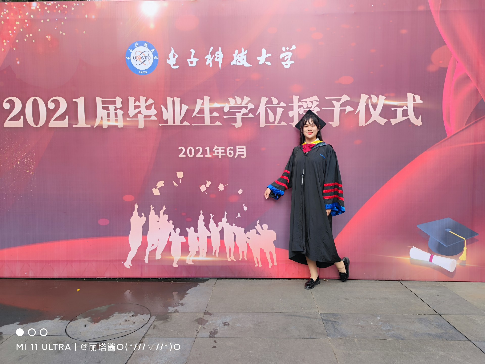
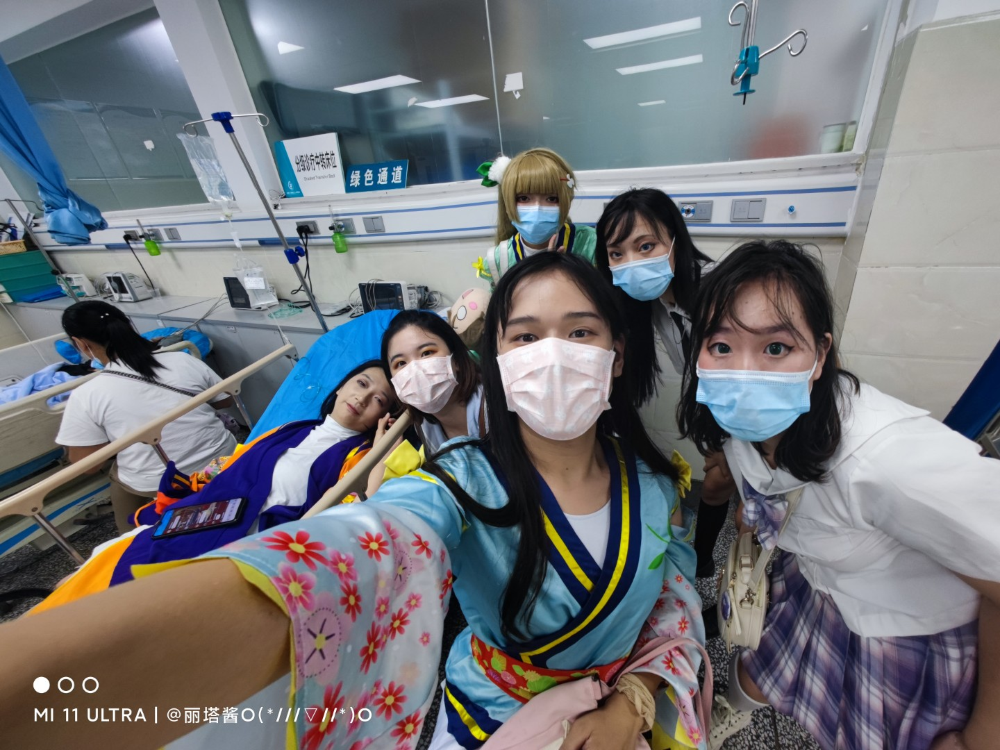
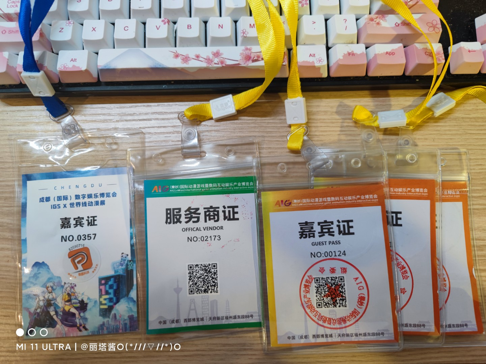
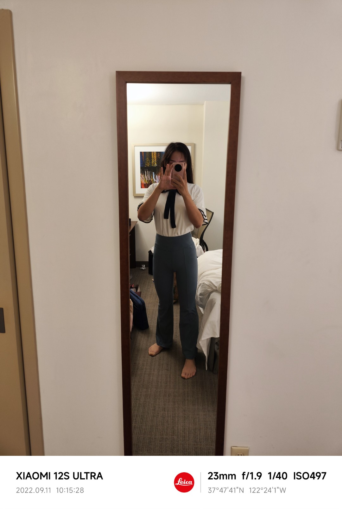

# A guide to become a welcomed girl 女孩子的修行之路 —— 前言

## 0x00 写在前面
**你好，初次见面，我是丽塔。**我和绝大部分看到这里的你们一样，我们都是跨性别女生——没错，就是那种遗传学上应当属于男性，但是认同自己是女生的情况。

要说起跨性别女生和普通的女生有什么不同？我的答案是没有什么不同

也许你不会相信，但我要用我自己告诉你，这真的是可以做到的。

我和大部分的跨性别女生没什么不同，甚至情况还要更糟。最初在初中时我就意识到了自己的性别认同存在问题

……

但我一直忍耐到了大学，直到大学的生活将我脆弱的忍耐一触即溃。

**我也曾经有过非常焦虑和抑郁的时期：**
- 在成都地铁2号线上情绪失控大哭引来站员，但其实连我自己也不知道为什么会这样
- 曾经在晚上喝下过两瓶啤酒喝一板头孢呋辛酯片，然后被辅导员拉到抢救室（哦，我还酒精过敏）
- 在一个人的夜晚砸坏了电脑，摔烂了键盘
- ……

**也有过非常不pass，甚至在身边人眼里看起来就是笑话的时期：**
- 曾经住在男生宿舍，因为穿裙子出门而被围观；
- 因为女装上课被教授叫起来写题，回到座位上后发现所有的群里都是自己的照片；
- 第一次在脸上抹了隔离去学生会开会，结果被部长问“你今天为什么要化妆，你要女装吗？”；
- 第一次参加动漫社舞见部活动，因为跳舞不好而被部长临时换人
- 班级综合素质互评等级F（全班最后，不合格）
- 等等等等……

我曾经问过我的心理咨询老师，**“我真的能补上缺失的，作为女孩子这一课吗？”**

**她温柔地笑着告诉我，“当然能，你不比其他的女孩子差“**

……

**只有四年的时间，毕业时回望我的大学生活，我：**
- 获得二等奖学金
- 动漫社活动跳舞最多的人
- 组织动漫社舞见部活动（视频拍摄企划）
- 电子科技大学三坑同好会会长
- 女生宿舍裙子最多的人（之一）
- 多次在漫展作为舞见和摄影嘉宾（虽然是不会给钱，只给门票的小嘉宾）
- 参加Bilibili Dancing Festival拍摄
- 参加大创项目
- 参加实验项目并且每月领取津贴（比硕士生的还要更多）
- 软件学院第一个拿到双学位的人（软件工程，和工商管理）
- 辅修法学
- 认识校内校外大量的女生朋友
- 等等……

实践证明，有一些看起来只有女孩子才能达成的成就，跨性别女生也是一样可以达成的。**扔掉内心的自卑，相信自己！**

# 0x02 本系列要回答的问题
我们中的每个人在第一次意识到自己的性别认同存在问题是，也许都会在瞬间闪过许多问题：
- 我会不会看起来很奇怪
- 大家能理解能接受我吗
- 我能做些什么
- 我能做到和别的女孩子一样吗
- 我该怎么办
- 是否有人可以帮助我

如何让我们的社会性别变成女性，如何让别人把我们当做女性看待（而不是“不是男生但也好像不全是女生”的看法）？这就是本系列要回答的问题

# 0x01 我会写些什么
本系列我将分为以下部分：
1. 头发——女孩子的发型究竟要如何获得
2. 化妆——可爱的女孩子们都做了什么
3. 服装——如何选择一套适合自己的服装
4. 嗓音——这可真是一个让人头痛的问题
5. 医学的力量——有时候你可以借助整形外科的力量让自己变得更加可爱
6. 社交——不仅要成为女孩子，还要成为受欢迎的女孩子
7. 尴尬时期——安然度过尴尬时期的小技巧
8. 自信——成为真正的女孩子的最后一步

在这些部分中，我将尽可能从最简单的内容开始，通过最简单的任务，一点一点帮助你找到变可爱的方法。

每天向着理想的自己靠近一点点，最终我们都将变成受欢迎的可爱女孩子哦~

# 0x03 需要说明的地方
因为这是我自己的经验的总结，我无法保证这样的经验适合每一个人。但是根据许多不同的跨性别女生的经验，我将会尽量总结出共通的部分。

虽然说本系列文档是如何成为女孩子的教程，但将会主要聚焦在RLE，回答如何在RLE时就把自己变成一个受欢迎的女孩子的问题。

HRT和SRS的内容将不会涉及，这方面内容请参考mtf.wiki。

本系列的文字总量可能会很大，我将会分批次更新。

# 0x04 丽塔

Twitter @lita_0x01

B站 丽塔丽塔丽塔塔

QQ lita001

附图：按照时间排序的精选相册，感谢一路上陪伴我走来的所有人。
> 2017年5月 毕业典礼
> 
> ---
> 2017年9月 大学入学
> 
> ---
> 2017年11月 第一次女装
> 
> ---
> 2017年12月 第一次尝试拍写真
> 
> ---
> 2018年4月 第一次女装漫展
> 
> ---
> 2018年4月 第一次上课女装（同学拍的）
> 
> ---
> 2018年4月 因女装上微积分课被教授叫去写题
>  - 这个前文提到过
> 
> 
> 
> ---
> 2018年7月 华盛顿大学交换生（美国人的拍照技术真是烂透了！）
> 
> ---
> 2018年9月 买了一个新的假发！
> 
> ---
> 2018年11月 我可以不用假发出门啦！（话说有些东西的发育是不是有点明显？）
> 
> ---
> 2019年5月 自信地行走在校园中
> 
> ---
> 2019年7月 上班通勤中的OL（其实是中国电信实习生）
> 
> ---
> 2019年8月 和家人一起在影楼拍的照片
> 
> ---
> 2019年9月 想去B站打工
> 
> ---
> 2019年10月 社团活动是女仆咖啡厅！
> 
> TODO: 给Yuki打个码
> ---
> 2019年12月 学校里的银杏这么漂亮。怎么能不拍一张写真呢？
> 
> ---
> 2019年12月 另一张银杏写真（这次拍得就像百合结婚照一样xxx）
> 
> TODO: 给无恙打码
> ---
> 2019年12月 准备动漫社晚会上台！（其实早就不是第一次上了）
> 
> TODO: 给檀姒打码
> ---
> 2019年12月 新版丽塔，上线！（刘海才是本体啊）
> 
> ---
> 2020年2月 公园里偶遇老法师（于是有了这张照片）
> 
> ---
> 2020年5月 在新公司的第一次下班（有工卡的感觉好棒）
> 
> ---
> 2020年6月 不就是上个班吗
> 
> ---
> 2020年7月 参加宣传片拍摄（话说这个照片里就没有一个女生啊！）（指我当时还不是女生）
> 
> - 宣传片：百度mojito
> - 因为宣传片都公开了，打码就省了吧
> ---
> 2020年8月 进行一波嫩的装（我的高中校服好看吧！）
> 
> ---
> 2020年9月 今天开始发配女生宿舍（这腿是不是拉太长了）
> 
> ---
> 2020年9月 练舞的日常
> 
> ---
> 2020年10月 JK制服同好会会长和会员们的聚会
> 
> ---
> 2021年2月 家乡的樱花也很美
> 
> 
> 
> ---
> 2021年3月 就我腿长
> 
> TODO: 给其他人打码
> ---
> 2021年3月 一次集体录舞
> 
> - 公开的照片，就不打码了
> - ---
> 2021年5月 又尝试了一个新风格
> 
> ---
> 2021年5月 毕业前最后一次动漫社晚会
> 
> ---
> 2021年5月 和千本露露一起录舞（话说露露居然是咱学姐？！—)
> 
> ---
> 2021年6月 该向心爱的电子科技大学说再见了
> 
> ---
> 2021年6月 感谢刁静老师3年间的陪伴（是心理咨询老师）
> 
> ---
> 2021年10月 宅舞比赛结束后的合影居然是在抢救室
> 
> ---
> 2021年10月 嘉宾证的合照
> 
> ---
> 2021年11月 诶！她就是我的女朋友吗？
> 
> ---
> 2022年2月 5点钟的火车站……异地恋有时候就是要起早贪黑
> 
> ---
> 2022年3月 海马体的照相技术还是值得信赖
> 
> ---
> 2022年5月 这里是京都大学
> 
> ---
> 2022年6月 镰仓的风可真是太过于喧嚣了
> 
> ---
> 2022年8月 铁道厨之魂被点燃了！
> 
> ---
> 2022年9月 差点在美国遭遇性犯罪（呼，好险！）
> 
> ---
> 2023年4月 我校的樱花简直就像动漫里的一样
> 
>  
> ---
> 2023年4月 Hello Kitty新干线！
> 