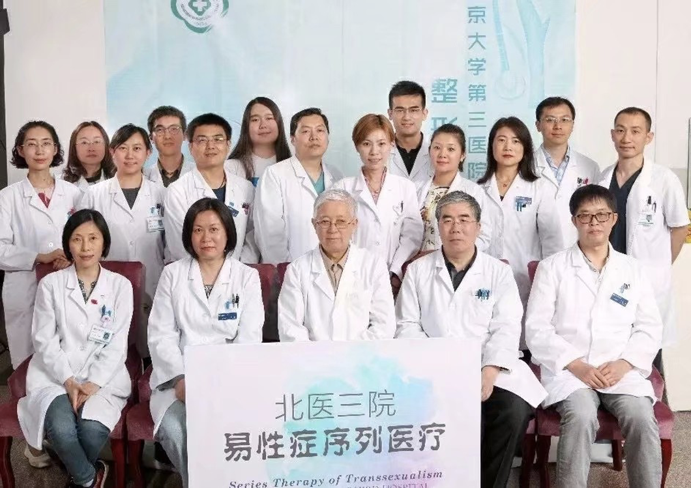
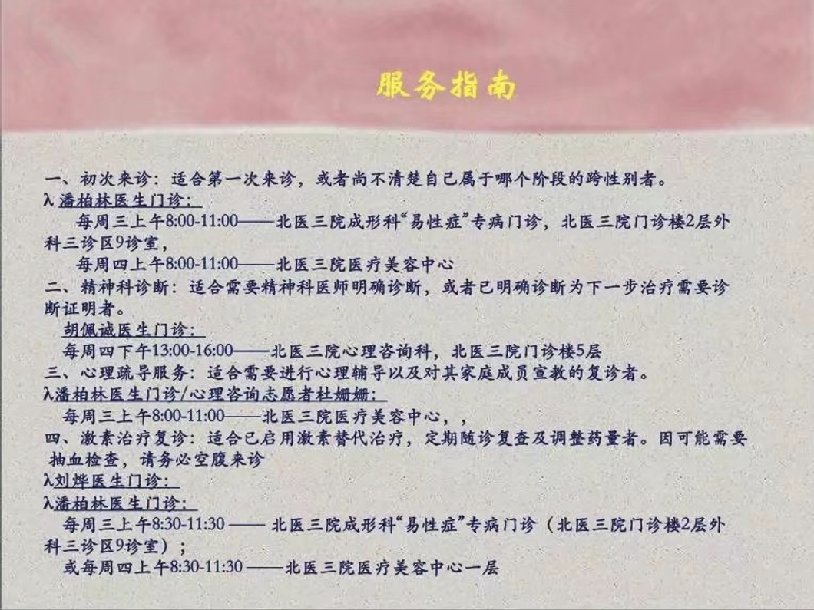

通过药物改变身体与内心, 缓解性别不安.

::: warning ⚠️
使用药物是一件非常危险的事情, 请考虑清楚再做决定.
:::

> **性別不安** (gender dysphoria) 是一个人因为出生时的性别指定而遭受的痛苦. 在这种情况下, 性别指定不符合该人的性别认同, 并且该人是跨性别. - [维基百科](https://zh.wikipedia.org/wiki/性別不安)

## 找寻自我

### 测试量表

当你开始思考自己是否患有 **性别不安** 时, 你可以通过测试量表帮助自己 **初步印证** 这个想法. (量表只是帮助判断的一种辅助手段, 仅供参考)

- bsri: [中文](https://www.psy525.cn/ceshi/84500.html), [english](https://www.psytoolkit.org/survey-library/sex-role-bem.html)
- ct-gri: [中文](https://www.idrlabs.com/cn/gender/test.php), [engilish](https://www.idrlabs.com/gender/test.php)
- osri: [英文](https://openpsychometrics.org/tests/OSRI/)

### 咨询朋友

## 天赋测试

皮肤

头发

伪声

## 就医

::: info 编者注

医疗部分内容依文章原样提供，RLE.wiki 不为以下信息提供任何担保与反馈。

相关信息请参考[MtF.wiki](https://mtf.wiki/)。

:::

- 北京

  在北京大学第三医院里存在着以整形科潘柏林医生, 内分泌科刘烨医生为首的易性症序列医疗团队, 在拿到了精神科的诊断之后就可以去潘柏林医生那里进行HRT方面的手续了, 不过可能会需要 (和家长) 签署一系列的医学文件, 之后就可以“合法”的开到一些激素类药物.

  
  

- 上海

  - 上海精神卫生医院

    星期天填卡, 附近有汉庭, 周一排队挂陆铮. 建议五点钟就去排队. 18岁没到不给转到陆峥, 心理咨询的大楼.

- 南京

  - 南京脑科医院

    提前一周 7:30 网上挂号, 或到医院挂号 (网上可能挂不到号, 直接去更保险), 说 '挂下周一下午失眠科陈建国的号'. 证明最后盖章需要推荐信, 或在校证明.

[中国俱备开性别焦虑证明的医院和医生 - TransLives](https://www.translives.net/baike/wiki/content/16)

开证明的理由: 说服家长, 开药, 手术. 如果有其它问题可以询问医生.

### mmpi 心理测量表

- 任何指数 60 以上不正常.
- mf 值 75 以上确诊患有性別不安 (异性症).
- mf 值 100 以上基本没有心理治疗可能, 建议进行手术.

如果数值很高, 可以要求医生写下: '心理治疗无法改变这种倾向, 建议手术治疗'.

## 激素治疗

::: warning ⚠️

一旦开始激素治疗, 请做好将来处理睾丸, 或做性别重置手术的准备. 如果你不希望走上这条路, 请不要激素治疗.

:::

### 使用激素

到正规医院 **内分泌科** (周末可能挂不了), 咨询用药, 购药信息. (或加入 [mtf 交流群](./3#本地群))

**举例**: 拿出异性症证明, 给医生说开补佳乐.

**激素种类**: [FTM/MTF的激素种类 - TransLives](https://www.translives.net/baike/wiki/content/141)

**注意**: 应尽量购买当地的合法药物. 不建议购买进口药物, 质量安全无法保证.

**医院外激素购买方法**: 部分在线药房, 线下药店可以不需要处方购买雌激素, 国产抗雄激素可以在使用 [药房网](https://www.yaofangwang.com) 购买, 如果需要处方可以上传白纸.

[中国大陆跨性别群体激素干预获取情况调查报告.pdf](https://s3-us-west-2.amazonaws.com/secure.notion-static.com/8ee0a8f7-3818-434e-98b6-12858d726d3a/.pdf)

### 激素测试

到正规医院 **内分泌科** (周末可能挂不了), 给医生说要测 **性激素六项**. 如果资金缺乏, 可以只测 **睾酮**, **雌二醇**. 如果医生问为什么, 直接说自己是跨性别者 (易性症).

**注意**: 体检前一天的晚 20:00 以后不要吃东西, 早上不要喝水.

睾酮 0.1 - 0.5 ng/mL

雌二醇 50 - 200 pg/mL (如果注射激素会更高)

https://zhuanlan.zhihu.com/p/21932142

## 其它疾病

### 生理疾病

**骨质疏松** 症状: 半夜出汗 治疗方法: 补钙

**掉皮** 治疗方法: 补充维生素b12

维生素片千万不要买保健品，要买国药准字. 含量更多, 监管更严格.

[跨性别医学院](https://www.notion.so/52237fd492624eca999f14b898d4df20?pvs=21)

### 心理疾病

如果注意到自己有任何心理不适, 请及时就医服药, 进行心理咨询.

::: warning ⚠️

抗抑郁药物不可自行停止服用, 应听医生建议服用. 停药, 更换药物时应慢慢减少之前药物, 不然有可能导致情绪产生较大波动, 病情恶化或终身服药.

:::

**服药期间禁止开车, 喝咖啡, 饮酒.**

**如果服药超过一个月没有效果, 需要再次就医说明情况并换药.**

scl-90: https://www.psy525.cn/ceshi/84307.html

#### 心理医生推荐

[臺灣 性別友善精神科醫師名單.pdf](https://s3-us-west-2.amazonaws.com/secure.notion-static.com/cb078d36-7ed2-4229-badb-b8d67ee1ca1d/.pdf)

[目前已知与性别认同相关的医疗资源列表 - Transgender-lost-years](https://github.com/Kristall-WangShiwei/Transgender-lost-years/blob/master/0002_Medical/Medical_Resources/目前与性别认同相关的医疗资源列表.md)

[全国友同、恐同医院、医生及咨询师名单 第8版 190520.xlsx](https://s3-us-west-2.amazonaws.com/secure.notion-static.com/1f59b8ea-0edf-4125-9b01-89032a90b9e3/_8_190520__.xlsx)

## 尾巴

做自己想要做的, 要证明给父母和别人看, 我们能够照顾好自己. 对于这些, 时间是最好的说明, 我们不是生来就漂亮的, 但是我们敢于改变自己. - [来源](https://zhuanlan.zhihu.com/p/29652966)

**特别感谢**: [然然](https://www.zhihu.com/people/xiao-ran-ran-35-66)

## 参考引用

- [为什么会选择变性？？泰国大学生变性的心路历程 - 知乎](https://zhuanlan.zhihu.com/p/29652966)
- [关于跨性别者——性别置换手术的经验分享1 - YaYa施雅欣](https://www.bilibili.com/video/av66350370)
- [关于MTF手术后荷尔蒙疗法的二三事 - YaYa施雅欣](https://www.bilibili.com/video/av54179359)
- [FTM/MTF的激素种类 - 就是甜筒](https://www.translives.net/baike/wiki/content/141)
- [Surgical Reconstruction for Male-to-Female Sex Reassignment - surgeryinmotion](https://www.youtube.com/watch?v=R9TGQIP-VLg)
- [MTF激素治疗的典型变化 - TransLives跨性别人生](https://www.translives.net/baike/news/84)
- [性激素六项 - TransLives跨性别人生](https://www.translives.net/baike/wiki/content/184)
