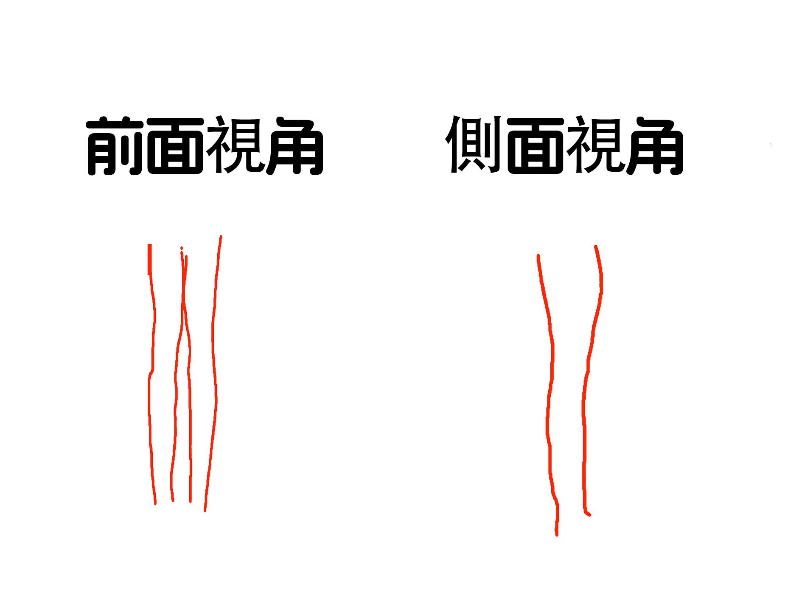

## 线条

请看以下示意图：

如图所示

- **在前面视角**，腿部在大腿至小腿关节处，大腿外侧有一定的斜度，而内侧则为直线型，小腿外侧稍微突出成弧形，再到脚踝成直线型，内侧则为直线型
- **在侧面视角**，后侧大腿到关节处有一定的斜度，小腿下面成弧形，前侧，大腿至关节处成弧形，小腿成直线型

## 如何形成这样的线条（如何从大象腿逆袭）

### 大腿：

如果大腿是肉肉比较多的话，可以平躺在床上（**记得腰部垫个枕头**），腿抬起来做开合运动，这样可以有效燃烧大腿部位的脂肪（**可能会很难受**，但做多几次就可以了，**前几次腿伸不直很正常**，**腿只要有点抽筋的感觉就是可以的了**），一天两次，每次30秒，可以有效消除大腿部位的脂肪，达到瘦腿的效果

### 小腿：

**有氧运动**：如慢跑、快走等，有助于消耗小腿脂肪

**瘦腿捏揉法**：沐浴后涂抹纤体服液，用双手拇指、食指和中指揉搓小腿肌肉群

**筋膜枪放鬆**：使用筋膜枪按摩小腿，可以放鬆肌肉，使腿部肌肉视觉上变得修长

**小腿做完运动一定要放鬆训练，不然就会越来越粗**

#### 为什麽会越来越粗：

- 肌肉增长：运动时，尤其是跑步、骑自行车、举重等锻炼小腿肌肉的活动，会导致肌肉纤维受到刺激，产生微小损伤，身体会产生修复反应，使肌肉纤维增长，从而使肌肉变得更加健壮，使小腿看起来更加粗壮
- 水肿：长时间站立或坐着会导致血液循环不畅，引起水分在腿部积累，造成水肿，使小腿看起来变粗
- 脂肪堆积：如果日常摄入高脂肪、高热量的食物较多，并且运动量较小，可能会导致脂肪在腿部堆积，使小腿变粗

### 小腿外翻处理：

- 姿势调整：保持正确的站立和行走姿势，避免外八字或内八字行走，长时间站立或行走后适当休息，避免腿部肌肉过度紧张。选择有良好足弓支撑的鞋子，减少对小腿的不良影响

- 功能锻炼：通过特定的锻炼来增强小腿内侧肌肉群的力量，如靠墙站立、蹲起运动、平板支撑等，有助于改善小腿肌肉的不平衡状态。进行腿部和髋关节的柔韧性训练，如瑜伽中的腿部拉伸动作，可以增加关节的灵活性，进一步促进外翻的矫正

- 佩戴矫正器具：对于青少年患者，若骨骺尚未完全闭合，可以通过佩戴矫形支具来矫正小腿外翻。矫形支具需要根据患者的具体情况进行定制，并在专业医生的指导下佩戴和使用

- 物理治疗：在专业按摩推拿医师的指导下进行手法矫正，通过按摩和推拿来松弛膝关节外侧的副韧带，促进膝关节内外侧的稳定结构恢复。电疗和热疗则可以缓解肌肉紧张，促进血液循环，对矫正小腿外翻有一定的辅助作用

- 手术治疗（不建议）：对于成年患者或外翻程度非常严重的患者，可能需要在专业医生的指导下进行手术治疗。手术通过截骨并重新固定骨骼，以纠正小腿外翻的畸形，术后需要按照医生的指导进行规范的康复训练，以促进恢复和避免并发症

- 生活方式的调整：改善日常生活中的不良习惯也是矫正小腿外翻的重要一环。选择合适的鞋子，避免高跟鞋或过于紧窄的鞋子，保持正确的坐姿和站姿，都是有助于减缓小腿外翻的措施。适当的体重管理也可以减轻腿部的负担，从而改善小腿的形态

## 心理支持

在这个过程中可能会很艰难，但是一定不要放弃，在将来不远的一天你会成功.

