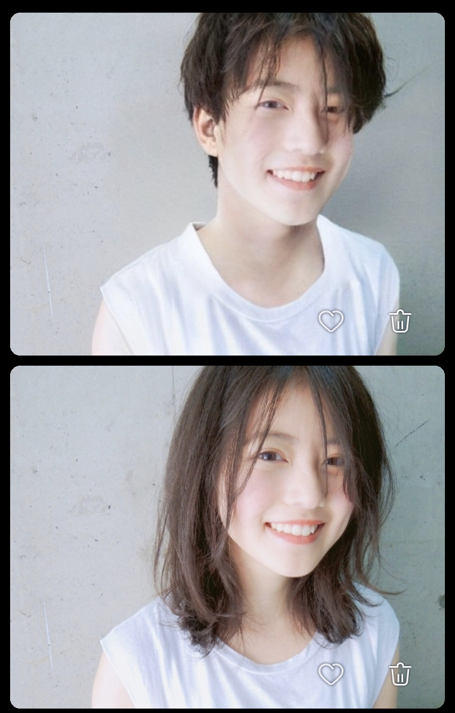

本文的RLE期望可能和你不同, 以下仅代表个人观点, 仅供参考

建议RLE时最好同步做到心理女和生理女

在我写这篇时, 我已经尝试女性身份生活1年, 生理女两年半

建议在rle前先练好女声
声音会影响自己对自己女性程度判断进而影响行为

## 明确目的和对象:

### 日常生活

RLE应该首先关注尽快在社会生活中实现女性身份, 即成为**普通女性**的一员

而不是成为**网红**(这需要好看的衣服和精致妆容, 摄影设备), 因为这并不是大多数人的**日常**

调整心理预期, RLE不是为了模仿或成为谁, 过度地追求精致好看, 这可能无法实现

唯一能做的只有走好自己的路, 并 用普女的**标准,** 而不是网红的标准要求自己

如果你想试着变漂亮, 你可以先做好普女, 再去尝试漂亮

如果你不这么做, 你可能会在被触发性别焦虑时面临极其严重的心理落差

### 迫切目标

你会因为各种和顺女,或者是一个目标之间的不同而GD

但如果这些焦虑在顺女中也普遍存在(比如身材焦虑) ,就不应该纳入RLE的范畴:

这些东西实际上并不是解决”男/女”问题, 而是试图在”女”的基础上过得更好

#### 我们首要解决男女辨识的问题和焦虑:

### 女相焦虑:

跨女和顺女 (以经典瓜子脸少女为例) 的主要不同点:

#### 1面部骨发育: 可有下颌角宽大, 下巴长, 颧骨高/太阳穴凹 ,眉骨突出…

**基因、性别、成骨破骨动态平衡 → 骨形状 大小 强度 的不同**

eg: 
基因: 亲姐妹两个人都是鼻骨偏左
性别: 姐弟二人中男的一般更高更大

后天骨改变: 

1、超强度健身导致骨强化和适应性形变、2、骨经常受力受损导致该处坚硬变大、骨上一点受到额外力导致该点处骨增厚凸起（这些变化按月以上积累时才会发生
最常见的有长期的高负荷健身、小时候习惯性托腮扶额这种）

在亚洲男性大多骨头突出而女生不会, 但是女生照样有一些满足条件的.而欧洲这样的女生就更多了
所以这其实**无关性别判断**, 只能说**骨相**影响人们对你的**印象**

骨头凸出会怎么样呢? 
自拍的时候你会发现脸棱角分明、晚上室内光源在你头顶的时候, 你的眼眶光线会被挡住眉骨挡住,留下阴影, 此时表情看起来很恐怖

骨相基本没有办法改变, 骨体积是按年来缓慢改变的, 如果你试图缺钙, 它只会塌缩而不是萎缩
整容手术改变效果有限, 价格昂贵而且风险很大, 不推荐首先考虑.

#### 2面部脂肪/总肉量(女相重要因素):

很多男性由于**脂肪分布**的性别差异或**体重不足**, 导致比如眼睑下没肉扁平, 两颊凹陷, 下颌显方等

而顺女的脸大都很**饱满圆润**, 此外身体其它地方也到处存在这种差异.

骨肉的关系: 互相衬托, 例如骨大/肉少, 总体感官=干瘦, **棱角分明**

pass的预后: 如果小时候比较胖或发育不良, 一般女性化后也更接近顺女

#### 3典型男性特征(几乎不在女性中出现):

眉毛黑粗倒三角、喉结突出、胡青…
眉眼距, 眉间距, 这些也会影响感觉

#### 4人们如何判断和认可你是社会女性:

有长头发 + 长相偏女/无男特征 + 女声(不假) + 其它辅助人们判断的要素(衣服饰品性征化妆等)

(你的行为和思想也要都是女生才行,这个后面说)

性别的判断其实是极其主观的

只要满足上面的**一部分**条件, 其它影响认可的因素比如具体的身材、长相、行为举止、言辞在庞大的范围内都是可以被忽略的(具体取决于你有多女)

我们可以看到其实有很多女星在面部的1和2上都不少女, 但由于她们有4且化妆, 所以一样被人们认为是好看的女性

头发有多重要? 你可以试试把女生头像上的头发都去掉, 看看她可不可以有男生版的形象, 有很多人其实把头发一换就能换个性别

图为 日本小姐姐 今田美樱   如果她作为男性出生, 就会是上面这个模样

### 美丑评价

#### 其它影响美丑评价, 但基本与性别无关的面部特点:

**五官**分布,也就是鼻子嘴眉眼的具体形状大小分布, 长成人群的平均值的五官最受欢迎

黑眼圈、鼻周脂溢性皮炎(泛红暗沉)、痘痘痤疮、脸太黑、皱纹、脸唇苍白/不红润(女性大多自带红润) 等 由于熬夜激素色素**健康状态**等导致

凸嘴等,属于**医学**上的面部问题,需要矫正

眼镜框耳环等**装饰**

如果你照镜子觉得自己并不好看,也有可能是这些原因导致

另外,手机拍照不能完全拍出真实的长相和场景, 特别凸显骨相, 要拍可以用相机, 拍摄时的光影条件特别影响效果

#### 自我评价的主观性是很强的:

困的时候、心情差的时候看自己不好看

早上有精神地起床、 生理周期中雌激素高涨时, 看自己好看

在自我心理暗示为男/女时, 看自己的长相也可能感觉自己很男/女

(比如刚刚被夸美丽、刚刚又觉得自己被当作男的对待了)

#### 近距离看自己和远距离看自己不是一个感觉

比如你贴着镜子看自己你会看到很多细节和瑕疵,看自己的脸更圆(角度遮挡)

远距离则是整个面容的缩略和整体形象. 这时候人们只会看重点

如果要改变自己在他人心中的形象,可以着重看自己在社交距离及远距离时展现的形象

只有亲密的人才会在30cm以内的距离看你,而她们都和你亲密了也不会太在意你具体的长相!

(同理适用于衣服,衣服好不好看,主要看一定距离之外的情况)

### 主要身体焦虑:**

身材问题几乎无法改变,只能接受. 但它正如前面所说不是主要性别判断因素.

#### **身高&脚码:

北方女性中高个子和大脚更常见, 实际上这并不多稀有, 可能十几个里面就有一个特别高的

别人只会觉得你比她高, 或者看你脚不小, 但是具体的尺码差异从人的感觉上来看区别并不显著

除非你是2m高 46脚 的女生, 进地铁都要低头, 我在我学校就见过一个

#### 高个子可以当可爱的女生吗?

答案是可以的, 世界上并不是只有白幼瘦的那种精致娇小的可爱

像小女孩一样保持乐观和爱, 也是一种可爱的精神.
举个例子: [https://www.bilibili.com/video/BV1icDdY7EEx](https://www.bilibili.com/video/BV1icDdY7EEx)

假设你现在刚开始RLE,  你很期望遵循一直以来形成的印象而去打扮, 但这些都是白幼瘦jk, 和你的条件不匹配, 你可能去这样打扮但是结果却不够理想

那怎么办呢? 你需要的是情绪焦虑的缓解, 当你对自己满意时焦虑才会缓解
你可以网上找合适你条件的装束打扮, 平时也不要再只看白幼瘦了, 这样的审美其实是很单一的

如果你是想要被爱, 那么打扮可能并不能让你真正得到满足, 你需要找到可以爱你的人才行

#### 肩宽感受:

大部分女生正面看,脖子宽度和”减去脖子的正面最宽宽度”比是1:1-1:2.5

另外去掉胳膊的宽度<=臀部最宽宽度.

驼背含胸会夸大视觉大小. 另外穿男装会让人觉得肩膀更宽

要挺胸抬头,但是光抬头不行,你可能处于前伸的状态, 还需要往后摆

出门在外千万不要低头驼背!!! 顺女几乎很少有驼背的, 你驼背可能会显得区别明显

注意,如果存在拘谨,防卫,害怕被看到喉结的潜在心理,可能会自然产生驼背, 抱胳膊,低头等动作 , 需要纠正

#### 皮肤差异:

年轻女性总体皮白皮薄(擦一下就能流血)、体毛无或稀疏, 另外有颜色差异

这其中基因占主要一部分, 其它的根据激素, 生活习惯而不同

再然后就是可以做一些额外操作, 黑就美白或者化妆, 毛多就脱掉, 这就是当代美人税了

---

#### 进阶目标?

争取排除所有男性成分,行为和思想, 就好像顺女一样. (让一切过去好像都不存在?)

弘扬女性美好品格,传递美好

#### 最终目标

我们的最终目的是:

消灭心理和身体外表不一致的情况, 不会再焦虑自己是不是女性, 日常生活中不会再注意到自身性别的存在

实际上当你能够接纳自己作为[不完美]的女性存在时, 你的焦虑可能就不剩多少了

## RLE实践细则:

### 蓄发:

头发长到齐肩需要1年左右, 出门最好梳一下避免炸毛

头发是一个巨大的粘灰尘、烟味等的载体

在路上看见有人烧垃圾, 进房间发现有人抽烟等, 赶快跑、北方冬天晚上没事别呆在外面(不然你会沾满煤炭味)

就算沾上十几秒, 你的头发也会留下一堆味儿,然后让你不开心. 我刚洗的头啊!

关于洗头, 确保大量洗发水都应该用在头发上, 而不是头皮

其实洗涤剂会严重损伤头皮, 轻则脱皮出油重则出血 而且还掉头发

你可以类比下每天用洗涤剂洗手, 手可比头皮皮肤厚多了,而且出油量极少. 洗几次手就干了, 然后粗糙脱皮,再厉害点手就开始疼,然后渗血了

在过去没有洗涤剂公司时, 人们5-10天才洗一次, 每天洗这样的观念正是那些洗发水公司一步步推动的

一般女生雄激素低都不会油头, 但如果你一直用洗涤剂搞破坏皮肤的脂膜, 这样你会疯狂出油, 而如果你的办法就是选择再洗一遍, 如此循环, 然后就出现了传说中的脂溢性皮炎, 这时候各种细菌真菌也进来掺和一脚, 就有了各种症状

如果你本身免疫系统比较脆弱, 那日常生活习惯就能导致头皮问题, 更不必说洗涤剂雪上加霜了

头皮有油是正常的,  对于这部分用水冲洗是比较好的, 同时尽可能避免洗涤剂对皮肤的直接接触

女生洗头费时间多了,如果你过去存在过度清洁, 考虑改变一下清洁策略吧

#### 刘海修剪:

首先在额头正中间往上把头发分开露出发缝,然后梳头发再剪

日常:眼睛以上的头发最长到眉毛不扎眼睛, 两边头发在低头时不会贴到脸碰到嘴影响吃饭

### 个人卫生:

#### 上厕所:

即便还没手术也应该和女生一样蹲着或坐着上厕所, 这样尿液不会飞溅到你的鞋子或者地上到处都是, 小便后要用纸擦一下余尿, 以防污染内裤

因为如果你是顺女或者做了有深度手术, 这样的习惯会帮助你避免感染

#### 毛发处理:

#### 拔毛:

使毛发一段时间不会显露,去除皮下黑青, 容易感染, 如果你经常上火发炎, 别拔

嘴边拔过的区域可能会时不时发红发炎, 可导致其它周边区域毛发刺激性生长

拔小腿容易内生毛长在肉里

#### 激光脱毛: 

一次只能除一点点正好在生长期的毛发, 需要长期坚持..

#### 刮毛:

没事不要随便刮非永久性毛(汗毛 细黑毛等) 这将导致它们进一步变粗变黑变长(不要问我怎么知道的) 一些体毛会随着雄激素降低而自然消退的.

### 衣服:

在满足**日常**服装的情况下,自选款式即可

选衣服可以考虑一下你周围人的穿着, 如果你选了一个特别华丽的衣服, 你就是整条街最靓的女.

如果存在身材问题,也可以通过衣服来改善**视觉效果**

比较好看的穿搭都是内外好几层的, 单穿不会那么好看

比如衬衫+马甲+披风+领结=一个好看的jk上身

推荐买容易穿脱的衣服, 不容易拽到头发, 而且热了冷了都能随时方便地调整

在颜色方面: 色彩不单一不冲突即可. 你可以多穿几个颜色看看自己适合啥色, 比如我适合紫色但不适合棕色. 你会很明显的发现你穿某个衣服的时候和其它情况比起来就显得很好看
如果不是特别pass, 不建议外穿黑色上衣, 这样会不容易看出你的头发的存在

一般女生的衣服口袋都特小而且穿的紧, 存在**为美观而牺牲实用性和穿着感受**的情况

而且同样质量价格更贵. 还有一些鞋子属于看着漂亮但是穿着难受,纯属服美役

买衣服优先考虑生活实用, 钱多了再美

在从未rle前, 你可能会因为出于焦虑而在第一次买衣服时就看重强烈女性色彩的衣服, 比如jk

正如前面所说, jk不一定会满足你的期望, 更可能会让你失望(你可以看看买家秀中普通女生无p图穿上的效果) .  网图都是后期精修的, 现实是没有那么美好的

你真正需要的体验只需要普通衣服就可以满足

#### 季节:

男生只需要少穿衣服就行了，而女生考虑的就多了

生理女体脂高,**夏天几乎必穿高透气衣服**, 比如纱裙 透气短袖 不然你会热疯的

但透气很多意味着透光也很高, 这样人们可以直接看到你里面穿了什么, 就算你不穿内衣,也会露点

所以建议如果很透就直接是黑的或者颜色较深的, 但是黑色在太阳底下热的最快, 可以打个伞

或者可以穿的少一点, 露出腋窝, 背, 和腰, 腿子, 不过这样男的看到了就会那啥, 尤其是不发达地区, 容易遇到危险

生理女会怕冷,**对环境温度更敏感**, 女性舒适温度一般都比男性高个几度

举个例子是空调房/火车里开的空调,可能男人觉得刚刚好,你就得盖个衣服

所以平时多关注天气变化, 出门要看天气和温度变化, 尤其是温度变化大, 不规律的城市

有时候突然下雨了或者白天不冷晚上冷, 这种时候出门建议带一件薄衣服

#### 内衣:

如70A, 数字表示底围 , ABCD大致表示乳房厚度. 底面x厚度=乳房实际大小≠视觉大小(主观感受)

大部分文胸都带海绵垫, 这会显著增加视觉大小

内衣主要起到的就是个支撑作用, 戴上之后其实不是特别舒服

需不需要内衣辅助首先看你的大小, 文胸A以下不需要穿, C以上可能建议穿, 据说自重太大可能形变

以及有没有运动需求, 一般如果平时不怎么运动, 乳房靠自己支撑就行

bra的选购, 如果要找到适合自己的最好不要网购, 而是去线下试穿

检验bra是否合身的步骤首先是看容得下的你胸, 没有偏, 也不能太紧, 其次做点动作看看罩杯有没有位移, 吊带等有没有位移或者其它地方卡着难受, 然后看运动起来晃不晃

我有外扩吗?

医学上的**外扩**是你的胸不垂直底盘而往外长, 而不是胸底盘靠近腋窝, 另外如果肋骨骨架是凸的看起来也很像.胸小则根本不用考虑

实际上这是看起来乳房靠两侧而不集中的现象, 在女人中很常见, 也许现在的**主流氛围**喜欢挤乳沟,  但它是会变的, 今年热卖聚拢, 明年就吹外扩的美, 再弄一波产品, 资本想割谁谁就是不美的

#### 化妆

化妆就是**用手或者各种工具在脸上绘画**

总体思想是, 提亮x补色x遮瑕 → 符合审美的好看女性肖像

化妆品中

**粉底**用于提亮全脸 (#容易裂开干皮或者让你过于苍白, 涂全脸会让你很显眼,需要控制用量和色度)

**眼影腮红口红**主要用于提升气色

**高光和阴影**用于凸显和掩盖棱角/视觉大小、遮蔽个别黑斑等

好的化妆可以让一般面容的人变成网红脸, 网上有大量美妆博主会分享妆前后的对比,可以看看 (但是要注意有些人会为了节目效果故意扮丑)

化妆之后,  如果亲密距离看是可以看到你脸上的粉的
但远距离印象、拍摄 等情况都会变得好看, 因为:

- 粉底和各种红 解决了远距离饱和度下降的问题 并且突出重点 更加引人注意

- 修容解决了光影和视觉大小的问题 ( 比如 骨凸出、鼻型 等问题 )

教程上总是喜欢画全妆, 粉底涂一脸, 这种需要花费较长时间而且时间长了要不断补妆, 卸妆也比较麻烦

日常为了简单基本都是淡妆, 浅浅遮个瑕提个色, 而且也不容易被看出来

化妆品是油性物且成分复杂, 可能导致**皮肤问题**

如果化妆不是日常生活中的刚需, 可以不进行

### 女性日常和经历:

**小红书**是最好的接触女性世界和日常生活琐碎的方式, 前提是你不要看美女等无关的内容

在这里你可以

- 了解女性的生理生活常识、学习化妆剪头发拍视频等

- 了解到女性在社会上面临的普遍问题

#### 安全感危机:
租房、点外卖 、走夜路 . 在这些情况遇到坏人或者恶意, 可能每几个女孩子就遇见过至少一次

还有更常见的坐地铁遇到流氓上手, 偷拍,  路边遇到口头骚扰
还有专门针对女性的恶意群体存在

#### 力量差距带来的负面事件:
中年男犯错看见你是女性不承认错误还骂你,来了男朋友就突然老实了、莫名其妙遭受恶意的眼光. 甚至是袭击

看见你可爱有礼貌就侵害你的利益, 比如一些商人漫天要价缺斤短两

#### 男性霸权的现实压迫:
处处是基于男性的视角建立的社会规则,知识理论, 工业产品, 活动策划, 政策、大数据算法 等等
比如: 被当成花瓶, 歧视能力, 录取比你更差的男性、汽车碰撞检测用的是男模型、办活动让女性跳热舞给领导看、婚姻政策偏袒男性利益(大龄剩男问题)、短视频首页推送全是擦边 、负面新闻如果是女性就特别去掉, 如果是男性就用某人…

男性无法共情这些遭遇, 因为他们从生理和身份上都不会遇到这些情况

而在雄激素的驱使下, 上述很多的场景在他们看来甚至是让他们感到兴奋的

…

这个世界是不美好的, 但还是有很多美好的女孩子

我们要互相帮助, 传递美好

让更多的女孩子参与社会建设

### 日常行为

#### 生理女后的运动习惯

在长期回避运动+生理女(且保持雄激素在女性范围) 1年等情况之后

你会在有一天突然发现自己的心肺跟不上运动的强度了

又或者同样上个6层楼, 你以前能一口气快速上去, 现在爬一半还得歇歇

你的体力已经大不如前, 要注意调整日常运动的习惯

#### 走路步态

男性走路的典型特点是有股劲儿, 每一步都往前晃一下 , 夸张一点的,踮脚走路,好像要跳起来一样

走姿没必要模仿, 你会发现像男人一样走路是一件很累的事情, 所以只需要找最舒适的走法就好了

### 第一次作为女生的心理问题:

#### 社恐:

始终担心自己被别人注视和怀疑, 尤其是觉得自己带有男性气质、不好看等情况时

#### 在这种状态下你会根据”对自己的判断”来暗示自己”别人对你的态度”, 比如你觉得别人都用异样的眼光看你, 但实际很可能并没有

但其实别人出门都不关心这些，都忙着自己的事, 见了你也最多瞟一眼

除非你非要站男生宿舍门口, 这样路过的人都会多看你一眼

或者站在特别闲没事干的大爷大妈前面, 不过人家看着你留长头发一般都会叫你小姑娘

如果近视可以把眼镜摘了, 看不见不知道就=没有

#### 自卑:

在做回自己的过程中可能时常是自卑的

你可能会因为自己不够女而**打退堂鼓**, (甚至尽管已经被认为是女生了, 但是自己并不理想)

纵容/允许自己保留一部分过去的男性内容,  甚至开始怀疑自己的想法: 真的要这样做吗? 自己是不是非二元

(明明你都理智决定要做女生了, 但因为临时情绪变卦又犹豫了)

比如因为现在还是有一些男相, 继而**表现出适应男性身份的举动来避免被特别关注和指责**

这样的心理可能造成你的社会女性化过程迟迟不能取得进展

彻底排除男性内容和时不时就出现几个男性内容的生活是存在很大不同的

如果你的初心是做回一个绝对的女孩子, 那就必须鼓起勇气接受现实(或者忽略它), 不要受到心理阻碍的影响, 继续你的女性化过程

在顺女中长相偏男的还是有的, 她们其实一样处在这种尴尬的局面

关于自信的反复摇摆问题 (比如自己的长相总是想让别人来评价,不能安心)

#### 不相信自己的判断,  总是不断寻找外界对自己的判断, 寻找一些能证明自己还好的证据

你期待从别人口中听到夸赞, 可如果你真听到好话可能又觉得ta只是在客气

除非你真的从别人的反应中发现自己在变好, 实际上你希望的不是别人的话而是别人的反应

你希望听到中肯的评价, 对实际有帮助的建设性建议,但是很少有人可以为你这样做

如果别人的话和反应是故意恶意的呢? 你会很难过. 有些人专门喜欢喷人发泄,或者看别人难过, 不要理会这些坏人,情绪不要受影响

#### 如果你有形成自己的判断, 你受别人的影响就会很小

比如你一直观察到别人的反应都很平淡,  你对自己有把握, 这时候你不会轻易因为别人的看法而动摇

#### 情绪危机:

性别焦虑可能充斥着负面情绪

情绪可以被事物和激素**引发**也可以**主动寻求**, 如果你**一直沉浸**在情绪中你可能会**越陷越深**

当你处在这样的状态中, 你可能只会哀伤而**不做出实质性的对自己有益的行为**

尤其是面对那些你觉得可能无法改变的事实, 这些可能让你很伤心并且想要删号

这是一个**恶性循环**, 你难过并且花费大量时间, 然后再感到不开心, 就再花很多时间去体会难过, 悲伤时间越来越长, 甚至占用休息时间, 久而久之就生理性抑郁了

也许最开始悲伤情绪体会是你主动寻求, 但之后的发展可就不会受你控制了

在你无法控制之前你需要**认识到并且停止**这样的沉浸行为, 一定要**尽可能远离**任何可以触发你焦虑的环境和条件

#### 循环问题:

一旦陷入负面循环, 要打破的唯一方法就是**做出改变, 让自己变好并感到开心至少1处**

仅靠自己做出改变会非常困难, 因为你已经在自我恶性循环了, 导致你很难坚持几天, 应该**试着寻找外界互动,** 比如你需要人不间断地真实真诚地夸你/给予帮助, 这会**让你重建信心**

只要**至少有一处**你有信心的地方, 你就不至于觉得生活没有意义很灰暗. 如果有更多, 你会产生**主动变好**的意愿, 当你做这些事时你的心情会很好.

当你**做出一些**让自己变好的事情后, 你的**内源信心**就会开始重建

接下来就是**正向循**环, 能不能形成取决于**他人的鼓励和支持**, 以及你自己**发现积极因素(在积极视角)和 赞扬/肯定认可 自己的习惯**.

如果你本身习惯对任何情况都是**负面视角,** 做事也都是平淡无感, **没有外界干预或其它吸引**的话, 你就会在短暂的欣喜中渐渐失去动力和信心, 什么都不想做, **长期上始终重复落入负循环**中

---

## 我的日记

从小到大既不想和男生玩, 也没有勇气主动找女生玩, 习惯了一个人

直到大学, 在外面走路还是低头环胸, 害怕女生们看到自己, 也不敢看她们, 靠近就更不必说了

人际关系只局限于对方的单方面, 自己座位相邻8格

小时候喜欢看少女题材动漫, 对这种特别感兴趣, 比如甜心格格, 淘气小甜心, 还有小学发订的漂亮画册

初中时总是幻想无数种变成女生的方法, 但最终还是被电脑游戏吸引了注意,没有继续深入了解, 更没有上网去搜, 如果当时去网上搜索了自己的想法, 今天我会变得不一样吧

一直到高中快结束, 当时伪娘刚开始火,我心里羡慕, 之后又刷到了变性手术, 我就知道我一定要手术了

从小受到的灌输让我下意识讨厌这种想法和人,  但是它最后还是没有战胜我对变成女生的渴望

我开始第一次在心里把自己称为女性, 并且试图这样要求自己, 尽管最开始有些不适

大学第一年封校,为了吃药出柜, 之后买了个假发, 第一次直视镜子仔细看自己, 自拍, 放到变脸软件上看女版自己的样子  (RLE后你会发现 这些预测一点都不准!)

然后就是疯狂的试图学习rle的知识, (学到东西甚少, 今天这里的内容几乎全是我的经验而和那些东西无关)

到一年半的时候才开始穿女装, 第一次买的是绿色的华夫饼阔半袖, + 浅蓝色女款牛仔裤, + 帆布鞋

因为特殊情结买了双蓝色调粉配镶钻的鞋, 但到现在没敢穿出门

那时候头发还不到肩膀, 加上不会打理, 说话不稳定 , 还有男的会坐我旁边或者跟我说哥们

人生第一次体会到幸福, 但是焦虑还没有结束, 我还是总是想成为别人

她们光鲜亮丽, 有人去爱, 家庭和睦, 生活富足, 有完美的身材和姣好的器官, 声音甜美, 可以随心所欲地表现自我, 可以像光芒一样给别人带来温暖. 而我什么都没有

一年后, 头发又长了一大截, 学会了简单的刘海修剪

这一年

经历过火车人脸过失败, 银行人脸失败, 工作人员都不认可我和证件是同一个人

女声开始知识系统化之后, 练习进步很大, 再也不用使用男声了

深夜emo刷小红书, 体会共情

衣服购买和内搭开始遵循女生常见的颜色

越来越多次遭遇顺女坐在我身边, 从最开始如坐针毡, 到现在习以为常

由于我们现在是一样的, 对顺女也不再是不敢直视, 不敢靠近了

再加上最近放下了对自己的各种要求, 现在已经不那么容易发生性别焦虑了
