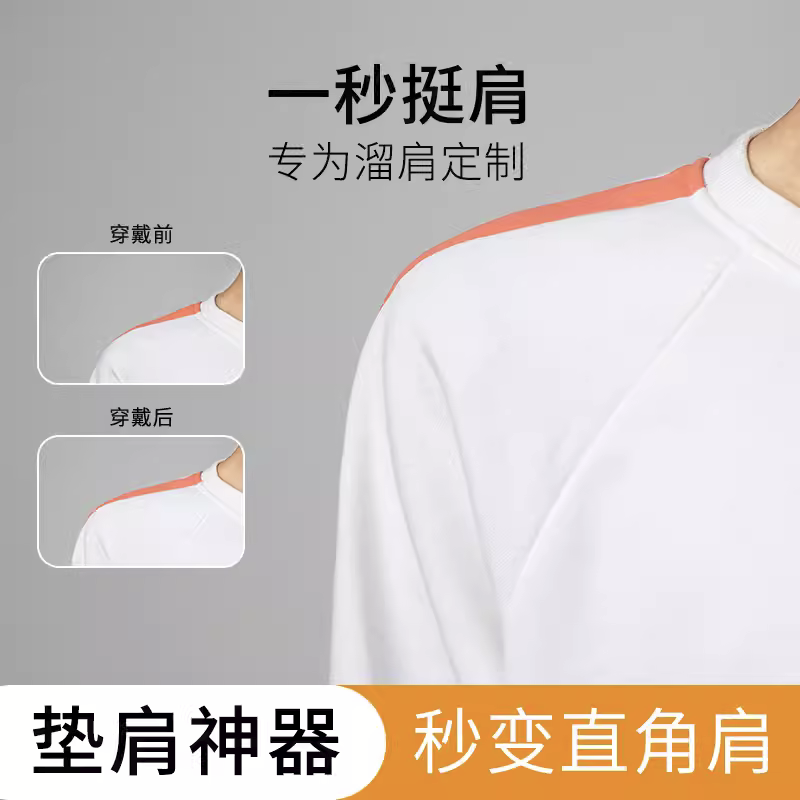
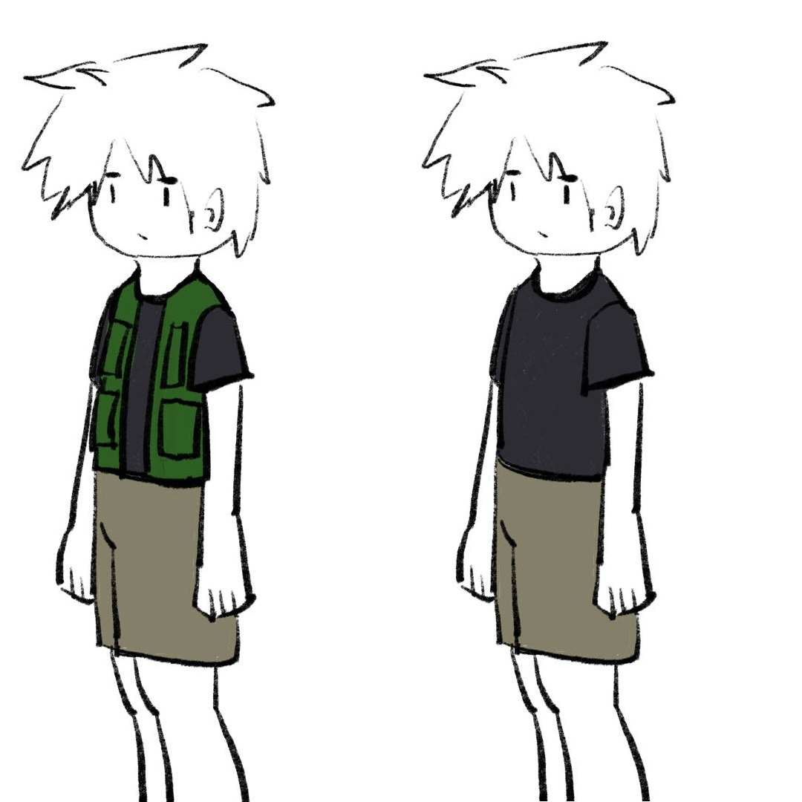
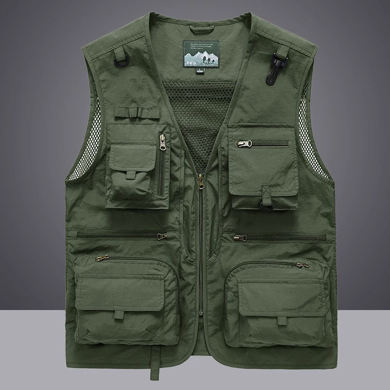
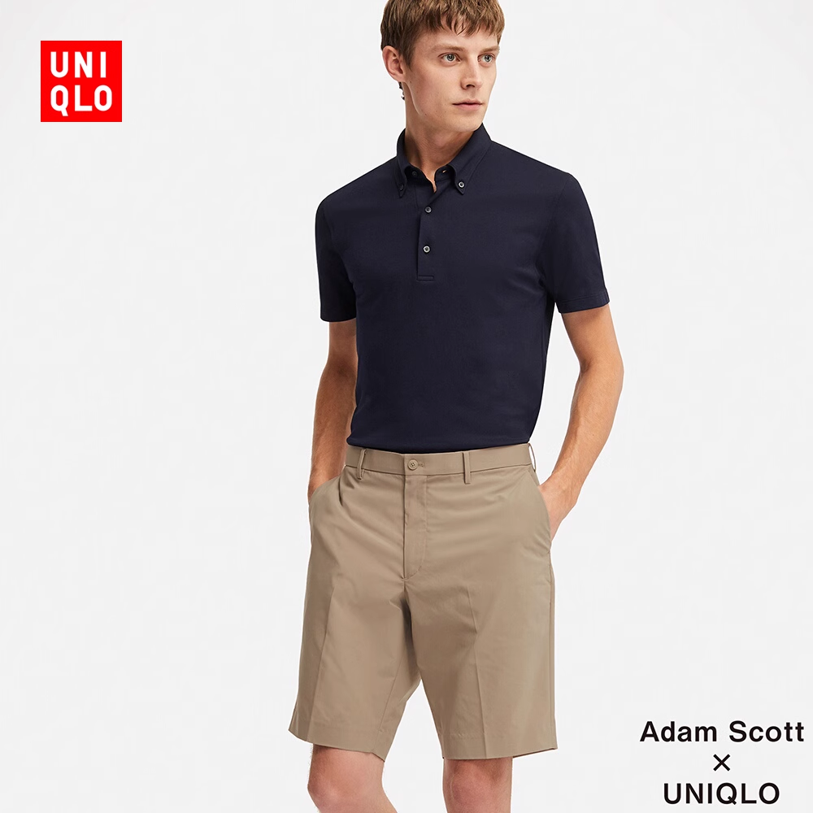
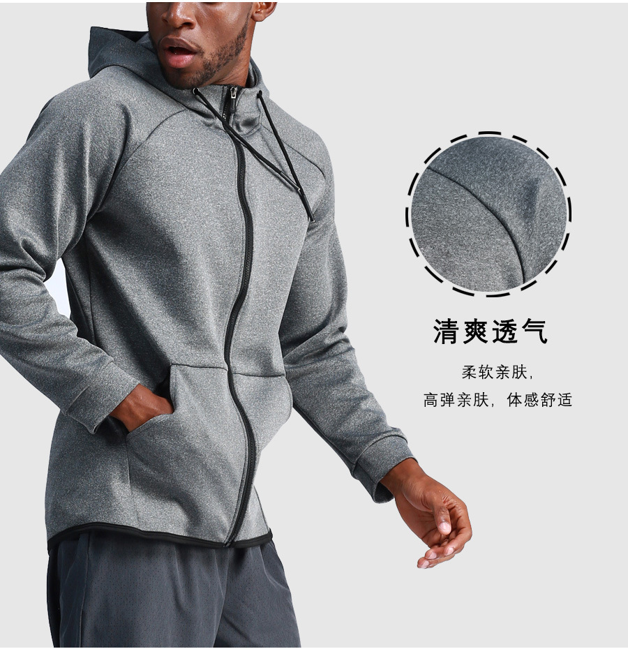
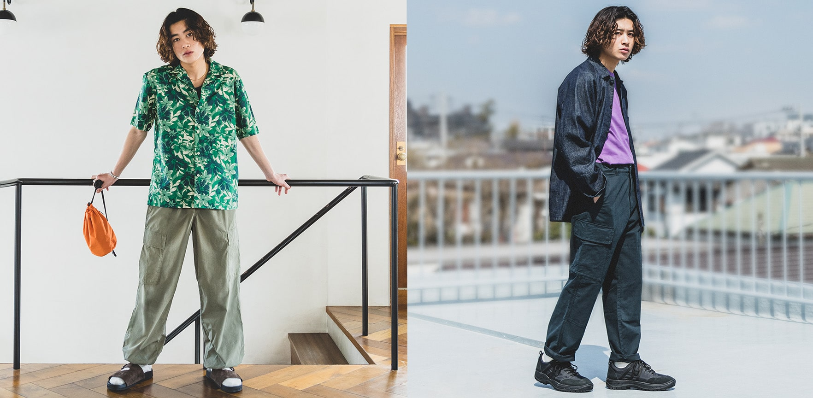

---
男性倾向跨性别者通常衣着指南
---

:::tip

此篇衣着指南为个人经验总结所得，适合**性别表达为男性**的男性倾向跨性别者，

一定程度上贴合了传统男性刻板印象的形象，仅作参考。

本人衣着可能比较土，不是很能跟得上潮流，请多多见谅。

HRT和SRS不是本穿衣指南的必要前提。

:::

## 为什么我剃了短发、穿着oversize男装还容易被misgender？

尽管社群中常有“FtM激素后非常容易pass”的传闻，但实际上大部分男性倾向跨性别者身高远低于顺性别男性身高，
且肩膀较窄、臀部较宽、大腿较粗，
因此很容易被认为是“铁T”或“假小子”。

甚至在使用增高、束胸后也会被misgender.

这时候，我们需要酌情选择穿衣搭配 -- 利用衣物去遮盖指派女性的躯干特征。

**需要注意的是，大部分男性倾向跨性别者在HRT之前或HRT初期看起来都比较稚嫩，所以可能以初中男生的身份pass**

## 基本思路与你可能需要的东西

我考虑穿衣时的基本思路就是宽松的裤子遮掩脂肪较厚的大腿+上身用马甲、卫衣等掩盖胯部、胸部，因此紧身衣裤在该指南中被避免。

如果您未经过胸部手术，且尺寸较大，建议出行时穿戴[束胸](https://rle.wiki/fashion/ftm/corset/)。（平常可以脱下，以防长期束缚造成胸部疼痛、下垂等不良后果）

如果肩宽较窄，可能需要**垫肩**，某宝搜索即可。

如果对裆部外型有额外需求，请参考[假体](https://rle.wiki/fashion/ftm/packer/)部分

如果你个子不算很高，可以在某宝寻找合适的内增高。

~~**某种意义上来说，mtf的穿搭指南中需要规避的东西可能正好就是我们需要的**~~

## 穿搭例子

这些取自我的日常在校、出门穿搭，因怕被认出来所以我选择使用绘图的方式表示。

### 夏季

南方的夏季肯定是要穿短袖的，但如果和我一样有遮挡上身的需要，可以添加一件户外马甲（它挺实用的就是可能有点土）

下身选择**裤长正好到膝盖上面一点的短裤**，太短了会露出脂肪较厚的大腿。

~~如果个子不高，可能看起来会像小孩~~

**短袖和马甲建议买稍微大号一点的**

整体图：

户外马甲（某宝）：

短裤（优衣库的）：

### 春季秋季

选择相对比较多，卫衣、长袖运动外套甚至是格子衫之类的都可以作为上身衣物。

**需要注意的是，卫衣不要买太oversize的，买大一码的就够了**

长袖运动外套（某宝搜，推荐大一码）:

宽松的运动外套可能不需要垫肩

裤子的话，我比较推荐宽松的工装裤（也不要买太大码！），例如优衣库的：

**左图模特的宽松外套也很适合穿，右图模特上身的衬衫穿搭也可以在夏天借鉴一下**

## 如何对自己外型进一步改善

健身增肌或多或少能提升自己的肩宽和臂围，使体态更加挺拔并一定程度上减轻指派女骨架特征。建议优先练肩、背与手臂。

对于体重较大、体脂率较高的男性倾向跨性别者来说，适当的有氧减重可以让自己更pass -- 较多的脂肪堆积在大腿、胯部、胸部会让自己容易被misgender

如果您打算开始HRT，服药后声音、体毛的变化会让您不容易因声音被misgender

**但HRT不是万能药，效果没有传言里那么明显**

