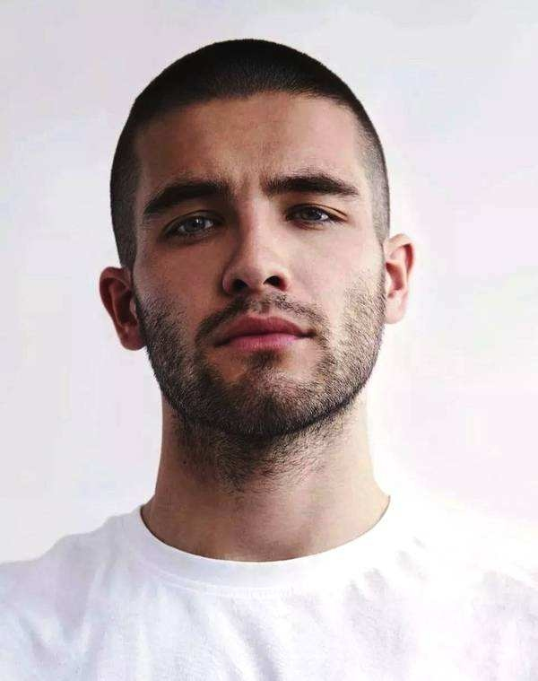
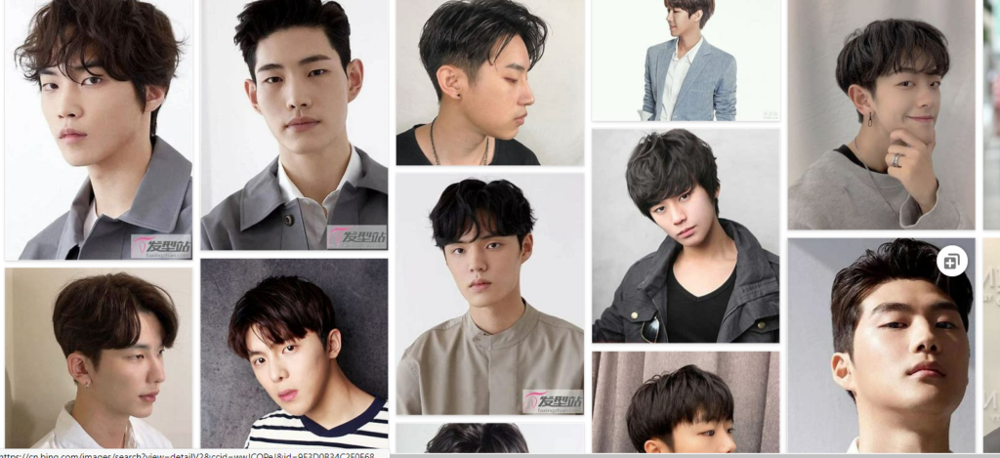
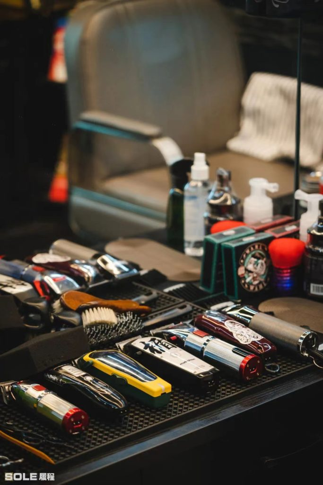
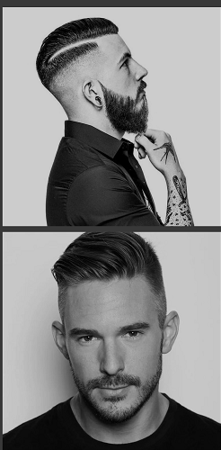
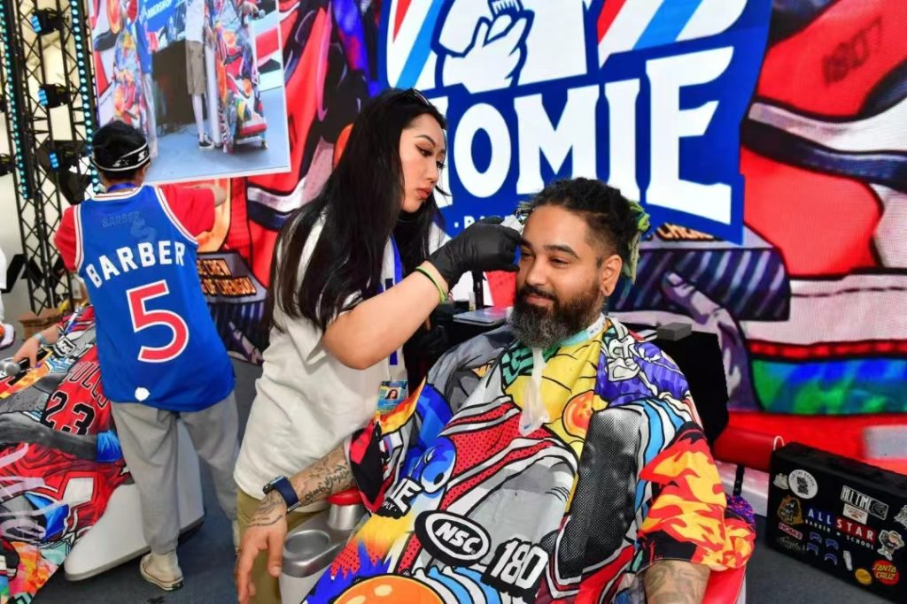

通常来说，发型是 RLE 的一部分。

可以按自己的喜好和外貌特征设计合适的发型，或是参考下述指引。

**需要注意的是，短发不是RLE的充分必要条件。这个世界上也有长发男。**

短发是男性性别刻板印象的一部分，但我们可以做出自由的选择。

目前我们有 **较为完善的短发指引**，能满足大部分喜好短发的兄弟的需求。

长发指引 待更新。

## 男士短发与理发店

作者：Finn

众所周知，男士短发的种类多种多样。

一个好看的发型可以修饰你的脸型，增加气质。

接下来，分享几个常见的男士短发

### 碎发、飞机头（[Quiff](https://www.google.com/search?tbm=isch&q=Quiff+Hair)） {#quiff}

- 和理发师说短飞机头基本都懂，作者个人觉得这个发型不错，激素前就留这个发型
- 容易剪，通俗点说就是两边推渐变，上面留长打碎 5 - 6cm 为最佳（根据发量调节，碎一点更适合会用发型产品的兄弟，如果发量多，请尽可能打碎！），后脑勺头发推到枕骨以上做渐变
- 通用发型，谁剪谁帅
- 若想要发型完美，需要用发型产品（随后会介绍）
- 最后可以叫理发师帮你修整一下发际线与鬓角，显得更加精神

接下来为大家上一些展示图 后面两张是作者



### 侧背油头（[Side Back](https://www.google.com/search?tbm=isch&q=Side+Back+Hair)） {#side-back}

- 较成熟/商务复古的兄弟，或者有发型打理习惯（**需要用发油定型**）
- 一定一定不能懒，要会打理发型
- 这个发型对理发师的渐变水平要求较高，建议第一次尝试选择前往 **男士理发店 BarberShop**
- 最好中渐变，高渐变考验头型（渐变也会在后面讲）
- 任何脸型的兄弟都可以驾驭
- 记得要修鬓角和发际线
- 剪此发型，需要**头发长度有 7cm 以上**，上不封顶



### 寸头（[Buzz Cut](https://www.google.com/search?tbm=isch&q=Buzz+Cut+Hair)）{#buzz-cut}

- 推荐美式圆寸，会根据你的脸型为你修饰，而不是一推子下去~~梦回提篮桥~~
- 干净清爽，不需要任何打理，睡觉也不怕乱
- 经常要修剪，稍微长一点点都会影响整体轮廓
- 大缺点：**考验颜值**

剪寸头是一个挑战，但是你不剪永远不知道自己那么帅（以下两张为作者）



### 中长发（[Medium Hair](https://www.google.com/search?tbm=isch&q=Medium+Hair+Men)） {#medium-hair}

- 把他们统称为一类是因为这些发型都可以通过**发蜡发泥或者卷发棒**统一效果
- 你需要一双勤劳且聪明的双手
- 几乎可以一两个月不剪头
- 觉得有需要可以去进行烫染，在此处不详细介绍
- 小红书上教程很多，作者暂经验不丰富不介绍

### 什么是 [BarberShop](https://www.google.com/search?tbm=isch&q=BarberShop)？ {#barbershop}

BarberShop 目前的意思是男士专属理发店，但这只是字面的解释，更深层次的理解是男士复古发型和休闲社交场所。追本溯源，BarberShop 是以男士复古发型为基础的文化，起源于欧洲，在一些绅士国家，男士的着装非常讲究，打扮往往是全副武装，而发型也是其中关键的一环。

在男士理发店 BarberShop 的理发师叫 Barber

如今市面上，比较流行的 BarberShop 有两种，美式 BarberShop 和英式 BarberShop，两者的区别是前者的风格更街头，后者的风格更商务。就好比是时尚街头和商务复古的调性，不过两者并没有高低贵贱之分。

不难看出，美式 BarberShop 会将线条处理的更加干净利落，而英式则更加自然。

目前国内大部分 BarberShop 的 Barber 们两种风格都可以驾驭、简明扼要的概况，Barber Shop 的理发风格主要是以渐变为主，包括高层次渐变，
低层次渐变以及高低渐变等等，在细节和纹理上处理的相当出色，明眼人一眼就能看出是在哪里理的发。

除此之外，还有一些更为复杂的像黑人烫、脏辫以及地沟头之类的。

Barber Shop 擅长的是推剪和雕刻，salon 则专注于剪发和染发，这也就是两者最大的区别。

### BarberShop 是否值得一试？ {#try-barbershop}

作者去过很多广州和上海不同风格的 BarberShop，里面的 Barber 都很热心店内装饰都很特别。

BarberShop 也是集潮流文化，英伦商务风于一身的男士专属休闲场所，除了理发外，还提供专业的修面，刮胡服务。

是一个放松身心的绝佳去处。
