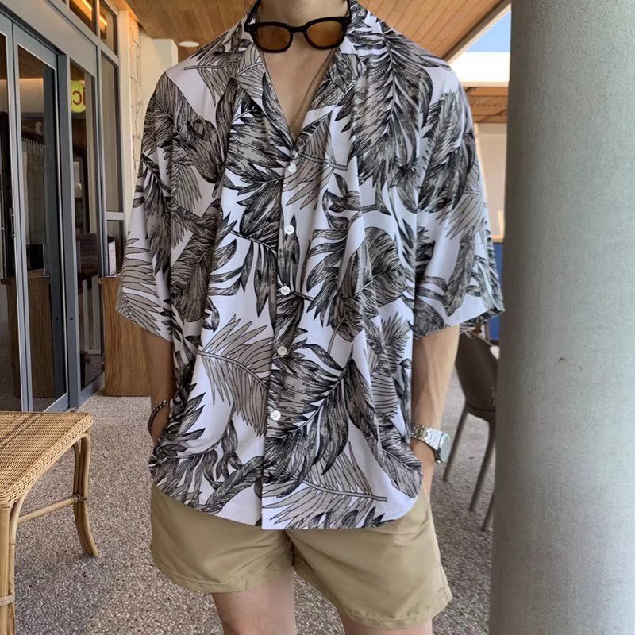
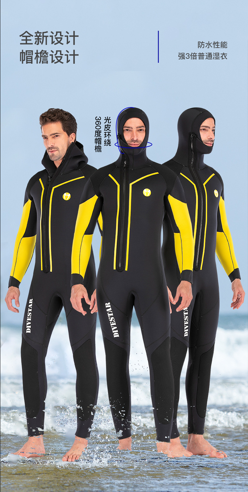
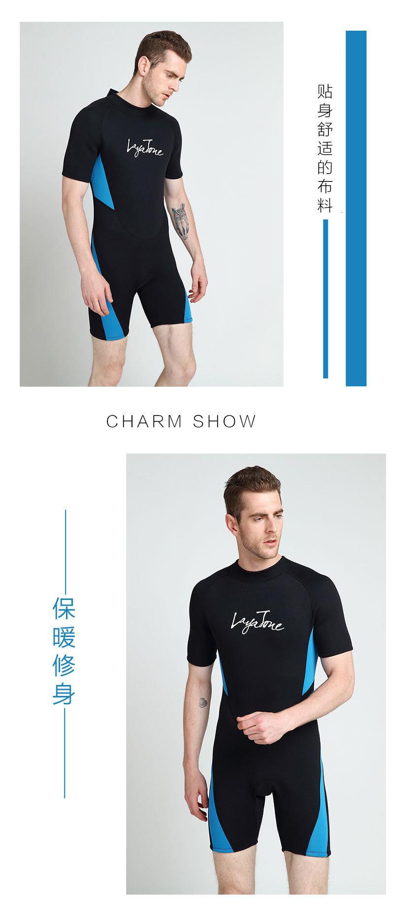
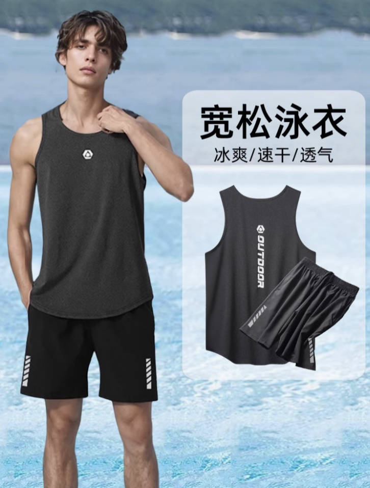

对于没有做过胸部手术的人来说，可能需要购买能够遮住胸部的泳衣并穿戴束胸。

搜索这类服装时要寻找的关键词是"沙滩衬衫"、“潜水服” 和 “游泳背心”。

连体泳衣是指一件连体的套装，通常由莱卡、尼龙或其他特制的织物组合制成，覆盖胸部和腿部。

### 沙滩衬衫

某宝上大约100元以下有冰丝沙滩衬衫，防晒、速干可下水。

### 潜水服

是一种通常由氯丁橡胶泡沫制成的服装，由一件或两件式（上衣和下衣）组成。可以隔绝冷水的寒冷。

它们经常被潜水员、冲浪者、浮潜者和皮划艇运动员使用，

板式选择很多：

- 长袖/短袖/无袖
- 裤长到脚踝/大腿

某宝上大约200元上下可以拿下，

**比较紧身，可能需要同时穿戴束胸，请注意自己呼吸是否顺畅。**

### 游泳背心

虽然背心不完全是泳衣，而且更厚且笨重，但因为相对宽松可以用来帮助遮盖穿戴束胸的大胸部（较大的胸部穿戴束胸后可能效果不甚理想，需额外遮盖）

在选择 游泳衣物 时，请确保它与您的 束胸 没有矛盾。

普通材质的 束胸 在沾水湿润后可能容易让皮肤感觉难受。

**游泳是一种剧烈的运动形式，因此请确保束胸有足够的 运动、呼吸空间**

