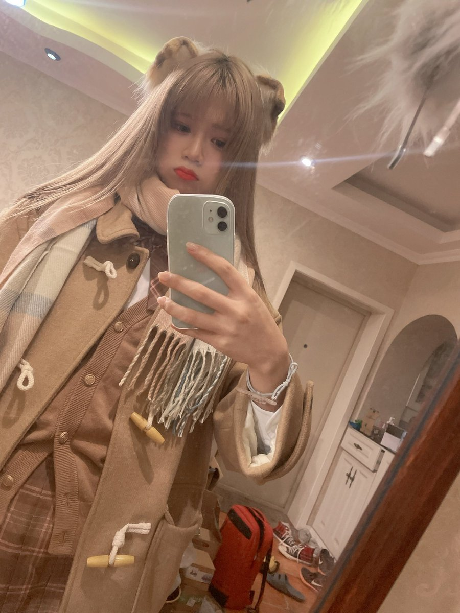
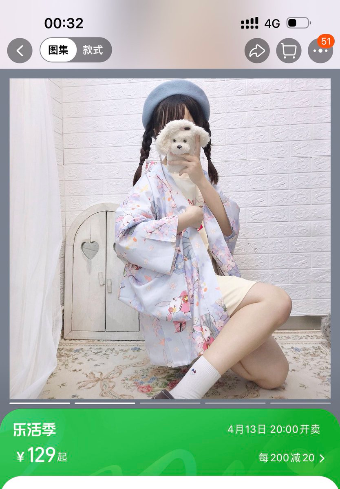
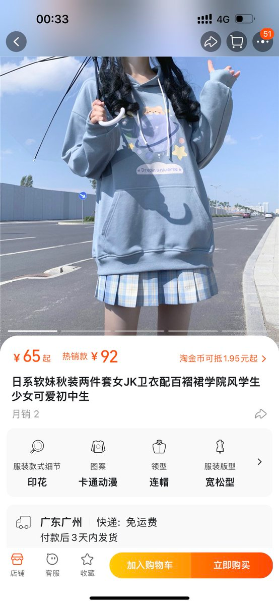

大部分的mtf的身材和顺女还是有很大区别的，所以参考顺女穿搭搭配只能解决掉服装搭配上的问题，但是因为身材上的差异！如果直接照搬，还是会出现很强烈的“跨味”不协调！！所以作为一只mtf，想变的更pass，找到适合自己的穿搭非常重要！！！

首先，造成“跨味”的最重要的一个因素就是肩宽，和胯宽，肩宽不要紧，胯宽还窄，一加一减造成的视觉上的差异就非常明显了！！mtf群体又非常热衷于穿jk和lo，我就先说说jk！如果穿jk只穿衬衣和格裙，且把格裙扎在衬衣上面！这种情况对身材的要求极高！大部分mtf这样穿都会直接形成一个非常明显的倒三角！

这种情况下可以说是不协调感拉满，所以如果想穿jk格裙，尽量在外面穿一个足够宽松的外搭！宽松的外搭自然下垂可以直接无视胯宽小的问题，整个上半身更加的“蓬松”视觉效果上就不会显得人太高，没有倒三角，也不会显得肩宽问题！所以我秋冬季节时会更热衷穿jk，针织毛衣，大衣等搭配让自己“圆滚滚”*

或者在搭配格裙时可以搭配宽松的卫衣，无论是冬天把自己拉“圆”还是通过外搭，卫衣来改变视觉效果，其实核心的宗旨就是，尽量宽松！！不要让衣服过于贴身，从而让自己的身材的“缺点”被放大！同时宽松的穿搭能让人看起来不那么的“高”和“棍”

穿格裙时除了要注意让自己“上半身”自然下垂以外！格裙的长短也非常重要！！！非常重要！！如果格裙偏长，因为胯宽本身就小，格裙又长，下半身的“蓬松”效果太差！也会让整体视觉效果不协调！重点来了！上半身尽可能宽松的同时，最好够长能盖住屁股，然后格裙稍稍漏出一点即可，这样视觉效果上会显得比较比较矮，可爱！但是请注意！格裙也不要太短，完全被上衣盖住，看起来会像下半身没穿衣服，不过这样也蛮可爱的.....
