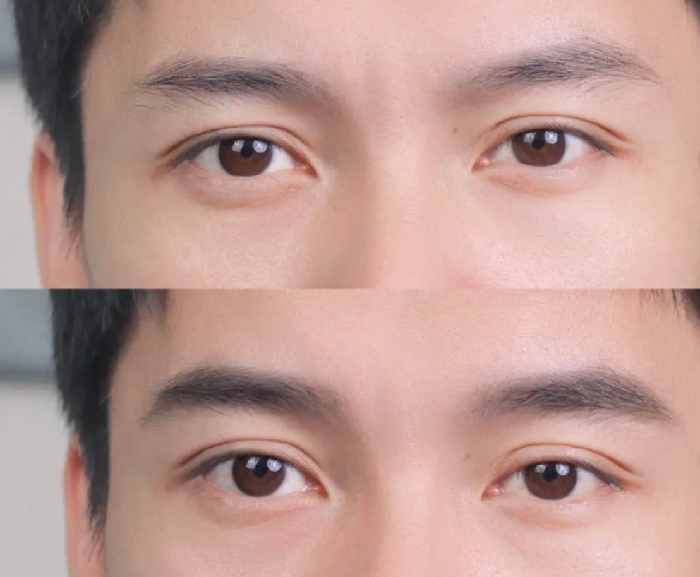

眉毛的形状对整个面部的感觉是超级无敌重要的！！大部分男生的眉毛都是比较厚，浓密，眉型是中间低，尾部高，轻微上挑的，这种眉型会让整个人看起来很凶，而且如果不改变眉型，搭配女性妆容非常容易产生极强的违和感！！↓接解决建议

不好看的眉型千奇百怪，好看的眉型千篇一律，所以猫猫直接举例比较普通又比较合适的眉型。p1，这种眉型很温柔，猫猫日常也是这种眉型，妆容也比较好搭，但是在画眉毛的时候也要注意眉笔要使用浅一点的颜色，比如棕色或灰色！慎重使用黑色！！！画的时候也要注意粗细！不要画太细！不要画太细！！

聊聊眉毛避坑！因为大部分男孩子要想把眉毛的“上挑”修掉。会把本来的眉毛变的比较细，或者比较短，这时候涉及画眉时加粗眉毛，加粗眉毛时也要注意眉毛的高度问题！！！不要把眉毛画高了！同时避坑一些“古典风”的眉型～如图，这种眉毛的违和感直接更上一层楼！虽然是女性的眉型！但是慎重尝试！！

具体如何调整眉型，如何修眉～教程大家自行看小红书，b站，找身边审美高的顺女帮助！！提升改观非常之高！小可爱们不要不把眉毛当回事嗷！
