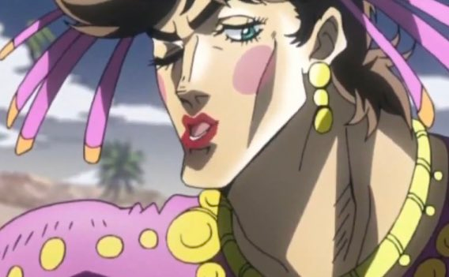
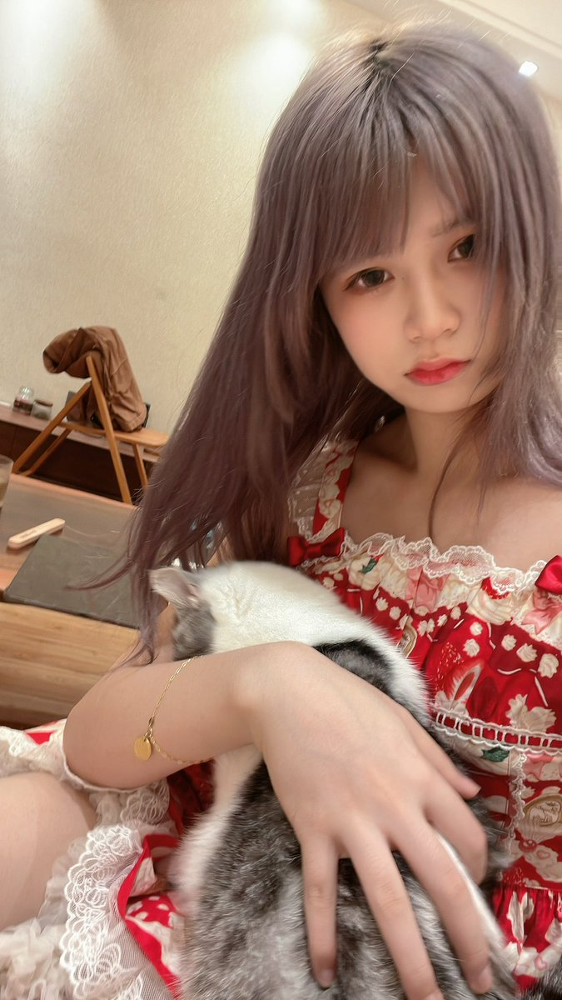
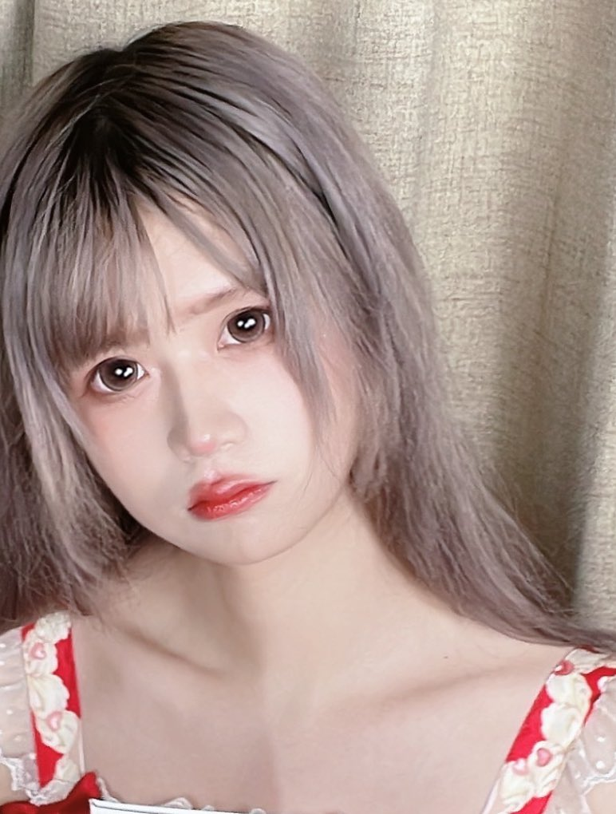
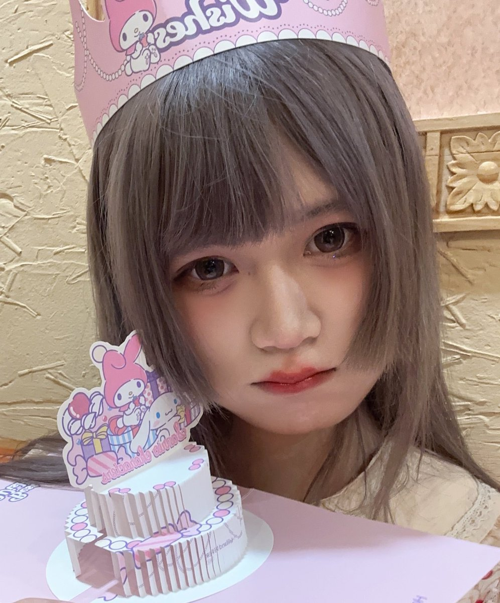

1. 化妆不是为了把脸变白，嘴变红！眼皮子上色！
2. 顺女的妆容不能完全照搬！！要根据自己的情况调整！盲目照搬会放大自己的缺点！
3. 大部分mtf因为五官和顺女存在的差异主要就是“三庭”偏长。颧骨高！面部棱角分明！五官过于立体不柔和！

先说避坑！

1. 千万不要让自己脸上的色彩“对比度”“饱和度”过高！比如用黑色的眉笔把眉毛轮廓勾勒的很明显！腮红！眼影的颜色要尽可能的日常色！！错误示范如图
2. 睫毛“宁缺毋滥”！！这点很重要！涂过于厚重的睫毛膏，或者不合适的假睫毛，会让妆感非常重，其实观感很不好 

3. 根据自己的脸型情况去选择修容！不要盲目的学顺女瘦脸修容！
mtf的脸因为脂肪分布原因，本身就偏骨感，甚至有凹陷！大部分mtf要学习的是如何把脸修圆！通过高光让自己的面部“鼓”起来，达到“圆润饱满”的效果！盲目学习瘦脸修容是踩大雷！
4. 如何修颧骨，等等猫猫不赘述了，这点对mtf很重要，自行搜索
5. 学习画卧蚕！如果你想走可爱温柔风，卧蚕非常的重要，它可以非常有效的放大眼睛，缩短“3庭”改善男相！附猫猫本猫图，猫猫经常会把卧蚕画的比较明显！搜索关键词“眼睑下至”
6. 口红涂抹也是非常讲究的！！！不要随便拿个颜色就涂，涂口红也是可以休整嘴型的！通过调整嘴型可以休整脸型！！很重要！ 

7. 腮红也很重要！！！腮红的位置～颜色！对整个妆容的感觉的影响很大！如何选择适合自己的腮红，如何涂抹腮红！大家自行搜索，按照顺女的教程来就行！
如果不涂腮红人会看起来脸煞白！没有血色！不可爱捏！！！
8. 粉底选择！！顺女也经常强调！底妆粉底的目的是为了遮瑕！！均匀肤色！！不是单纯为了变白的！色号最好不要和自己肤色差异过大！！！！敲黑板！划重点！！
9. 搭配美瞳～提升也很明显，不过不戴美瞳，一些妆容很难搭配～
猫猫笨手笨脚的～也不会化妆，不如姐姐们化妆技法的高超～🍵～～～大家有什么问题还是多请教下小红书和b站的美妆博主呐。
