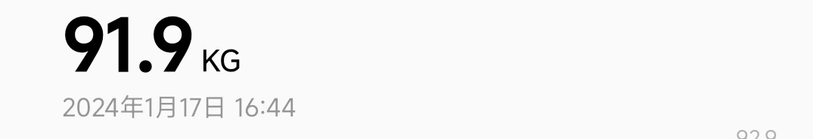
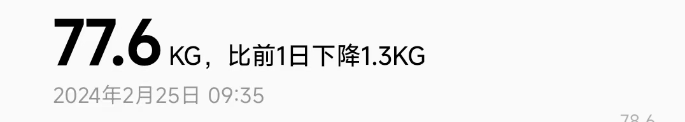
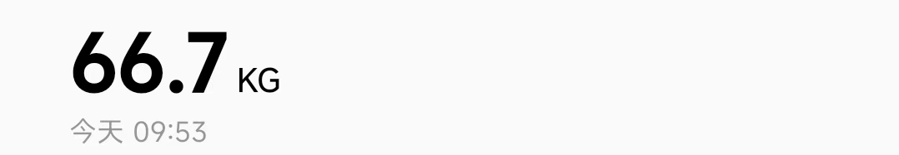

## 观前声明

文内所写的均为本人真实案例，在24年寒假期间从180/91.9kg减到77.6kg，后经过维持，截止到24年十月份，笔者体重65kg。

本文不代表任何的医学建议，因体质差异可能不适用于所有人。

> 笔者更侧重于生活化减肥，在尽量舒适的情况下控制体重

## 减肥目的

减肥可能是为了更好的体态，也可能是为了更好的身体~？亦或者是为了更好的吃（）\
笔者体重焦虑比较严重，结合身体因素（脂肪肝），~~不减不行了（划掉）~~

## 明确目标

无论您是为了什么原因决定减肥，请先确立一个明确的体重目标，推荐使用 `BMI` 作为体重参考。

笔者比较偏好 `BMI = 20` 的身材，故减重到 65KG 。

### BMI 值判断

BMI 计算公式：`BMI = (体重/身高^2)`

|     BMI    |  分类 |
| :-------: | :-: |
|   BMI ＜ 18.5  | 不足 |
|   BMI = 18.5 - 23.9   |  适中  |
|   BMI = 24 - 27.9  | 超重  |
| BMI ＞ 28|  肥胖  |

## 减肥难度

如果没有特殊的身体疾病和使用某些药物，减肥是一个只要努力就能给你正向反馈的活动。但前1-2周可能格外困难，生理上的酸痛和心理上的不适均集中出现在前两周。

## 我减肥的几个时间段

1. **寒假阶段**：调整饮食 + 有氧运动 + 早中晚三餐 + 戒零食
2. **开学阶段**：半控制饮食，偶尔整点火锅/DQ/烧烤等，+中晚两餐（早上起不来）
3. **暑假阶段**：午餐随缘吃，晚餐家常菜，控制摄入量微饱，偶尔馋了吃点零食，平常去健身房做做有氧（每周打卡天数＞5）
4. **又一个开学阶段**: 每日两餐 + 偶尔零食 + 每日上课通勤2-3公里，一个月后体重66.7->65（此阶段主要为维持）

> 胃是有弹性的，长期过量饮食可能会导致食量增大，反之同理。因此即使是0热量食物，也不推荐过量食用。

## 药物

不推荐任何减肥药物，尤其是小作坊的药物。

> 不要相信任何平台上的减肥产品广告，尤其是 **bilibili**、**小红书** 等平台的“神贴”、“神油”、“中药”、“外国进口药”

## 饮食

### 控制总摄入

减肥的关键在于摄入量＜消耗量，前期可以通过估算每天消耗的卡路里来制定饮食计划。

### 饮食结构

常规的家常菜品就是非常好的减脂餐，请**不要相信**小红书上的**戒碳水**减肥法，没有碳水可能会导致脱发和情绪低落。

**摄入量**：每餐进食到微饱即可，不易过饱。但不提倡**过度节食**，身体可能会觉得正在遭受饥荒而降低基础代谢，可能会起到**反效果**。

**零食类**：避免**经常进食**高糖、高脂的零食和饮料，咖啡/苏打水等不在此列。\
但也无需完全戒断，令人发胖的不是某一种成分，而是总量超标。

**关于代餐**：不建议买代餐，尤其是代餐奶昔，极其难喝。

> 反面教材：笔者上次减肥失败是因为即食鸡胸肉太好吃了，三餐正常吃的前提下把那堆鸡胸肉~~当零食吃了~~，请不要因为某种食材很健康就吃得太多。

## 三餐

### 早餐

有吃早餐习惯的读者建议维持，平时不吃早餐也无需刻意去吃。\
目前笔者对早餐是否影响减肥进程尚不明确，实践测试吃不吃早餐都在稳定变轻。

### 午餐 or 晚餐

午餐和晚餐正常吃即可，推荐适当减少摄入量，但不可绝食。

笔者比较推荐的食物：

- 碳水
  - 糙米
  - 燕麦
  - 欧包
  - 麻薯（虽然没其他的健康但是它好吃）
- 肉类
  - 牛肉
  - 鸡肉
- 其他食物
  - 关东煮（高饱腹+低热量+营养均衡）

## 运动

笔者寒假期间的方案是健身房+私教组合训练，每周健身房打卡天数＞5。实测健身房仅减肥可不请私教，有条件的读者建议在附近的健身房办一张短期卡，冬暖夏凉、全年恒温，对运动体验影响很大，学生通常会有额外优惠。

### 有氧运动

适当的运动有助于燃烧脂肪，个人比较推荐跑步机爬坡（坡度15，速度3.5），每周三到五次，每次30分钟以上，可适当搭配力量训练。

没有器械也可以考虑散步/跑步等其他运动，也可以消耗掉多余的热量。

> 大基数减肥者慎用跑步/跳绳等手段，可能会对关节造成比较大的压力。

### 日常活动

除了计划内的运动，也可适度增加日常活动，如短途优先步行，有助于热量消耗。

## 心态

脂肪的消耗具有滞后性，短期内体重的上下波动很正常，请不要气馁。建议以**周**或**月**来进行体重参考。

大基数减肥者在减重十斤时可能外观上看不出明显区别，需积少成多。

## 维持

减肥成功后可适当放宽饮食计划，但请不要暴饮暴食。生活化减肥的精髓在于将自己调整到一个健康的生活习惯，这是个持续性的行为，而不是仅仅为了减肥。

## 其他

- 条件允许的情况下请多喝水，脂肪分解时需要用到水分。
- 请在每天固定时段测量体重，建议将这个时段选在早餐起床排泄后，此时的体重最为准确。
- 笔者亲测献血对体重并无明显影响，24年4月到9月累计捐献单采血小板3800CC，情绪和体重均无特殊波动。

## 联系我

有不懂的地方可以私信我咨询。\
加油！

### Lee

GitHub: [@Leetfs](https://github.com/Leetfs)

> GitHub主页内通常有我最新的联系方式
