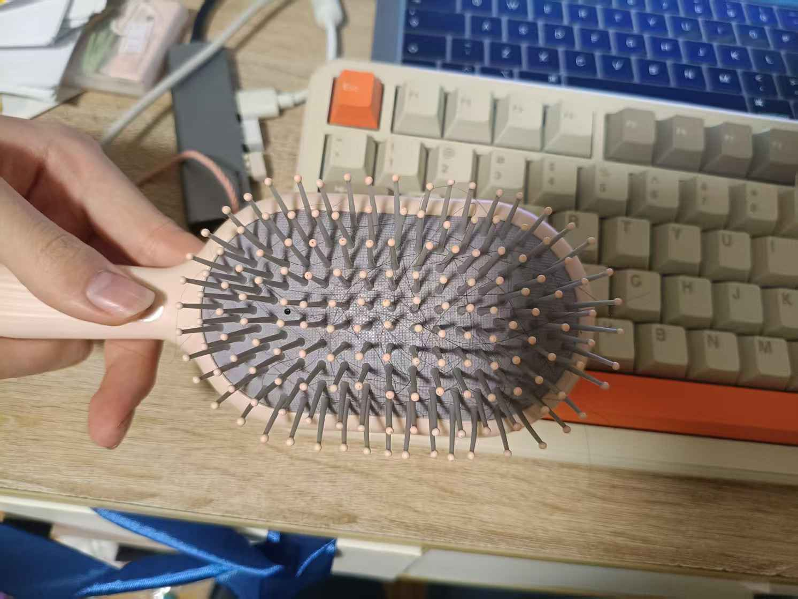

## 理发术语

### 打薄

打薄指的是把你的头发不均匀剪短。

例如，抓起一撮头发，剪短它的一半；拉起来一些头发固定住，取下面的头发剪短。

打薄后，你的头发视觉上和梳起来和原来长度一样，但是厚度变薄了。因得名。

::: tip 优点

- 不那么热。
- 对于头发比较多的人，可以减少头发蓬度

:::

::: warning 缺点

- 打薄后再次打薄可能会导致头发视觉留长速度变慢、形状变奇怪。例如，一次打薄把1/2的头发剪短，那么第二次打薄后，最长的头发只占1/4了。
- 手感不佳（

:::

::: tip 注意事项

- 打薄一次以后，一年内还是不要打薄第二次了

:::

## 头发养成速度

<https://zhuanlan.zhihu.com/p/22120181>

> 根据测定，头发的生长速度是每天0.27-0.4毫米。按此计算，头发一个月大约长1-1.5厘米，一年大约是10-20厘
米。

## 发质

::: info
一般而言，顺女孩子的头发更有光泽，垂直发质较多。因为细所以留长的话，不仅乌黑，而且看上去有着淡淡的亮色、质感轻柔。但是顺男孩子要是头发长，由于厚重的质感，看上去就会又沉重，又酷热。

男孩子若要把头发留得像女孩子那样，使用染色剂来染发非常见效。

若能染成暗淡的茶系色的话，那么头发看上去的质感就可以和女孩子差不了。

染色既可以自己做，也可以上美容院让别人长期帮你做，所以条件宽裕、或者要求较高的人们就去美容院吧。
:::

发质的影响主要有三方面：

<https://baike.baidu.com/item/发质/4179802>

> - 第一是外在因素——生活环境，头发生长环境。不要在空气污浊–空气里充满粉尘。油雾的环境中呆得过久。还要注意空气相对湿度、空气温度在25度左右。忽冷忽热，温度反差较大的环境使头发难以适应。使头发失去抵抗力。
>
> - 第二是自身的原因——头发是属于干性，中性，还是油性。如果偏油性的话只有坚持常洗头了，一天一次为宜。要想改善发质必须进行适当的自我调节，保护头发。选用适合洗发水，护发素。补充维生素B2,B6.多吃水果，多喝水。多参加体育锻炼。
>
> - 第三是内在因素——心情好坏也会影响。大部分时间调解好自己的心情，保持好的心情，可以使大脑不紧张，从而让头部放松，能更好的给头发一个生长的环境。

其实还有第2.5方面，即【激素】。进行了HRT的MtF很容易发现，自己的出油量大大减少，头发也逐渐变成顺女的有光泽，垂直发质较多、细长。这主要是由于雄激素的减少导致的。如果您不幸不能进行抗雄，一定要记住，**每天都好好洗头**是一个好办法。

## 发型

:::info 来自《好想做个女孩子》（伪娘养成手册），P20~22，格式有改动

女孩子的发型也有哈莉贝瑞那样的，像男孩子一样的短发。而反过来，男孩子里也有可以盖住耳朵的长度，貌似女孩子的短碎那样的发型，但是由于是男是女一眼便知。所以是不会看错的。

那样的话他们的发型中到底有着什么样的差别呢？到街上去看各类路人吧。

男孩子大多都是看上去感觉是“噌”一下的，锐利的帅气发型。而女孩子都是有着松松软软的各种发型的。

关键是，发型的外形和相差不大的发长。这二者毫无关系。实际上在剪发的方法上，男女间有着巨大的差异。这里也与第一节所说明过的，男孩子是直线化、女孩子是曲线化的法则相通应。所以让我们分男女依次溯其原因。

一般来说男孩子在做长发发型时，需要做所谓的离子剪的。让上 面的头发短，侧面的头发长的剪法，并多用拿剪刀把头发剪去的那种盘剪。由于这种方法，才可能在保持长发的同时给人以锐利的印象。

其要点是**剪得看上去帅气**。

相反女孩子则以有效地利用头发的垂直度修饰脸型为目的而剪的。修出**让头发顺延着脸部，从头顶到下颚圆圆地笼住的发型**。

总之就是要剪得漂亮。

像这样长度虽然相同，而发型可以全然不同。所以如果要做一个 用于女装的发型的话，到了美容院，就**请直率地说“我要剪个女孩子 的头”吧**。如果你做得到这一点，那就尽量要求理发师给你理一个看上去可爱一点的发型。

还有，关于男女发型差异还有前发（刘海）和边发（鬓角）的长度需要说明一下。

大多数女孩子的刘海，最短也得把眉毛盖住，也有长的能把眼睛都遮没。

一般来说女孩子会把前发攒起来剪出一个刘海，然后使用喷剂和发蜡的套装，做一个头发的分路，把头发全部向前放下。这样每天做发塑。女孩子的发型也有把小额头露出来的，但是男孩子因为眉骨突出，所以不建议把头发向上扬。

另外，要防止眉骨的突出显眼。刘海分成七三分或六四分都可以，而哪种分法能够使发型看上去更像女孩子，就尽可能选择那种。

关于边发的长度，特别是在女装的时候。因为考虑到要把脸颊和 下颚的显眼的线条尽量隐蔽，所以为了遮盖颧骨，强烈推荐鬓发留得 比女孩子更长。

刘海的留长和利用鬓发修蔽脸部线条，都利用了一种心理要素， 它会无意识地给人一种“哇，好可爱”、“哇好年轻”的感觉。所以 就算是戴假发的时候，也还是要选择将刘海和鬟发留长哦！
:::

留长发最重要的事情之一就是要找出一种适合自己的自然发型 [^1]。

当然。现成的类似“这样的人可以用这样的发型”的规则是没有的。但根据脸型不同，各有容易合适的发型：

- 披肩长发：长发披肩的结果会使得肩宽比较引人注意。除非脸型比较小，肩宽又比较窄的人，最好避免使用太长的假发。

接下来让我们考虑脸型的因素。

虽然人的脸型各有不同，但大致可以分为长脸和圆脸。

- 脸型比较瘦长的人如果用长发的话，瘦长瘦长组合会使脸显得格外的长。所以如果脸型又瘦又长的人，最好使用不及肩的中到短发。

- 发色染成了鲜艳的颜色时，如果你的毛发量较大，头发体积会显得更大。所以要适当地打薄一点。

## 日常生活技巧

### 对付卷发

当你的头发留长到一定程度的时候，对付头发发卷就成了必须应付的问题——扎头发、夹头发，睡觉压倒头发都能让你的头发变得卷卷的。不过好消息是，顺女也同样被这些困扰，没什么大不了的。

#### 水

当你的头发只是因为不合适的睡姿、洗头发忘记好好吹干而变卷时，水是个很好的办法。

::: info 操作流程

1. 用喷雾器或者湿纸巾把你头发卷起来的部分弄湿。
1. 把湿漉漉的头发弄直、定型。
1. 这段时间内你可以用帽子、夹子等方式约束头发的运动。等头发自然干燥后，头发就不卷了。

:::

::: tip 优点

- 几乎不要钱
- 对头发没有伤害
- 无危险

:::

::: warning 缺点

- 对天生卷/烫卷无效。水一干，头发就卷回来了。

:::

#### 夹子

适用于不合适的睡姿、洗头发忘记好好吹干而变卷而且你没有足够的时间等水干掉。

::: info 操作流程

1. 对着镜子，把翘起来的头发压下去。
1. 用夹子夹住。

:::

::: tip 优点

- 几乎不要钱。一字夹仅需5块就能买50根。
- 对头发伤害很小
- 无危险

:::

::: warning 缺点

- 只能处理一小块区域。

:::

#### 购买直发器

如果你的头发实在是卷的不行，可以考虑直发器。直发器的原理和烫发一样，利用电磁原理使发热体产生热量，温度传送到一块版面上，利用高温把头发拉直，一般温度在200度左右。

::: info 操作流程

1. 自己看说明书或者百度

:::

::: tip 优点

- 非常快速方便

:::

::: warning 缺点

- 高温会损伤发质。如果你的头发不是天然就卷，建议不要这样——因为日常生活很可能会让它卷回来
- 温度过高，容易烫伤
- 要不少钱

:::

### 对付头发太长吃进嘴里掉眼睛里落在碗里

头发掉到眼睛里你可能需要忍耐一下。对于很多顺女来说，刘海掉到眼睛里再正常不过了。

而剩下两种——当然是夹子啦！

::: info 操作流程

1. 买个夹子。不要一字夹，要好看的或者朴素的大夹子（一般最便宜也得是5块8个）
1. 把头发理顺，轻轻夹上去，保持稳固。没有经验的，你可以参考周围的女生，她们怎么使用夹子。
1. 如果经常要低头（比如高三狗写作业），这样做几乎不可避免地会让你头发变卷变翘。请做好心理准备。

:::

::: warning 缺点

- 可能让头发变翘。

:::

### 护发素

发质差者在头发留到一定长度后，经常会出现头发打结梳不动的情况，且在出汗后更加难受，此时建议使用护发素对头发进行润滑

::: info 操作步骤

1. 使用洗发水将头部分泌的油脂洗干净，注意此步不要揉搓以免头发打结，特别对于烧长发
2. 买一把类似于这样的，上面可以挤东西的梳子，类似于这种：
   
3. 挤出适量护发素（按照头发的密集程度和长度来用）到梳子上
4. 将梳子顺着头发方向往下梳，同时保证护发素覆盖每一根头发，且保证头发方向正确不打结
5. 将护发素冲干净，建议此步用梳子一边梳一边冲，当摸到头发润滑且没有明显的护发素粘液时就可以了
6. 最后一步，一定要把头发吹干，在吹的过程中也建议使用梳子调整方向防止二次打结

:::

::: tip 护发素推荐

推荐蜂花护发素，性价比最高，蓝色比较适合硬发质

:::

### 扎头发

虽然理论上说这个应该参考别的女生自己学会，不过我还是教一下。

#### 单马尾（最简单）

::: info 操作步骤

1. 把发圈套在一只手上。这只手之后被叫做A手，空的那只叫做B手。
1. 把头发拢起来，这一步可以用梳子。调整高度
1. 用A手去握紧你的头发。
1. B手钩住A手上的发圈，把它拉出来，A手趁机用力，让头发束从发圈里穿过。B手这时候拧一个圈，反手用两只手指继续握住刚刚的头发束。
1. A手（现在空了）也像刚刚那样钩住发圈，B手用力，让头发束从发圈里穿过。A手继续拧圈。
1. 重复以上步骤直到足够紧。
1. 如果后脑勺上还有碎发，拢上来，拿夹子夹紧。

:::

::: tip 注意事项

- 多练习，拧的顺序不要搞反了。
- 不要扎得太紧，会脱发。

:::

#### 丸子（需要很长的头发，至少大于披肩）

::: info 操作步骤

1. 把发圈套在一只手上。这只手之后被叫做A手，空的那只叫做B手。
1. 把头发拢起来，这一步可以用梳子。
1. 让头发束紧紧围绕你想要的中心转圈，直到留出大约5cm的头发
1. 像马尾一样扎起来。

:::

[^1]: 这部分参考《好想做个女孩子》（伪娘养成手册），P52~53，格式有改动。
