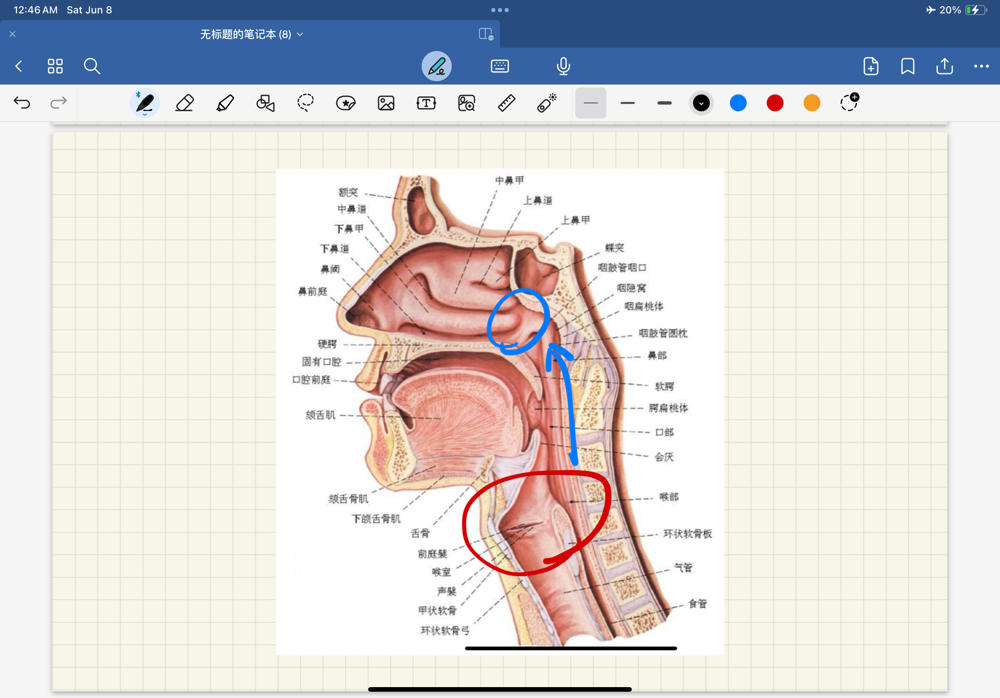
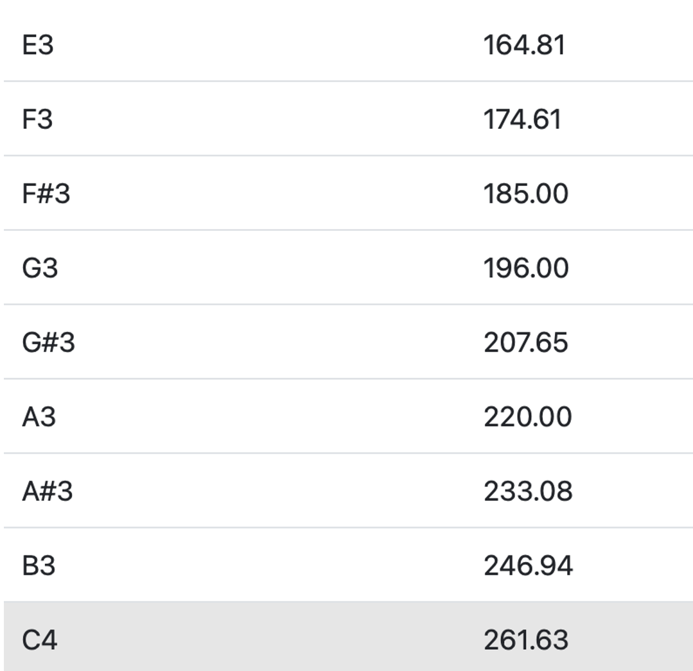
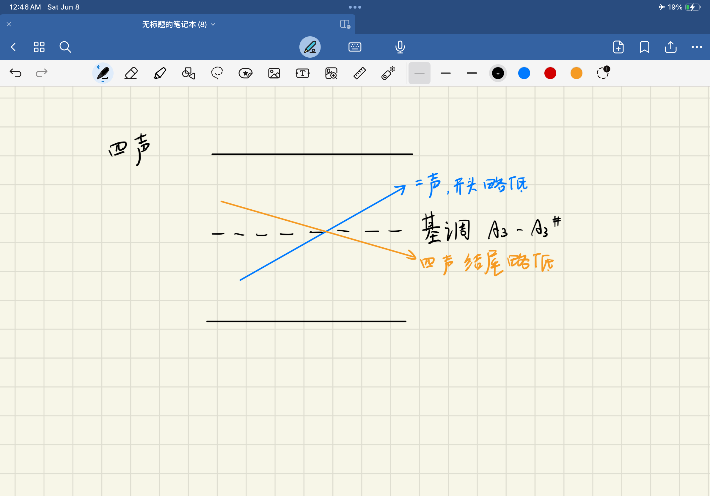
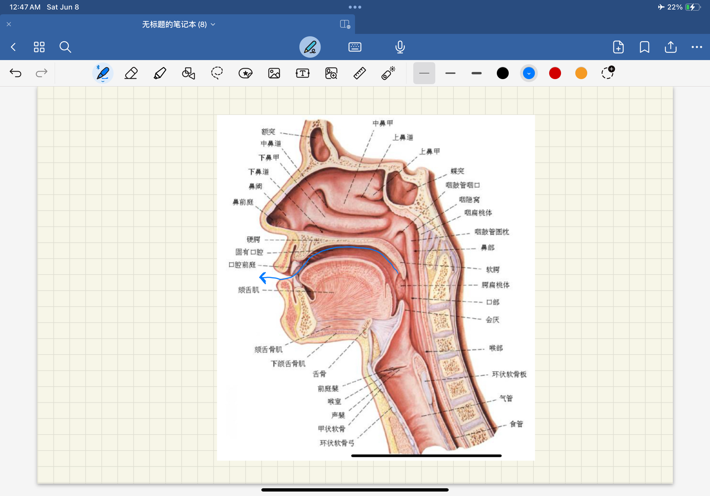
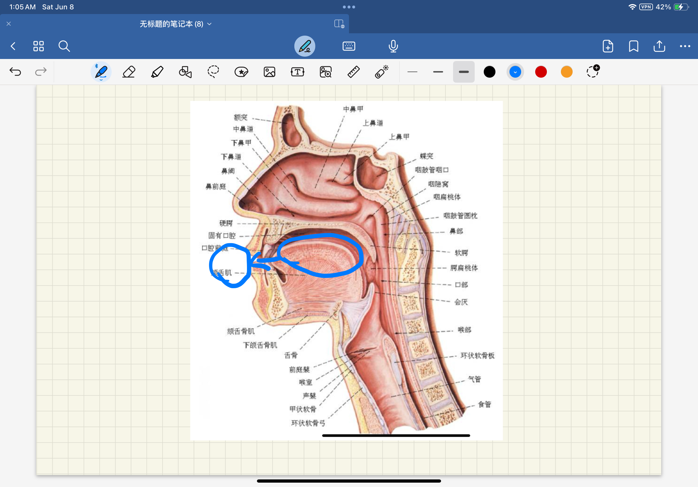

### 前言：
这是一个从0开始尽可能简单的嗓音训练教学，其目的并非是快速学会伪声，而是在保护嗓子的前提下，舒服的发出自然的女声。笔者结合了言语训练的相关医学资料以及互联网上的公开资料，加上自己的一些经验，完成了这份嗓音训练教学文稿的撰写工作。如果希望获得更专业的指导，可以前往[MtF.wiki](https://mtf.wiki/zh-cn/docs/vocal-therapy/overview/)寻求线下的医疗资源。  

*音高不是越高越好，避免夹子，避免假声 这对声带有损伤，听起来舒服和女性/中性化就好  

*每个人声音都是不一样的，应有自己的特点，嗓音从不应该是流水线上的产品，嗓音训练的目的也是让你找到自己喜欢的嗓音。  

*在练习的时候不要太着急，在完成音高练习后之后润色音色，让声音更加柔和，避免厚实的声音。  

在本文中，笔者将教学分成了两个板块，音高与音色，本文将先进行音高的练习，后进行音色的练习。

**应注意**:嗓音训练的重点是使用，而非练习，单纯的练习而不使用，这项技能即使在学会后也会被“遗忘”，需要重新寻找感觉，重新练习，在日常生活中经常使用伪声将会帮助你提升伪声技巧，同时保持“语感”，保持一个说话的感觉，以达到应对生活日常使用的目的。

你可以使用这些应用程序来进行辅助：   
钢琴  
[VocalPitchMonitor for Android](https://apkpure.com/cn/vocal-pitch-monitor/com.tadaoyamaoka.vocalpitchmonitor),
[VocalPitchMonitor for iOS](https://apps.apple.com/tw/app/vocal-pitch-monitor/id842218231)  
[Voice Tools for Android](https://apkpure.com/cn/voice-tools/com.DevExtras.VoiceTools),
[Voice Tools for iOS](https://apps.apple.com/us/app/voice-tools/id1447495900)

## 音高练习
### 找到发声位置
找一个伪声的发声位置是一个比较重要的环节，伪声的发声从来不是依靠夹嗓子，而是依靠改变发声方式，（如图）。找到合适的发声位置就是将发声的位置从原红圈内提升至蓝色圈内。

#### 如何寻找发声位置：
1.	摸着喉结位置 用本音尝试发“ā” ，根据图片寻找发声位置。  
2.	用鼻子呼吸，闭上嘴巴，感受呼吸的时候，鼻腔凉凉的位置，记住这个位置。  
3.	继续闭上嘴巴，模拟鼻子中有异物，用力擤鼻涕的感觉。  
4.	尝试在“擤鼻涕”的过程中用声带闭上嘴巴发出“hèn” 的声音（有点类似于mc村民不满的声音），发声时音高会呈现↘️的趋势，尽可能记住发声最开始较高的位置，多尝试几次。*不要夹嗓子，嗓子应当一直保持放松的状态！*  
5.	保持这个发声位置，尝试发出简短的“hèn”后发出“ mū”的声音  

在这个过程中，你可以体会到自己的喉结向上抬升，寻找并保持这种感觉。  

如果你可以发出这个声音，并且在多次练习后，嗓子并没有疲劳，那么，祝贺你，你已经找到一个发声位置了。
#### 如何提高音调（基调）
用Voice Tools尝试寻找自己的音高  
打开钢琴app 尝试用上述的发声位置发声  

用尽量舒服的方式 发出声音，*不要让嗓子太紧  
一般从E3开始尝试，慢慢的发出较高音调的声音，继续尝试练习F3或者更高的音高  
一般认为声音达到G3就是基本达标的，G#3-A3就是较为普通的女性音高
我们将发出的 声音音高定义为 *基调*  
*注意 音高不用提升的太快，慢慢提升，不要破音  
### 汉语四声练习

（由图像可以看到第二声和第四声的走向）
我们根据找到的基调来定制  
第一声比基调略高  
第三声先降低后上升，但是在拐点的时候很容易掉音高，在练习中可以讲第三声发平调，尽可能保持结尾的时候音高不要太低。  
二声注意字的开头音高不要太低，略低于基调即可，但是应保证不要在末尾破音。  
四声在声时可以提升初始音高，同时不要让末尾音高过低，略低于基调即可。  

在四声练习的时候可以选择一些简单的音节开始练习  
通过先进行基调哼鸣（哼基调声音）后发出音节的方式练习   
例如：mi，ma，ne，mu 加上四声进行练习  
练习说出简单的词语  
给词语匹配音高  
发出基调+词语 与四声的练习方式一致  

### 日用语练习
在完成简单的词语练习后可以尝试说简单的日常生活词语，  
同样是 发出基调+词语 ，先发出0.5秒的基调后过度发出词语  
“你好” “早上好““中午好”“晚上好”“我坐地铁”“不好意思”“我戴眼镜”“打个电话”“出去吃饭”“乘坐高铁”

练习* 通过不同时间段，多听基调，在空闲时间多尝试几次，尽可能保证在寻找基调的时候一次就到G#3（或者到更高的音调），保证对音高的敏感
练习词语&短句注意事项  
1.	保持放松，不要夹嗓子
2.	不要把声音憋在嗓子里，应该尽可能放出来，不要太紧张，让声音往外走
3.	可以将手背放在嘴前，感受气流，气流量充足，让声带充分震动
练习长句子
1. 先从四五个字的短句开始，慢慢变长（不要着急）
2. 在长句子的时候去加一次基调哼鸣，让音高稳住
3. 从长的基调哼鸣慢慢缩短，最后实现短而轻的哼鸣，让基调哼鸣隐藏在语流中。
4. 尝试保持说的每一句话都保持音高， 如果有第四声的字尽量不要掉太高的音高，尽量吐字清晰
5. 句子末尾的时候注意音高，男性的句末音高一般是↘️趋势， 女性则一般为↗️趋势

举例：收音机的发展X源自于许多发明者X的帮助，科学家发现X电波和声波X有关。  
（在句子中 X 的位置处进行一次基调哼鸣，稳住音高，找到发声的感觉。）  
*练习 C1

### 段落练习
在长句子的发声技巧基本掌握后，可以练习过度到读段落
1.	在练习中应注意音高，在练习中多次进行基调哼鸣，但是在一段时间后尽可能减少基调哼鸣的次数。
2.	注意在训练中保持嗓子放松，不要夹嗓子
3.	控制句末音高，保持句末时音高为↗️趋势

*练习 语料练习P1，P2，P3

### 聊天场景练习
在生活中最常见的场景是与人聊天，嗓音训练的目的也是帮助大家在生活日常的场景中尽可能pass。  

聊天场景时的练习可以通过一些方式自己练习。  

*练习 阅读一篇新闻，尝试概括，不看新闻的情况下将大致内容复述出来，在说的时候加入基调哼鸣。  
*练习 说说从今天上午到现在发生了什么（20秒以上）  
*练习 从S1中找出两个词语，尽可能快的造句  
*练习 找朋友聊天，可以先从qq语音消息开始  
以上练习时均建议录音，自行回放听一听  

## 音色练习
简述：音色训练的需求其实是因人而异的，有时候音高达到后，即可pass，那么音色训练对你来说就不是必需品，音色训练更像是锦上添花的练习，因为哪怕是顺女，嗓音也并非全是“顺女嗓音”，这并没有界定的标准。音色训练更多的是将你的声音变得柔和，不是那么的“硬邦邦”。音色的训练更多的不是一个完整的训练，而是更多的“技法”。音色的训练更多取决于你对自己声音的预期，而并非像音高，有一个相对明确的标准，这也意味着，在这个阶段的练习中，你将没有任何软件/标准可以给你提供参考，完全取决于自己对声音的认知。  

在练习音色时，同样应参考音高练习的方式，从词语到句子，再进行自己的造句和总结段落等，最后进行一些模拟的日常对话和实际生活使用  

### 模仿  
经过一些研究，经常听自己喜欢的声音（如果有），会慢慢的改变自己的声音，所以有机会的话可以多听一听你喜欢的声音。  

### 气流发声  
在说话的时候不要将每一个字落到实处，说话的时候伴随漏气，这会让你的声音听起来更加的柔和。  

首先发 “hè” 但是不要让声带震动，让气流随着口腔上侧吹出，体会气流的感觉。（如图）  

  

然后用手背放在嘴前，进行基调哼鸣，体会在发声时的气流，尝试增加发声时的气流量，就像说悄悄话那样。  
与音高的训练相同，先尝试说一些简单的词语，然后尝试朗读句子，最后尝试自己造句和日常的交流，循序渐进的练习，不要着急，会慢慢的看到自己声音的改变。  

寻找一个适合你的气流占比，让声音听起来更符合你的预期，可以是软软的，也可以是比较硬朗的。在寻找占比的过程中应当注意，不要漏气太多，这会让声音听起来很“虚”。  

同时注意，在练习这项技巧的时候可以更多的使用腹部的力量，用充足的气流让声带震动，稳定住音量，自信一些，把声音放出来，这样声音就不会“发抖”。  

注意：在进行这项练习的时候音量可能会降低，需要在练习后期注意提升自己的音量  

### 微笑和发声位置的移动  
在练习的时候尝试微笑，并且在脑海中假想自己将发声向外移动到口腔外，根据一定的论文和研究表明，通过此方法练习，有大约70%未经训练的人的声音会有女性化的改变（此数据来源为一位言语训练的医生，未经本人二次确认，仅供参考）  

具体方法如图（如图）。

在练习的过程中，头部会不自觉的向前伸，这是正常的现象。  

同样，这也需要一定时间的练习，从词语开始，到句子，最后应用到生活中。  

## 结语
至此，一份参考了医疗机构提供的言语训练相关的教学资料，对嗓音训练的医学研究与结合了本人经验的嗓音训练教学已基本完结，一些图片和资料将会陆陆续续的补充进这份文档，希望可以对正在进行嗓音训练，但是因为经济或时间原因，无法前往医疗机构训练的你提供一些帮助，如果能给本文提供一些建议与自己的想法，欢迎通过邮箱或telegram联系到笔者。

本文基于 CC BY-NC-SA 4.0 开源，欢迎所有人贡献自己的想法和用于所有非商业的用途。  
Copyright Catherina Grace 2024
