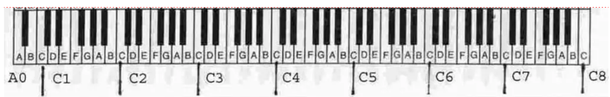
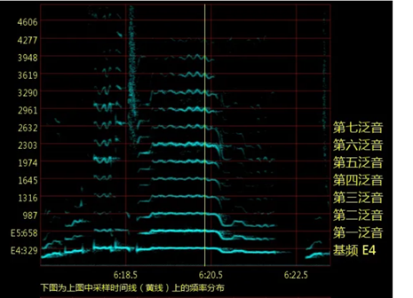
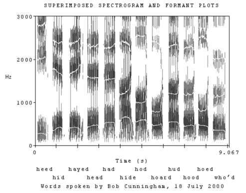

### 音高

即声波的振动频率hz “低音”对应低数值，“高音”对应高数值

_声乐中的音高按“律”来规范划分，比如do re mi fa so la xi.
每一组称为一个“八度” , 用C1，2，3…表示每个八度的起始”do”音，同理DEFGAB表示re mi… ; 定义中央的C4表示261hz._

常见的男声基础频率在100-200hz，而女性在150-350hz

日常说话的频率范围一般很稳定，但会随着情绪，生理状态而波动

### 音域

你能发出从最低到最高的音高范围，经过训练后，音域可以扩大，能说唱的音域范围也会变宽

[https://www.bilibili.com/video/BV1ut4y1H7aB](https://www.bilibili.com/video/BV1ut4y1H7aB)

### 共鸣

人除了声带之外，还有喉腔口腔咽腔鼻腔等大大小小的空腔

物体的**共振**是一种物理现象，当物体A发出的振动传到B时，正好符合B的振动胃口，B就会跟着振动

人在说话，气体经过声带振动发声的同时，可能会引起其它腔体一起振动，称为**共鸣**

共鸣通常会放大音量. 不同的共鸣情况导致不同的声音响度、音色, 男女在共鸣习惯上也存在差别

歌手能通过训练共鸣来唱歌达到扩大音域、唱歌好听的效果

### 本音/真音(声) 与 假音(声)

假如你从大喊开始抬高音高，你会发现到某处时喊不上去了，变得没有着力点，但是还能轻轻地说或者哼哼，这后半部分就是假音.

<https://www.bilibili.com/video/BV13t411z7Xx>

可以看到，真音的唱感是踏实的，听起来清脆明亮，而假音的唱感是飘渺的，听起来气息感强. 它们各有特色，无优劣之分.

我们日常说话用的都是真声.

大多下意识发出假声的情况可能只是因为你没有那个音高的真声发声经验，身体自己想办法去等效实现，可以经过练习转为真声发音.

实在没有办法用真声实现的，已经超过真声极限的那部分假声可以通过共鸣训练媲美真声的听感，此时也叫“混声”

### 音色和泛音(了解)

在同样音高上每个人的声音听起来的感觉不同，这和生理结构(声带和腔体)，说话习惯有关。

物理上，琴弦在以本体长度振动的同时，也会以1/2长度、1/3长度、1/4长度……整数倍分之一长度进行分震动，这些振动的频率hz是本体的2，3，4..倍. 而响度会越来越小.人的声带也是如此

我们对声音的音高的判断主要来自本体振动，称为“基音”

而其它振动称为“泛音”，不同音色的本质就是不同的泛音状态。

如图所示，(bideyuanli.com)

横坐标为你持续发出一个音，纵坐标为声音的频率hz 可以看到在发声时除了最底下的基频, 同时有各种各样的泛音，我们可以称其为泛音列。

同样的音高下，泛音的数量表明声音的品质，声音信息的丰富程度, 职业歌手经过训练往往比普通人更好。

泛音可分为低频泛音、中频泛音和高频泛音。

低频泛音:浑厚；如鼓

中频泛音:圆润、自然、和谐； 如人声

高频泛音:明亮、清透、解析力强 ; 如小提琴，三角铁

声乐理论里，一般把低频泛音叫低位置共鸣，高频泛音叫高位置共鸣。

比起真声, **假声发音时泛音极弱或不可见, 所以也可以从高频泛音的数量看出声音的真假**

“频谱分析法”就是如上图观察泛音情况的方法 <https://zhuanlan.zhihu.com/p/190950643>

在线测音高 频谱图 钢琴 <https://bideyuanli.com/pp>

### 共振峰原理(了解)

人的声道可以看作是一根管子，改变它的形状会导致它接受到声波引起共振时，有些频率的强度增强，有些减弱

如图，纵坐标是频率分布

假设我们随着时间发出不同元音的单词，统计每段频率的情况，可以看到每个元音对应的发音的频率分布图都不一样

我们把这样的图(图中的竖条)中被增强的那些频率(黑块)的中线称为共振峰

共振峰是声道本身的特性，可因操纵口腔临时结构、共鸣运用、声道结构不同而发生变化.但不随发声基频的改变而改变。(你可以把声道当作声波调节器，声带振动的基频和泛音全都要经过此处，如果未经过滤，你的声音就会听起来像乐器，而不是在发音说话了)

共振峰的分布情况决定了我们对不同声音特征的识别，比如说各种元音，保持好了发a音的口型，在很大的音高范围内，别人都能分辨出你在说a。

通过共振峰也能识别说话者性别，女声的共振峰频率比男声更高。

<https://www.zhihu.com/question/20474700/answer/19661726>
