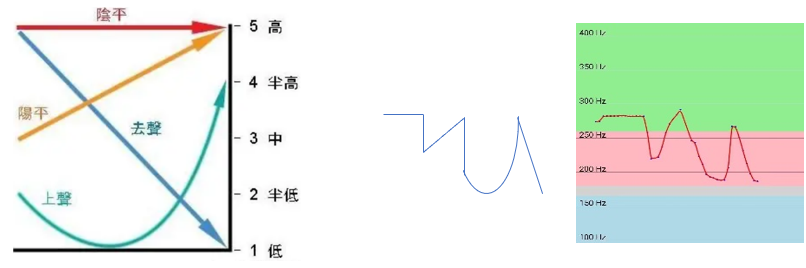
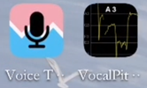
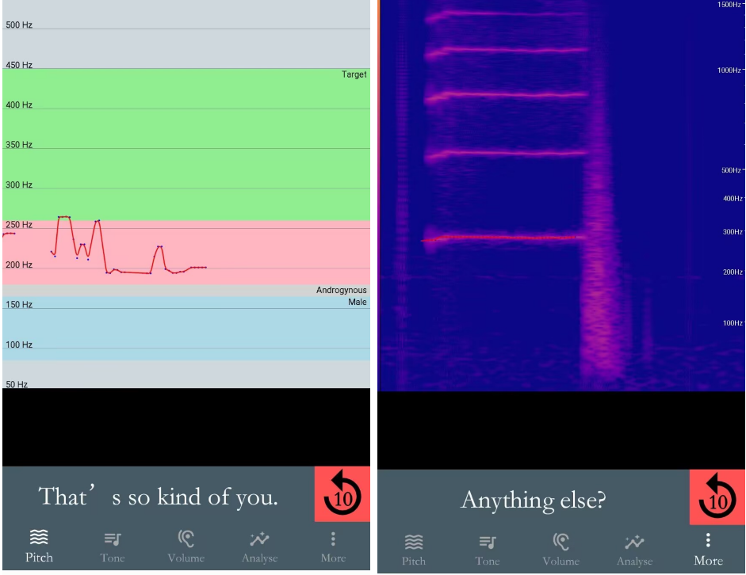

## 前言

练声是一个自己摸索的过程

不管别人教你什么东西，先不说那些概念能不能和你的经验对的上

照猫画虎被牵着走，没有判断经验，这些都够让人厌烦

先把所有接触到的技巧或者方法抛之脑后，你应该先清楚自己的情况，才能进一步去谈掌握

在一切之前，首先应该清楚一些事实情况，帮助我们判断到底应该怎么做

### 这一部分主要包括四个实践阶段

1. 认识自己的声音
2. 发声试探和维持练习
3. 吐字练习、气息训练
4. 进阶: 唱歌、声线

### 认识自己的声音

接受目前自己的声音 尽管可能是男声 但这是认识自己声音的第一步

然后，试探自己的音域(本音的范围，和上下界限)、所有能够感觉到发声的方式(使用哼、说话等，你会发现不同情况下，感觉不同地方有振动感)

你会发现你有时候会发出奇怪的声音,有时候会很费力地发音等等,这些经验将是我们第二阶段讨论的基础。

### 发声试探和维持练习

这个阶段主要试着去感受每种发声办法的感觉和音高范围

尝试发出简单的音节和句子，

1. 第一步找最舒适的发声办法，
1. 然后接着去尝试发出女性感觉的声音
1. 在找到正确的道路后，尝试长期使用女声看看情况 最好是让别人评价一下你的发声，多出门用用

你也可以先进行第三阶段, 系统学习运用之后再来

下面是详细的认识和原则：

## Ⅰ舒适发声

正确的发声方式轻松不累，一旦出现费劲和难受、嗓子疼，表明现在(瞬时)的发声方法是错的 需要调整

### 错误方式/不良习惯

#### 挤嗓子: 强行实现

你在发声时，能明显感觉到发声地方的整块肌肉在使劲，很挤，感觉说话唱歌很费劲 而且过一会发声部位处就会感觉肌肉酸，嗓子难受, 发热。

<https://www.bilibili.com/video/BV1V4411j7bj>

在强行模仿、故作腔调时很容易出现这种情况，这种情况的主要原因可能是因为你缺乏发这个音高的经验, 而你又很自信觉得自己能发出来, 结果只是强行拼凑了一个像样的发声结果出来。
挤嗓子也是有极限的, 你会发现再使劲也最高发到某个地方上不去了. 要注意, 实际上**音高并不是靠挤上去**的。

#### 超出自己能力的模仿

很多人不清楚自己能发声到什么程度，觉得自己能实现这种声音，上来就发音，

有些人只是破音或者哑到不能出声，根本上不去，有些人能用假声近似

而有些人靠着挤嗓子这种错误的办法，也能实现听感上的近似

但实际上身体没有正确发这个声音的经验，而是自己想办法强行靠近听感，这称为模仿

毫无基础的模仿，结果很可能是各种听起来不正常的声音和声带受损的代价

#### 气息不足, “拉嗓子”

你可以试试屏息并发声，或者通过倒吸的方式发声

这样发声时气息很少几乎没有，声音听起来干涩嘶哑 ，并且会逐渐感到疼痛

在小声练习时容易出现这种情况，因为带上足够的气息时声音也会变大

…

其它类型, 欢迎来评论补充

总之, 当上面的**错误情况作为习惯存在时，应该在练习过程中时刻注意和调整**：

练习一定要保证每个字都说得差不多，不要出现上一个字很好下一个字就开始挤嗓子这种情况

平时不要哼哼，哼歌时可能存在以上情况，会对习惯改正造成不利影响

### 休息和保养

感觉嗓子状态较好时适合练习，感冒时(包括潜伏期)禁止练习，练习期间，禁止吃辣吃冷吸烟

首先进行一会儿热身, 1天内一次练习最好不超过1小时，一天不超过3小时

练习时间长会口干嗓子干,准备温(糖)水，口干时喝. 少吃薄荷片,中药糖片。 (这些只是镇痛的, 嗓子照样会受损)

同时应该学习声带放松技巧，练习结束后进行。

不正确发声可导致迅速口渴，声音嘶哑，发热，嗓子难受，疼痛。

严重时你会感到没有心情发声，发声困难，说不出话(哑，失声) 出现这种情况时应该**休声**至少一天

坚持不正确发声可最终导致声带发炎、水肿、起小结、息肉

声带小结 (毛细血管破裂及表面起泡) [https://www.bilibili.com/video/BV1jJ411q71s](https://www.bilibili.com/video/BV1jJ411q71s)

不要在有咽炎、身体其它地方感染或者发炎的时候练声!!!

如果发现已经有沙哑、断音、说几句就发烧，疼，始终有异物感

应该先做个喉镜检查一下有没有声带问题

## Ⅱ 女声

### 确定参照和目标

在确保舒适发声,避免踩坑后，你可以找**自己能达到的相近水平的女声日常说话的素材 作为练习时的参照** 这些素材应该是足够日常的，比如女生的独白vlog，讲述，日常交流视频等

这些素材这会让你知道真实的女声是什么样的，对什么是女感体会更明确

比如说这些例子: (音高从低到高排列)

<https://www.bilibili.com/video/BV1Xe4y1b7ii>

<https://www.bilibili.com/video/BV1Eg411R7cz>

<https://www.bilibili.com/video/BV1HB4y187QX>

<https://www.bilibili.com/video/BV1nu411m7BX>

<https://www.bilibili.com/video/BV1Gz4y1z7hm>

注意: 不必刻意追求很高的音高, 女感其实比音高更重要. 只要有女感, 无论你声高如何的低, 人们都可能会认为这是女声

**对于一个跨性别女孩来说，你的声音应该:**

1. 能被别人认作是正常女性, 不一定需要很高的音高
1. 能在日常生活中一直使用，取代原来男声的地位，经得起时间考验.
1. 声线满足个人期望(如果可以)( 但不是动漫声优或者专业主播的声线(不日常)

相对于男性自然发声，我们这里**定义上面是女性的“本音(真声)” ，而你的目标就是那样的声音**

每个人的音色都不同，你最初能达到的女声本音一定是和你目前声带情况有关联的，而不一定是你期望的

比如有的人天生声带细，这样的话能达到的预期女声也是比较高和清脆明亮的

但随着对新音高的适应，你的本音可以尝试继续走高, 但仍然会有一部分音色无法改变

长期本音女声，习惯改变，声音会越来越自然，还有可能会忘记以前的男声怎么发音

特殊发音情景 ，如咳嗽，喷嚏，边说边笑，失声笑，哭泣，撒娇，有声打哈欠..

这些不是最初的目标. 你可能会发现在你能够稍微说话女声时，这些似乎还是男声

但其实不用过于担心，当实现日常本音女声之后，这些都会变成女声的 (比如你在说话过程中出现这些情况，你就会发现这些都变成女性该有的声音)

### 声音的听感

#### 夹子音

所谓夹子的概念，第一个是是网络词汇，是指那种听起来像是刻意去表现女性幼态可爱的女声 ，听起来很嗲，一些人觉得很假或者故作矫情. 但正常女声也有很高的，人家自然发声，那不是“夹子” 。需要注意跨女可能有刻意去强化女声感的情况

<https://www.bilibili.com/video/BV15b4y1y7wF>

另一种夹子，也就是练声过程常说的“太监” ，虽然有女声的音高，但是听起来是男0的声音，或者太监/米老鼠，戏子，电子歌姬，的声音，是一种能让人明显感觉到是一个男性在刻意模仿女声，而且模仿得很拙略. 稍微好一点的呢，虽然听起来已经很像女声了，但总是感觉怪怪的，有些别扭

这个就不举例子了，现在去网上搜一下男伪女黑历史，一抓一大把

**很多时候，听着别扭怪异不像女声，主要有以下几个原因:**

- **假声女声** 你可以想象一下如果女生日常说话用假声是什么感觉
- **破音**，本该发那个音但却突然变成了别的

没有控制好气息和声道，还有就是能发的声音不连续有断层(突然出现其它共鸣)

很容易发出一些不常见的声音 比如非常鲜明的尖锐声或断层 或者读字被拉长变调

- **跑调**

可以试试说“拉拿扯要”四个字，正常的四声一般在100hz范围内波动，用软件看可以呈现出一个w

如果存在跑调，这时候可以看到最低点和最高相差距离远超100hz

由于日常习惯更低的男声，而不习惯更高的女声，发音时会下意识往低走，也就是回到更低的频率范围

而女声在正常时也是稳定波动范围，但在兴奋时波动剧烈，会倾向往高走

解决办法是多听和学顺女说话

- 基频满足，但**共鸣位置不对** 导致有男味

如果是女性的共鸣位置，即便是低沉的音高照样能听出来是女声

当女生有男生的共鸣，还很重，会是怎样：

<https://www.bilibili.com/video/BV1ZE411d7st>

可以看到小姐姐在低音的基础上换了一套共鸣方式 ,听起来就完全不同了。

我自己在实践过程中也略微体会过一些强烈男性感觉的共鸣方式, 这些方式对于男性来说基本上就是日常。

另外提醒一下, 女孩子发声都是轻柔的，可能比你能做到的最小力度还要轻, 如果控制不好, 很容易直接盖过去, 气息支持度的变换是一段需要适应的过程

- **女性感太强烈太鲜明**，听起来有点刻意，明显和正常女生说话不一样

(就算在顺女中, 说话太嗲也会被人议论的)

### 设备支持

如何判断自己发出女声的情况呢? 这时候你需要一些设备的支持

专门去买麦克风没有必要, 一般有手机就行

#### 实时耳返

能够将你刚发的声音录下来并且立即通过耳机播放，大概有5-10ms不算明显的延迟

耳返可以通过APP或是一些蓝牙耳机、麦克风实现

APP这里推荐“**艾米助听**” 点击”开始助听”即可开始耳返. 不需要进阶版付费.

耳返或录音的声音是你传播到空气后的声音，也是别人耳中你的声音.

而你平时说话听到的声音主要来自骨传导(在室内的情况下听到的声音包括自己的声波反射)

“混响” 即回声和骨传导的声音感觉混在一起，使得感觉声音稍微延长，模糊，减少瑕疵

耳返可以强化对自己声音的反馈

有些跨女对自己的声音判断有误，自己觉得有一种男性的味道，但是录音里是实实在在的女声

耳返实时返回的声音使人被提醒到刚才的声音是自己发出的, 有助于自我对声音的接纳

而且如果你不想听见自己说男声，但又对自己平时说话没有感觉, 接收到刚才自己说话的反馈，便可能会去一直说女声.有利于女声的长期使用

虽然耳返可以帮助你进行即时的调整, 但初次尝试发声时，如果想要准确调整发声，还是要不戴耳机自己听。

在监听时你会更难进行声音控制(因为一心二用)，加上如果你女声不熟悉不稳定，还是在依靠控制才能勉强稳定的状态时, 很容易在听的同时出现说话跑调等失控的情况

#### 频率反馈和录音回放

这里用的呢是经典的**voice tools** 和**vocalpitchmonitor** .

第二个可以即时显示你的音高,也可以录音

第一个显示你刚刚发音的频率，这个软件会显示男女频率的范围(蓝粉)，并且可以点击红色按钮回放刚才10秒内的声音

你可以自定义能够录音的时间，以及自定义目标频率范围(绿色部分)

还有就是可以看频谱图(右图)

这些软件都要科技上网, 所以我把安装包放这里了

链接：<https://pan.baidu.com/s/1oQITjpxxapWDFpZ2csrSpg?pwd=vqbt>

### 心理因素

练习女声，你也许会觉得是一个有些羞耻的事情

事实上心理因素对练声造成的障碍不亚于其它技术和观念的缺失

常见心理：

**1.在心理上没有做好接受自己发出女性感觉的声音的准备**

可能发生于男性形象期间，出于男性形象而对自己有女性感感到自我怀疑，不够那么名正言顺，这时候麻烦好好确定自己的认同

站在男性的角度去模仿女声，和发自内心发出女声的感觉是不一样的.练声是需要少女心的，不然你甚至无论怎么发声都觉得自己声音不正常

声音练习最好与RLE同步进行，女性形象对于女性自我认识和声音练习成果的维持都有帮助

**2.练习过程中怕被人知道，羞涩、或者害怕被指责**

所以不愿，不敢在别人(陌生人，朋友，家人)面前展现真正的自己，甚至有时候还会主动去做掩饰

所以练声一直都是偷偷练，练习行为受影响

有可能**整个过程一直都在有意控制发声的力度和大小，或者腔调**，出现下面这些情况:

> 不管是嘈杂还是安静的地方都**不敢放声练习，经常从大声变小声，越来越小。**

在小声的时候因为经常只拿捏力度控制声带，缺少气息，所以发声才不自然 ，也容易难受和声带损伤

> **出于掩饰,合理化自己的行为**，比如故意歪曲当前的声音的腔调让别人以为你其实在学戏腔、乱整活，而不是在练女声. 让你的行为符合自己现在的“男性”形象，试图避免男性发出女声这种的更“严重”的情况被人听到，减少受到的注意和谴责.

但是你看看顺女，她们有这样吗? 没有人会责怪顺女发女声

如果你是女生的形象，那你也可以名正言顺，发出男声才是奇怪的现象

对此我们有两种办法，一种是条件上隔离掉别人，

另一种是心理上克服，总之是解除自己放肆练声的后顾之忧

#### 让别人听不到 没有人知道

**最常见的办法是找个没人的地方或者隔音的地方**

声波的特点:

传播需要介质，障碍物(介质的存在)可以实现部分降噪.

传播速度固体>液体>空气，空气中衰减很少，比如平原声音传得超远.

真空中不能传播，所以双层真空玻璃可以隔绝.

[隔音材料为什么能隔音?](https://www.zhihu.com/question/21611602/answer/25226804)

人耳的特点：

对同响度的高音更敏感，尤其女性。; 听觉敏感度基于环境背景噪音: 安静环境更容易听到声音。

练声环境一览:

| 基础条件                        | 效果                                                                                                       | 可得性                                                   |
| ------------------------------- | ---------------------------------------------------------------------------------------------------------- | -------------------------------------------------------- |
| 室内(隔着墙，房门)              | 承重墙>轻体墙. 门缝会极大漏声   地板的话,楼下/旁边邻居可以听到喊叫   好一点的建筑室外听不到,除非大喊 | 住房、空教室、地下室、汽车内                             |
| 厚厚的被子                      | 只能让声音在外面听起来变闷，而且会让你狂出汗                                                               | 家里                                                     |
| 隔音舱/朗读亭                   | 消音30db左右，外面能听到一点.                                                                              | 室内定制价格较贵 ; 一些大学图书馆有                      |
| 小树林                          | 视空旷程度而定                                                                                             | 大学没人去的地方，郊区，无人区                           |
| 搭建录音棚，隔音房, ktv，钢琴房 | 较为理想，但可能有很大回音                                                                                 | 自己做房屋改造，铺设材料，价格数k，Ktv，钢琴房按小时计费 |
| 专业吸音房                      | 基本隔绝，无回音                                                                                           | 工厂，科研机构等                                         |

一般房子条件如果不是太烂, 家里普通声音的说话是听不见的

白天外面嘈杂, 晚上安静, 相对的别人可能更容易在晚上听到声音

#### 做好心理工作

干脆脸皮厚一点，把所有人当空气. 只要你练声没有扰民，没人会去管你 (但也不排除那种没事找事的)

在陌生场合就更简单了，反正也没人知道你是谁

而且就算这事引起了关注，也持续不了多久，人们不会记得的

现在各大医院也有声音训练的地方，可以到那里练

如果你出柜了, 你甚至可以在宿舍里练习

也可以在知情同伴的陪伴下练习. 心里有底气，谁敢议论就怼回去!

这个勇气是越练越勇，最难的是第一次开始，但如果不能习惯如常的话，每一次都是第一次.

#### 稍微有一点成果之后，虽然能说女声，在外畏畏缩缩不敢女声说话，在内习惯上仍然日常男声对话或者自言自语

这可以说是练声过程的必经之路了

女声的日常化，一个是经常的说和听，让别人评价，多去实际社交培养自信

自己觉得自己声音好听，说出来也有信心

还有就是心理上，要维持少女心，尽可能拒绝男声再出现在自己的生活

如果你一直习惯于对别人有所保留，还有些熟人你已经习惯了用男声和他们对话

而你现在要对他们说女声, 等于把自己少女的内心，一直隐瞒的秘密，毫无保留地展现出来给别人

你做好这样展现真正自己的准备了吗?

## III 吐字练习、气息训练

如果前面已经可以找到基本的女声了，到这里你可以期望能有更好听的女声

如果没有找到，也可以先尝试学习一些基本功

当我们要想要好听的声音，想学唱歌，考普通话学播音腔时，都需要练习吐字，控制气息

这里就是各种唱歌课或者播音主持课所教的范畴了，网上都有教程，这也是我目前的学习进度

要注意一定要选择系统，专业的数小时以上的，而不是网上随便搜的十几分钟速成视频或者短视频.

即便是长视频,也要看看其发布内容的目的, 到底有没有干货。

有些视频发出来纯粹是为了引起兴趣,卖课导流而存在, 真正的货,讲解的细节,观念等是很难放出来的

比如说打着系统, 基础的名号, 不去做知识概念的理解, 而大谈xx技巧, 实战例子, 而且内容不全, 甚至东拼西凑。

没有掌握基础,看这种东西就是顾此失彼本末倒置. 而当你掌握基础之后, 你又会发现这些东西很水, 居然花这么久讲这一个浅显的东西。

在学习时应该关注老师教授的内容是否基础扎实，能让你明白自己在学什么，学这些的意义，不然就换人。

坚持跟练，相信你们都见过播音专业的艺考生吧，起早贪黑在那里朗读，既然要学习就要拿出那种架势。

学这些不仅可以美化声音，还是下一步对声音自如变换的基础

如果跳过它直接模仿复杂的发声，就容易出现上面提到的各种问题

## IV 进阶: 唱歌、声线

对于跨女的日常来说没有特别的必要,可以作为兴趣去学

### 唱歌

唱歌好听并不是简单的音高模仿就能实现的，初期也不应该从唱歌开始

学唱歌的过程不是跟唱的过程，而要自己组织发声，调整到原唱的状态。

翻唱则要唱出自己的个人音色和情感.

在不跑调的同时，应该做到

①准确咬字口齿清晰，蕴含情感 (同朗读 抑扬顿挫 哪个字读得快或者慢

②从真音开始并尽可能维持真音, 如有必要也应该自然发出假声

还要注意③气息支持和稳定，掌握共鸣技巧，还有④节奏把握

**声线:** (米老鼠 、熊二、萝莉绿茶御姐..)

类似方言口音，有一套新的发声规则，没有熟练的声音运用技巧最好不要接触
