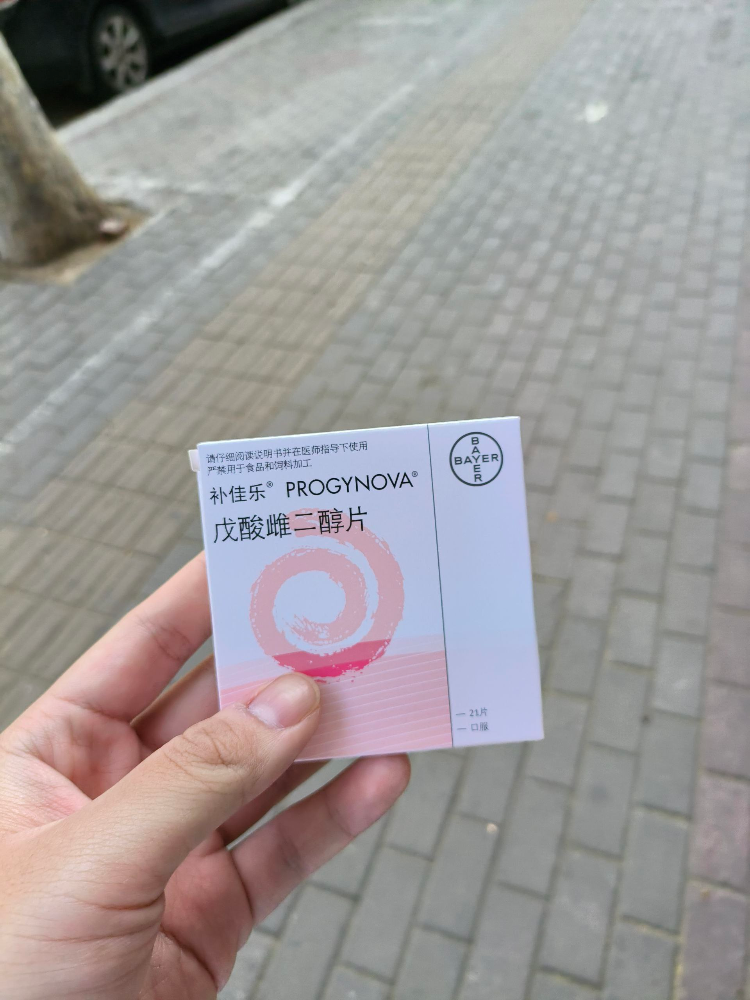
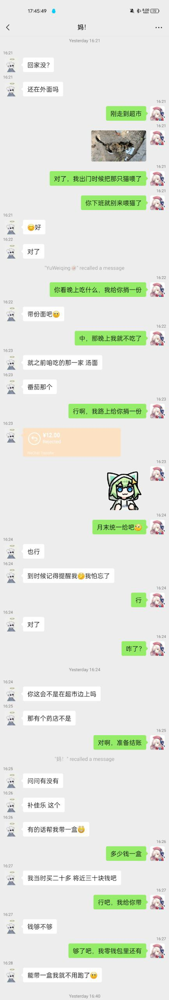
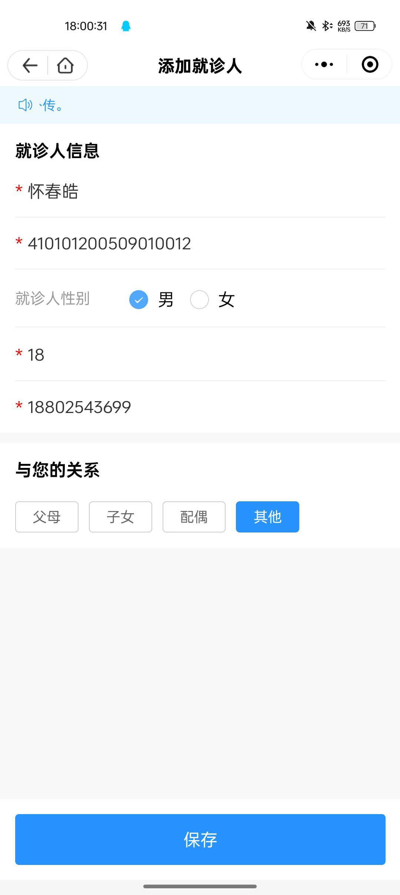

## 引言

这是一篇关于如何在线下药店购买补佳乐的文章。

补佳乐（戊酸雌二醇片）作为跨性别女性群体中常用的 HRT 药物，由于前些时候被列入了网络禁售药物清单，现在在网上几乎买不到它。已知的线上购买途径仅有天猫大药房（50 元每盒）和方舟健客网上药房（比市价贵且需要运费）。

而相当一部分 MtF 没有处方和诊断证明，且她们的资金有限，这就导致她们必须通过「特殊渠道」购入这类药品 —— 即寻找所谓的「药商」。事实上，有许多所谓的药商，都以低价为幌子进行诈骗，要么收钱后跑路不发货，要么卖假药，危险极高。这对于部分生活困难的跨性别群体，无疑又是一个打击。

对于这部分 MtF，笔者最推荐的方法就是去线下药店购入补佳乐。但这种药品，如果贸然购买，可能药店工作人员会猜疑，甚至干脆不卖。本篇文章将会讲述如何在线下的药房中，「优雅」地购入补佳乐，而不被药店工作人员猜疑，或是减少自己内心的恐惧。

当然，这篇文章更适用于「社恐」人士购买补佳乐。如果你是「社牛」，当我没说。

## 写在前面

**切忌盲目跟风。**
请确保你是真正的需要这个药品后购买，并能承担吃药所带来的一系列副作用（例如抑郁、血栓风险等）

请一定明确自己的需求后再进行 HRT。极度建议你先获得医生的认可后再开始 HRT。

对于家庭支持程度一般的 MtF，请一定考虑被发现吃药或身体变化后所带来的后果。

笔者不对本文章带来的一切后果负责，仅为经验分享，不保证有效性。

## 铺垫

### 克服内心的恐惧

**药房不会吃人。** 请记住，去实体店线下购买补佳乐，并不是违法行为。只要药店有药品经营许可证，那你的购买就是合法的。即使药房因为各种原因不卖给你这个药，你的后果最多也只能是红着脸离开药房。过段时间你肯定也会忘记被拒绝购买这事。所以，请先克服你内心的恐惧 —— 过于紧张地走入药房询问店员，反而可能使他们感到怀疑。

**尽量不要女装去药房买药。** 补佳乐属于处方药，，购买时需要提供你的身份证号。如果你以非常女性化的模样去了药房买药，当填写个人资料开具处方时，可能会完全露馅 —— 即，外表为女，身份证性别为男。不用想，这也会引起工作人员的猜疑。最好的方法是，尽量男性化一些地去买药。如果真的因为 GD 等因素无法做到这一点，请尽量想办法减少店员的猜疑。

### 有理由地去买

**找一个合适的理由。** 公认的最好的理由就是 —— 路过帮着给更年期的母亲买点。

**不要说是给朋友买的！** 你这个年龄可能没有什么顺性别朋友要用到雌二醇。

**如果真的不放心**，可以请一个你信任的网友，在微信上假装作为你的母亲和你聊几句 —— 就比如图片里这样：

记得把你那位网友的备注名改成不那么突兀的。语言尽量自然些，这样会减少药店工作人员的怀疑。

在这里感谢于惟清（X：@yuwwqk1229）与笔者一同演戏（）

记得先铺垫一些聊天记录，尽量把整个屏幕占满。

### 如果可以的话，伪造一下身份信息

以河南省张仲景大药房为例：购买时需要扫描二维码进入微信小程序，在小程序中点击在线问诊，输入真实身份信息后药师开具处方才能把药拿到手。

如果你因为各种顾虑，不敢填入自己的或是家里人的身份信息，请记得提前编一个：笔者实测，在这个药房购药系统中，并未接入公安实名认证系统 —— 这就代表着，只要你的身份证「形式上」符合要求 —— 即校验码可以通过系统检测，就可以用此身份信息购药。

身份证号想必各位读者都十分清楚了：行政区划代码 + 生日 + 后四位，最后一位为校验码，倒数第二位奇数代表生理男性，偶数代表生理女性。

你可以自己去找一个身份证号有效性校验的网站，从 0 到 X 全部试一次，或是自行查阅资料算出校验码。

当然，伪造身份信息的时候，不要太过离谱 —— 尽量和你的年龄一样（或者略大也可以，如果你未满 18 周岁的话）、性别那一位里面尽量填奇数（你也不想店员和你一起尴尬吧）。名字可以随意起一个，但也不要太过离谱。

手机号可以随意使用。当然如果你实在不放心的话，可以改一下最后一位 —— 例如你的手机号是 188\***\*3698，你可以在填信息的时候写成 188\*\***3699。

下面的图片是一个比较好的例子，当然不要照搬）

**切记不要用假身份证干任何违法的事情！笔者不承担责任！**

## 踏入药房

### 选一个大一点的药店

毕竟，你肯定也和笔者一样，不想跑到药店后，得到「我这里没有这药」的答复，对吧。

对于河南来说，稍微大一点的张仲景大药房是有这个药的，当然可能其它药房也有。

之前笔者在南京的益丰大药房也买到过补佳乐（需要手机验证码）

医院旁边会有很多药房，找一个稍微大一些的就可以了。

### 放轻松

可以在星期六星期天的傍晚去药房，给人一种你在傍晚锻炼，顺路去趟药房的感觉。

或者可以拿一些买菜的袋子，总之就是，不要显得太过紧张。

手上可以拿一杯饮料，工作人员找药的时候，你喝一口，缓解焦虑，同时也更自然一些。

### 踏入药房

记住，务必装作啥都不懂的样子去药店。

带着你的聊天记录，去药房。直奔柜台，把聊天记录给店员看，问他们「有没有这个药」

这里有一个办法：先把聊天记录大体给店员看，然后当着店员的面，双击这个消息气泡，让你家里人帮忙买药的这条聊天记录全屏显示。这样的话，可以极大程度打消他们的疑虑。

工作人员找药的时候，可以在药店里四处走动。尽量不要一直看手机。

### 登记信息

一般来说，药店要你的个人信息，并没有什么用，只是为了合规需要，填一个身份证开药罢了。

如果你实在放心不下，可以看上面的指南，制作一个假的身份证号。

手机号可以填自己的，也可以填假的。

### 一些常用话术

> 我妈说，她买的那个是粉色盒子，二三十块钱那个的，这儿有吗？

> 我给家里人买的，但我不记得身份证号，我填自己的身份证行不行？

> （如果你填了假的手机号但是需要验证码）欸？我收不到验证码啊，可以换个手机号吗？

> 帮忙拿个袋子装着呗

### 请注意

如果你的家人（或亲戚、家人的朋友）有在医疗系统工作的，或者是在药房直接工作的，请尽量跑得远一些去买药。

跨行政区买药（如新乡市红旗区 -> 新乡市牧野区、郑州市二七区 -> 郑州市惠济区）可能是一种比较好的方法。毕竟鞭长莫及，越远越好。

如果你的微信 / 支付宝有亲属卡，请尽量不用。

部分药店可能会在支付宝 / 微信的账单页面写出你买了什么药。就像这样：

在找药房的时候，尽量不要找一进门都是中药的药房，原因嘛……不言自明。他们可能会给你开一些中药，或者极力推销所谓的滋阴壮阳药。

尽量不要去你所在的社区 / 居民区附近的药房，尤其是你家里人去过的地方。有时候店员的一句漏嘴，对你而言是致命的。去一个两三公里外的居民区可能是一个更好的主意。

有时候用方言可以增加一点信任度（？存疑，有其它朋友跟我说过这个，但是笔者不会河南话）

尽量不要太过频繁的在一家药房买药。对于顺性别中年女性来说，一盒药是三周的量。如果你三天一去药房，不用说也会引起怀疑。

### 买到之后

如果要登记身份证，自然一些。如果一个人连自己的生日都能背岔，那信任度会直线降低。

如果要说刷医保，请拒绝，因为在你小的时候，你家里人可能用你的医保卡绑定过买药，这样的话，你医保动账的消息会直接传到他们那边。

可以拍一个药盒，发给你的那位和你一起伪造聊天记录的朋友，并配上这样的文案：`是这个药吗？`

在从药房走远之前，不要拆开盒子。记住，这个药是「给你家人吃的」，而不是你吃的，对吧（

## DLC:如何藏药

在这里笔者就简单补充一些注意事项：

**如果家里人翻你的房间** ，就在回家之前找个没人的地方，把药丸抠出来放在口袋里。

可以垫一层纸，这样不会洒出来。

回家之后找个没人的时间，把药藏起来，切记 **鸡蛋不要放在一个篮子里**

像是笔盒、装维生素的药瓶、书包夹层这些都是极好的藏药的地方。

**记住，不要把盒子直接扔到单元楼门口**。尤其是在家里面十分怀疑的情况下。有时候一只爱翻垃圾箱的流浪狗会让事情变坏。

**最危险的地方，不是最安全的地方**，如果真的要藏，请藏在视野盲区。甚至可以藏在机箱里面。

## 总结

这篇文章主要适用于家里面支持程度差但迫切想要进行 HRT 的 MtF 群体。

如果你很有幸成为家长党，就请去开个证明，然后光明正大的吃糖吧！

不是家长党也别泄气，会熬出头的，都会好起来的，对吧。

如果你有任何补充的想法，可以直接在这个博文下面留言。作者看到了就会回复的。
